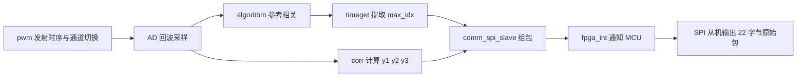
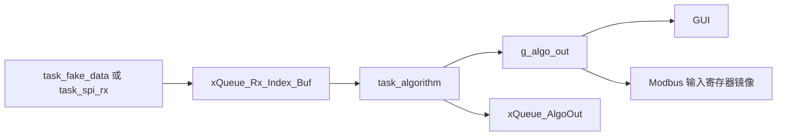

# 核心测量功能运作流程与代码实现分析文档

## 1. 文档说明与分析范围

本文档基于当前工作区中的 MCU 工程 `-1-2-Template_CN` 与 FPGA 工程代码片段 `FPGA_prj_code/RUF_MIX.srcs/sources_1/new/` 进行分析，目标不是简单罗列文件名，而是围绕“FPGA 先完成前级采样、相关运算和时间特征提取，MCU 再实时计算流速与流量”这一核心测量主链路，形成一份可直接服务于毕业设计撰写的分析材料。

从代码结构、任务组织和数据处理方式综合判断，当前项目本质上是一套基于 FPGA 与 MCU 协同实现的超声时差式流量计。其核心思想是：前端高速、强实时、并行性强的信号激励与采样处理由 FPGA 完成，而参数化、可配置、可显示、可通信的流速与流量换算由 MCU 完成。这样的分工既符合两类器件各自的优势，也便于整机联调和后续论文表达。

本文重点分析以下内容：

- FPGA 侧顶层与核心模块：`Top.v`、`RUF.v`、`pwm.v`、`AD.v`、`algorithm.v`、`timeget.v`、`corr.v`、`DeltaT.v`、`comm_spi_slave.v`、`communication.v`、`SPI8370.v`
- MCU 侧启动、任务和中断：`User/main.c`、`User/gd32f30x_it.c`、`TestTask/src/does_it_work.c`、`Task/src/task_spi_rx.c`、`TestTask/src/task_fake_data.c`、`TestTask/src/task_algorithm.c`
- MCU 算法与参数层：`App/src/algorithm_packet.c`、`App/src/algorithm_process.c`、`App/src/algorithm_flow.c`、`App/src/data.c`、`App/src/fake_data.c`、`App/src/freertos_resources.c`
- MCU 外设驱动层：`periph/src/periph_link.c`、`periph/src/gpio.c`、`periph/src/spi.c`、`periph/src/usart.c`、`periph/src/rcu.c`

需要特别说明的是，本文所有结论均以当前源码状态为依据。对于部分仍处于联调阶段、尚未完全接入正式启动流程的链路，文中会明确标注“根据代码推断”或“当前代码中尚待进一步联调确认”。

---

## 2. 项目核心功能总体判断

从系统功能角度看，本项目的核心任务是测量流体在管道中的流速与流量。结合 `pwm.v`、`AD.v`、`algorithm.v`、`corr.v`、`algorithm_packet.c`、`algorithm_flow.c` 等代码可以看出，该项目并不是直接采集一个模拟电压后做简单标定，而是围绕超声激励、回波采样、相关计算、时差提取、流速换算和流量累计这一整条链路展开。

其总体工作原理可以概括为：

1. FPGA 周期性控制超声激励，交替驱动两个声学通道。
2. FPGA 在激励后启动高速采样，将回波信号写入片上 RAM。
3. FPGA 对采样数据做参考波形相关与互相关处理，提取粗时间索引 `idxA`、`idxB` 和细化插值所需的 `y1`、`y2`、`y3`。
4. FPGA 将这些“前处理后的特征量”封装成固定 22 字节 SPI 数据包，并通过 `fpga_int` 通知 MCU 读取。
5. MCU 收到原始包后，先解包，再将 `idx_a / idx_b / y1 / y2 / y3` 换算为 `t1 / t2 / dt`。
6. MCU 在参数系统 `g_parameters` 的参与下，继续完成流速计算、滑动窗口统计、卡尔曼滤波、零漂补偿、上下限裁剪、瞬时流量换算、累计流量更新和报警判断。
7. 最终结果进入 `g_algo_out`，再提供给 GUI、Modbus 等上层模块使用。

这说明 FPGA 并没有直接给 MCU 一个“最终流量值”，而是给出一份“经过硬件前处理但仍保留物理意义和可配置空间”的特征数据包。这样做的好处在于，MCU 仍然可以根据管径、壁厚、声程角、零漂参数、单位换算方式、报警阈值等配置对结果做二次处理，从而兼顾测量实时性与系统灵活性。

---

## 3. FPGA 与 MCU 的功能分工

### 3.1 FPGA 侧职责

从 `RUF.v` 及其调用模块来看，FPGA 主要承担以下工作：

- 产生发射时序与双通道激励控制
- 完成 AD 采样触发与多时钟域数据搬运
- 对采样数据做相关运算
- 提取波形峰值位置 `max_idx`
- 计算互相关三点值 `y1 / y2 / y3`
- 将关键特征量封装为固定长度 SPI 包
- 通过 `fpga_int` 与 MCU 建立事件驱动式数据交互

这些任务共同特征是数据速率高、时序要求强、可并行程度高，非常适合 FPGA 实现。

### 3.2 MCU 侧职责

从 `task_algorithm.c`、`algorithm_packet.c`、`algorithm_process.c`、`algorithm_flow.c` 与 `data.c` 可以看出，MCU 主要承担以下工作：

- 维护全局参数 `g_parameters`
- 接收并解析 FPGA 或假数据生成的原始包
- 将特征量换算为时间量 `t1 / t2 / dt`
- 基于管道参数与零漂参数完成物理量换算
- 做异常检测、滤波、补偿、报警与累计
- 向 GUI、Modbus、日志等上层模块提供统一结果

这些任务的特点是逻辑更复杂、配置项更多、与人机交互及通信系统耦合更强，更适合 MCU 和 FreeRTOS 承担。

### 3.3 这种分工的工程意义

这种“FPGA 前处理 + MCU 后处理”的结构具有明确的工程优势：

- FPGA 负责前端高速链路，可保证激励、采样与相关运算的实时性。
- MCU 负责参数化计算，可方便调整公式、阈值、单位与业务逻辑。
- FPGA 与 MCU 之间只传输特征量，不必把海量原始采样全部送给 MCU，减轻带宽与处理压力。
- MCU 侧保留对最终结果的解释权，便于 GUI、Modbus 和参数系统统一管理。
- 对毕业设计而言，这种分层方式更容易清晰地论述“系统工作原理”“软硬件分工”“任务协同机制”和“数据流分析”。

---

## 4. FPGA 侧核心代码结构分析

### 4.1 `Top.v` 与 `RUF.v` 的角色区分

结合 `Top.v`、`communication.v`、`RUF.v` 和 `comm_spi_slave.v` 的结构判断：

- `Top.v` 更像早期或阶段性验证用顶层。它侧重把 `max_idx` 这类中间特征通过 `communication.v` 发送出去，偏向单点验证和模块联调。
- `RUF.v` 更接近当前整机目标架构。它把 `pwm`、`AD`、`algorithm`、`timeget`、`corr`、`comm_spi_slave` 等模块串成一条完整链路，并直接面向 MCU 侧 SPI 从机接口。

因此，如果从“最终系统主链路”的角度描述 FPGA 结构，`RUF.v` 显然比 `Top.v` 更具代表性；而 `Top.v` 可以视为项目演进过程中的验证型顶层。这个判断是根据当前源码组织方式推断得到的。

### 4.2 FPGA 侧各核心模块职责

| 模块 | 主要职责 | 在主链路中的位置 |
| --- | --- | --- |
| `pwm.v` | 产生周期性激励节拍、通道切换、驱动波形输出，并在发射结束时产生 `ad_tog` | 测量起点 |
| `AD.v` | 在 ADC 时钟域完成采样，在算法时钟域输出缓冲数据 | 采样与跨时钟域搬运 |
| `algorithm.v` | 对输入采样流与参考波形做卷积/相关，输出相关值流 | 波形特征提取 |
| `timeget.v` | 在一帧相关结果中寻找最大值及其索引 `max_idx` | 粗时间定位 |
| `corr.v` | 对 A/B 两路缓存做互相关，输出 `y1 / y2 / y3` 三点值 | 细粒度时差特征提取 |
| `DeltaT.v` | 提供另一种 `y1 / y2 / y3` 计算思路，带有较明显验证/调试痕迹 | 备选或历史方案 |
| `comm_spi_slave.v` | 冻结 `idxA / idxB / y1 / y2 / y3`，封装 22 字节数据包，经 SPI 从机发给 MCU，并拉起 `fpga_int` | FPGA 与 MCU 接口 |
| `communication.v` | 另一套 SPI 通信模块，当前更像早期主机式发送验证模块 | 历史/验证接口 |
| `SPI8370.v` | 可编程增益相关控制，服务前端模拟链路 | 前端辅助模块 |

### 4.3 `pwm.v`：发射节拍与通道切换

`pwm.v` 是整条采集链的前端时序起点。根据代码可见，它在 100 MHz 域产生 4 ms 节拍，并在 2 ms 时刻翻转一次通道选择信号 `channel_sel`，从而实现两路换能器的交替工作。与此同时，它在 200 MHz 域读取 ROM 中的驱动波形，输出约 500 点的发射 burst。发射结束后，模块通过翻转 `ad_tog` 向后级 ADC 采样逻辑发出“现在开始采样”的事件。

这意味着 FPGA 内部采用的是“激励事件驱动采样”的组织方式，而不是让 ADC 持续无意义采样。这样既节省资源，也让测量过程保持稳定的时间关系。

### 4.4 `AD.v`：采样与时钟域跨越

`AD.v` 的作用是把前端回波采样真正落到片上可计算的数据缓冲区中。该模块一方面在 65 MHz ADC 时钟域根据 `ad_tog` 启动采样，将 `AD_LEN=2000` 个点写入 RAM；另一方面又在 100 MHz 算法时钟域按分频节拍把 RAM 中的数据重新读出，形成 `adc_buf_en` 与 `adc_buf_data`，供 `algorithm.v` 连续消费。

这部分设计体现出典型的多时钟域协同思想：采样严格跟随 ADC 节拍，而算法则在更适合后级处理的时钟域运行，中间通过 RAM 与事件同步机制隔离。

### 4.5 `algorithm.v` 与 `timeget.v`：粗定位阶段

`algorithm.v` 内部维护长度为 `TAPS=150` 的滑动窗口，将采样流与参考系数做卷积/相关计算，并在每一帧内输出一串相关结果。随后 `timeget.v` 在 `frame_end` 到来时给出本帧最大相关值及其索引 `max_idx`。这一步本质上完成了回波主峰的大致定位。

因此，`max_idx` 可理解为一个“粗时间位置”，它为后续更细粒度的时差估计提供了基准。

### 4.6 `corr.v`：互相关三点值提取

`corr.v` 是 FPGA 主链中非常关键的模块。它先分别缓存 A、B 两个通道的数据，再在两路都准备好后计算三组互相关和：

- `y1 = A[1..1999] * B[0..1998]`
- `y2 = A[0..1999] * B[0..1999]`
- `y3 = A[0..1998] * B[1..1999]`

这三个量可以理解为相对时差在 `-1 / 0 / +1` 采样附近的互相关值。它们本身还不是最终时间差，但已经足以支持 MCU 用抛物线插值方式获得亚采样级的 `delta`，从而得到更精细的 `dt`。

因此，FPGA 并没有把插值也完全硬化，而是把“足够支持精细插值的局部特征”交给 MCU。这正是软硬件分工设计的核心。

### 4.7 `comm_spi_slave.v`：面向 MCU 的特征包输出

`comm_spi_slave.v` 是当前 FPGA 与 MCU 交互的关键接口模块。其逻辑可概括为：

- 使用 `channel_sel` 区分并缓存 `idxA`、`idxB`
- 在 `corr_valid && idxA_ready && idxB_ready && !packet_ready` 时冻结一帧数据
- 将 `idxA / idxB / y1 / y2 / y3` 组织成固定 22 字节数据包
- 拉高 `fpga_int`，提示 MCU 有新包可读
- MCU 通过 SPI 主机读完整个 176 bit 后，模块清除 `packet_ready` 和 `fpga_int`

这说明 FPGA 对 MCU 侧采用的是“中断提示 + 主机拉取”的接口策略，而不是持续主动推送。这种方式在 MCU 系统中更常见，也更容易与 FreeRTOS 中断唤醒任务模式结合。

### 4.8 `DeltaT.v` 与 `communication.v` 的位置判断

`DeltaT.v` 中保留了另一套围绕 `y1 / y2 / y3` 的存储与乘加实现，并接入了 `delta_ila` 调试逻辑，说明它更像算法验证阶段的备选方案或实验模块。

`communication.v` 则实现了一套由 FPGA 主动输出 `max_idx` 的 SPI 通信方式，而 `Top.v` 也与之配合使用。与 `RUF.v + comm_spi_slave.v` 相比，这套路径更像早期单特征量验证方案，而不是当前面向 MCU 整机协同的正式接口方案。

---

## 5. FPGA 侧核心数据处理流程

从 `RUF.v` 出发，FPGA 的核心处理流程可以概括为下图：

这条链路中，FPGA 做到的并不是“最终流量计算”，而是“测量特征前处理”。如果把整个系统看成一个信号处理流水线，那么 FPGA 相当于完成了从超声激励到时差特征提取的前半段，而 MCU 则完成了从时差特征到工程量输出的后半段。

这种结构有两个很重要的意义：

- 首先，它把最依赖时序精度和并行处理能力的部分尽量放在 FPGA 内完成。
- 其次，它避免 FPGA 与 UI、通信、参数系统强耦合，使 MCU 可以独立负责配置与业务层逻辑。

---

## 6. FPGA 到 MCU 的数据接口与原始包格式

### 6.1 SPI 接口组织方式

从 `comm_spi_slave.v` 和 MCU 侧 `task_spi_rx.c` 可以看出，双方约定的是固定包长 SPI 通信。MCU 侧按 `RUF_X_PACKET_SIZE_BYTES` 读取一整包，FPGA 侧保持 `packet_buf` 稳定直到本次传输完成。

该接口的好处是：

- 数据边界清晰，不需要额外的复杂帧同步协议。
- MCU 读取逻辑简单，适合中断触发后立即读包。
- FPGA 侧只要保证包冻结期间不改写内容即可，状态机容易实现。

### 6.2 原始包字段定义

`comm_spi_slave.v` 明确给出了包格式：

| 字节范围 | 字段 | 含义 |
| --- | --- | --- |
| byte0~1 | `idxA` | A 通道相关峰值索引，粗时间特征 |
| byte2~3 | `idxB` | B 通道相关峰值索引，粗时间特征 |
| byte4~9 | `y1` | 互相关三点值之一，48 bit 有符号 |
| byte10~15 | `y2` | 互相关三点值之一，48 bit 有符号 |
| byte16~21 | `y3` | 互相关三点值之一，48 bit 有符号 |

这 22 字节并不直接代表流量，而是“供 MCU 做进一步时间差估计与物理换算的特征量”。其设计思想非常清晰：

- `idxA / idxB` 提供粗定位信息。
- `y1 / y2 / y3` 提供细插值信息。
- MCU 利用二者结合，可以在保持算法灵活性的同时减少 FPGA 运算复杂度。

### 6.3 为什么发送特征包而不是最终流量值

这部分是毕业设计中值得重点阐述的设计点。原因主要有四个：

- 流速和流量换算强依赖 `g_parameters` 中的内径、壁厚、声程角、管材、单位制等参数，这些参数更适合由 MCU 管理。
- MCU 侧还要做零漂学习、单位换算、报警判断、累计量更新和 GUI/Modbus 输出，这些都不是纯硬实时电路问题。
- 如果最终计算完全放在 FPGA 中，则后续每次改公式或改参数映射都需要重新修改 HDL，工程灵活性差。
- 当前包结构已经足以表达测量本质信息，因此把“特征提取”和“工程量解释”分开，是更合理的系统分层方式。

---

## 7. MCU 上电启动与核心链路建立过程

### 7.1 程序入口

MCU 程序入口位于 `User/main.c`。其执行顺序非常简洁：

1. `hardware_periph_init()`
2. `my_elog_init()`
3. `does_it_work()`

这表明整机启动采取的是典型的“先硬件、后日志、再业务”的结构。

### 7.2 硬件初始化阶段

`hardware_periph_init()` 位于 `periph/src/periph_link.c`，内部依次完成：

1. `SystemInit()`
2. `nvic_priority_group_set()`
3. `rcu_config()`
4. `gpio_config()`
5. `g_modbus_rx_cb = modbus_buf_init()`
6. `usart0_dma_modbus_init(...)`

其中 `rcu_config()` 已经打开 FPGA SPI 对应的 GPIO 与外设时钟；`gpio_config()` 也已经配置好：

- `FPGA_INT` 外部中断引脚
- `FPGA_START` 控制引脚
- FPGA SPI 的 `NSS / SCK / MOSI / MISO`

并且 `FPGA_INT` 被配置为下降沿 EXTI 中断。

### 7.3 当前启动流程中 SPI 链路的实际状态

这里有一个非常关键的代码事实：当前 `hardware_periph_init()` 中并没有调用 `spi1_init()`。也就是说，虽然 SPI 相关时钟和 GPIO 已经准备好了，但“SPI 主机外设初始化”并未纳入当前正式启动路径。

这与后文 `does_it_work.c` 中注释掉 `task_spi_rx` 的现象互相印证，说明当前固件确实处于“主业务链用假数据联调，真实 FPGA SPI 接收链尚未正式启用”的阶段。

### 7.4 FreeRTOS 公共资源建立

`does_it_work()` 会先执行：

1. `freertos_resources_init()`
2. `parameter_init()`
3. `init_modbus_data()`

其中 `freertos_resources_init()` 创建了两个关键队列：

- `xQueue_Rx_Index_Buf = xQueueCreate(1, sizeof(rufx_raw_packet_t))`
- `xQueue_AlgoOut = xQueueCreate(1, sizeof(Pipe_algo_out_data_t))`

这两个队列长度都为 1，反映出一个明确的实时设计思想：系统更关心“最新一帧数据”和“最新一次算法结果”，而不是积压历史数据。对于实时测量仪表，这种“覆盖式最新值语义”是合理的。

### 7.5 参数系统初始化

`parameter_init()` 在 `App/src/data.c` 中完成默认参数装载、EEPROM 恢复、算法状态清零以及外部镜像同步。初始化后，系统至少具备以下全局状态：

- `g_parameters`：当前测量参数
- `g_algo_state`：算法内部状态
- `g_algo_out`：当前输出结果
- `g_alarm`：当前报警状态
- `kf`：卡尔曼滤波器状态

同时，`parameter_sync_external_state()` 会同步：

- Modbus holding registers
- Modbus input registers
- 假数据配置刷新请求

这意味着参数系统不仅服务算法本身，也承担 GUI、Modbus 与假数据联调链路之间的桥接作用。

---

## 8. MCU 关键任务分析

### 8.1 当前测试固件中实际创建的关键任务

`TestTask/src/does_it_work.c` 中当前实际创建的核心任务如下：

| 任务 | 入口函数 | 优先级 | 栈大小 | 当前状态 | 作用 |
| --- | --- | --- | --- | --- | --- |
| `task_modbus_parse` | `task_modbus_parse()` | 5 | 768 | 已启用 | Modbus 解析 |
| `task_modbus_execute` | `task_modbus_execute()` | 5 | 384 | 已启用 | Modbus 动作执行 |
| `task_lvgl_test` | `task_lvgl_test()` | 6 | 1024 | 已启用 | GUI 主任务 |
| `task_key` | `task_key()` | 5 | 384 | 已启用 | 按键处理 |
| `task_elog` | `task_elog()` | 3 | 384 | 已启用 | 诊断与日志 |
| `task_fake_data` | `task_fake_data()` | 4 | 384 | 已启用 | 假数据输入源 |
| `task_algorithm` | `task_algorithm()` | 5 | 512 | 已启用 | 核心测量处理任务 |

在同一文件中，`task_spi_rx` 的创建代码被注释掉了。这直接说明当前运行链路并不是“真实 FPGA SPI 输入 -> 算法任务”，而是“假数据任务 -> 算法任务”。

### 8.2 `task_algorithm()`：核心数据消费者

`task_algorithm()` 位于 `TestTask/src/task_algorithm.c`，是整个测量主链的核心消费者任务。它的工作模式是：

- 阻塞等待 `xQueue_Rx_Index_Buf`
- 成功收包后解包与时间换算
- 调用 `algorithm_process_group()` 完成主算法处理
- 把新结果覆盖写入 `xQueue_AlgoOut`
- 通过 `g_algo_out` 和 `g_alarm` 维护全局最新状态

它的关键特点有三个：

- 上游数据源被统一抽象成 `rufx_raw_packet_t`，因此它不关心包来自真实 FPGA 还是假数据模块。
- 算法执行采用“有包才运行”的被动式消费模型，避免无意义轮询。
- 它既连接输入侧，又连接 GUI、Modbus 等输出侧，因此是整个业务链的中心节点。

### 8.3 `task_fake_data()`：联调阶段的输入替代源

`task_fake_data()` 位于 `TestTask/src/task_fake_data.c`。它按 `GROUP_PERIOD_MS = 8 ms` 周期运行，每次调用 `fake_data_make_packet()` 生成一个与真实 FPGA 包格式完全一致的 `rufx_raw_packet_t`，然后通过 `xQueueOverwrite(xQueue_Rx_Index_Buf, &raw)` 提交给算法任务。

这项设计非常关键，因为它不是简单产生一个“假的流量值”，而是伪造真实的 `idx_a / idx_b / y1 / y2 / y3` 数据包。也就是说，在 `task_algorithm()` 看来，假数据链和真实 FPGA 链几乎是同一种输入接口。这种做法极大提高了联调效率，也体现出很好的接口抽象能力。

### 8.4 `task_spi_rx()`：真实输入链的预留实现

`Task/src/task_spi_rx.c` 中的 `task_spi_rx()` 明确实现了真实 FPGA 输入链：

- `ulTaskNotifyTake(pdTRUE, portMAX_DELAY)` 阻塞等待 FPGA 中断唤醒
- 拉低 CS，调用 `spi_master_read_packet_timeout()` 读取一整包
- 拉高 CS，结束本次 SPI 访问
- 为包打上 `seq`
- 通过 `xQueueOverwrite(xQueue_Rx_Index_Buf, &packet)` 送入算法任务

它与 `gd32f30x_it.c` 中的 `fpga_int_gpio_exti_handler()` 配套，说明真实链路设计意图非常明确。

但需要注意，当前代码里关于它的资源配置存在两个版本：

- `does_it_work.c` 中被注释掉的创建代码给出优先级 7、栈 256。
- `Task/src/task_spi_rx.c` 中单独封装的 `do_create_spi_rx_task()` 又给出优先级 9、栈 128。

这说明该任务的正式接入方式和资源配置仍处于演进过程中。当前源码状态下，它尚未进入实际运行链路。

### 8.5 任务协同方式总结

当前 MCU 核心测量相关任务的协同关系可以概括如下：

这张图揭示了当前软件结构的关键点：输入源可以替换，但算法任务和结果输出层保持不变。

---

## 9. 关键调用链梳理

### 9.1 链路 A：真实 FPGA 数据进入 MCU 的目标链路

这条链路对应系统最终目标形态，可概括为：

`FPGA_INT -> EXTI -> task_spi_rx -> SPI 读包 -> xQueue_Rx_Index_Buf -> task_algorithm`

具体过程如下：

1. FPGA 在 `comm_spi_slave.v` 中准备好 22 字节特征包后，拉起 `fpga_int`。
2. MCU 的 `EXTI10_15_IRQHandler()` 捕获 `FPGA_INT` 下降沿中断。
3. `gd32f30x_it.c` 中的 `fpga_int_gpio_exti_handler()` 通过 `get_spi_rx_task_handle()` 获取任务句柄，并调用 `vTaskNotifyGiveFromISR()` 唤醒 `task_spi_rx()`。
4. `task_spi_rx()` 被唤醒后拉低片选，通过 `spi_master_read_packet_timeout()` 读取固定长度数据包。
5. 读取成功后，将 `rufx_raw_packet_t` 覆盖写入 `xQueue_Rx_Index_Buf`。
6. `task_algorithm()` 从队列中取出原始包并开始算法处理。

这条链路的工程特点在于：ISR 只做“通知”，复杂 SPI 读取放在任务上下文中执行，符合 FreeRTOS 中“中断轻量化、任务处理化”的设计原则。

### 9.2 链路 B：联调假数据链路

当前固件实际运行的是：

`task_fake_data -> fake_data_make_packet -> xQueue_Rx_Index_Buf -> task_algorithm`

其过程是：

1. `task_fake_data()` 周期唤醒。
2. 根据当前 `g_parameters` 更新假数据配置。
3. 调用 `fake_data_make_packet()` 构造与真实 FPGA 相同格式的原始包。
4. 将包送入 `xQueue_Rx_Index_Buf`。
5. `task_algorithm()` 继续沿用正式算法主链进行处理。

该链路的意义在于：即使真实 FPGA 采集链尚未完全接入，MCU 侧的参数系统、算法系统、GUI 系统和 Modbus 系统仍可先完成联调。

### 9.3 链路 C：算法主处理链

这条链路是 MCU 测量功能的核心：

`task_algorithm -> rufx_unpack_packet -> rufx_calc_t1_t2_dt -> algorithm_process_group -> update_flow_outputs`

其详细过程为：

1. `rufx_unpack_packet()` 按大端格式解析 `idx_a / idx_b / y1 / y2 / y3`。
2. `rufx_calc_t1_t2_dt()` 用采样周期 `Ts = 1e9 / 65e6` 将 `idx_a / idx_b` 转为 `t1 / t2`。
3. 同一函数再依据 `y1 / y2 / y3` 做抛物线插值，计算亚采样偏移 `delta`，进而得到 `dt = (t2 - t1) + delta * Ts`。
4. `algorithm_process_group()` 先检查异常值，再进行流速计算、窗口统计、滤波、补偿和限幅。
5. `update_flow_outputs()` 最终写入 `g_algo_out`，完成瞬时流量、累计流量与 SQ 的更新。

### 9.4 链路 D：参数影响测量结果的链路

这条链路可以描述为：

`g_parameters -> 速度换算 / 零漂补偿 / 限幅 / 报警 -> g_algo_out`

典型影响包括：

- `inner_diameter` 影响截面积，从而影响流量换算。
- `wall_thick` 和 `pipe_type` 影响管壁传播时间估计。
- `cos_value`、`sin_value` 影响速度换算公式中的几何项。
- `te_ns` 影响电子延时补偿。
- `zero_offset_speed`、`zero_learn_*` 系列参数影响零漂补偿。
- `lower_speed_range`、`upper_speed_range` 影响限幅与速度越界报警。
- `alarm_lower_rate_range`、`alarm_upper_rate_range` 影响流量报警。
- `speed_unit_type`、`rate_unit_type` 影响最终显示和通信输出单位。

`data.c` 中的 `parameter_commit()` 在关键参数变化后还会调用 `parameter_reset_measurement_state()`，重置算法状态、卡尔曼状态和输出结果，避免旧窗口数据污染新配置下的计算结果。这体现出参数系统与测量系统之间是强联动而非简单赋值关系。

### 9.5 链路 E：测量结果输出链路

当前输出链路应理解为：

`g_algo_out -> GUI / Modbus / 其他上层模块`

具体体现为：

- GUI 侧在 `menu_app.c` 中直接读取 `g_algo_out.flow_rate_instant`、`g_algo_out.flow_rate_total`、`g_algo_out.sq_value` 等数据。
- Modbus 侧通过 `update_input_registers()` 把 `g_algo_out` 映射为输入寄存器。
- `task_algorithm()` 与 `data.c` 还会把结果覆盖写入 `xQueue_AlgoOut`，为其他任务或后续扩展保留统一输出通道。

因此，`g_algo_out` 才是当前 MCU 软件内部真正的“测量结果中心对象”。

---

## 10. 数据流与关键物理量演化关系

### 10.1 FPGA 侧数据流

FPGA 侧数据流可以概括为：

`发射控制 -> 回波采样 -> 参考相关 -> 峰值索引 -> 互相关三点值 -> 特征数据包`

其中：

- `idxA / idxB` 是粗时间定位结果。
- `y1 / y2 / y3` 是细插值所需的局部相关特征。

这说明 FPGA 的数据流本质是“从波形数据中提炼时间特征”。

### 10.2 MCU 侧数据流

MCU 侧数据流则可以概括为：

`原始包 -> t1 / t2 / dt -> 流速 -> 流量 -> 累计量 / 报警 / 显示值`

其中具体演化关系为：

1. `idx_a -> t1`
2. `idx_b -> t2`
3. `y1 / y2 / y3 -> delta`
4. `t1 / t2 / delta -> dt`
5. `dt + g_parameters -> flow_speed`
6. `flow_speed + pipe_area -> flow_rate`
7. `flow_rate + DT_S -> flow_rate_total`

### 10.3 `idx_a / idx_b / y1 / y2 / y3` 到 `dt` 的演化

`algorithm_packet.c` 中的逻辑非常关键。它首先将：

- `idx_a`
- `idx_b`
- `y1`
- `y2`
- `y3`

从 22 字节中解析出来。然后使用：

- `t1 = idx_a * Ts`
- `t2 = idx_b * Ts`

完成粗时间换算，其中 `Ts` 对应 65 MHz 采样周期。

接着，利用：

`delta = 0.5 * (y3 - y1) / (y3 - 2*y2 + y1)`

做三点抛物线插值，再得到：

`dt = (t2 - t1) + delta * Ts`

由此可见，MCU 对 FPGA 包的第一层处理并不是直接得出流速，而是把硬件特征量转换为更具有物理意义的时间量。

### 10.4 `dt` 到流速、流量与累计量的演化

`algorithm_flow.c` 中的 `vel_calc_from_dt()` 负责将 `dt` 换算为流速。其核心公式体现了：

- 几何声程因素 `cos_value * sin_value`
- 电子延时 `te_ns`
- 管壁传播附加时间 `calc_t_wall_ns()`

的综合作用。换算得到的瞬时速度随后还会经历：

- 滑动窗口 + IQR 去异常平均
- 一维卡尔曼滤波
- 零漂补偿
- 上下限裁剪

最后 `update_flow_outputs()` 利用管道截面积计算流量，并将累计量按 `DT_S` 积分更新。

这里有一个值得特别指出的细节：虽然假数据任务每 8 ms 产生一次原始包，但 `flow_window_add()` 并不是每次都输出结果。它要求窗口填满，且每累计 `FLOW_WINDOW_STEP = 5` 次更新才输出一次统计结果。因此算法有效输出节拍约为 `5 * 8 ms = 40 ms`，这正好与 `DT_S = 0.04 s` 一致。这说明累计量积分周期并非直接等于原始包到达周期，而是等于“算法产出有效平均值”的业务节拍。

### 10.5 SQ 的含义

`SQ` 不是简单的原始信号幅值，而是 `algorithm_flow.c` 中基于 `SQ_WINDOW_GROUPS` 维护的“好数据比例”。由于：

- `GROUP_PERIOD_MS = 8 ms`
- `GROUPS_PER_SEC = 125`
- `SQ_WINDOW_GROUPS = 3 * GROUPS_PER_SEC = 375`

因此当前 SQ 统计窗口覆盖约 3 秒。它本质上反映最近一段时间内坏数据占比高不高，是后续零漂学习和结果可信度判断的重要依据。

---

## 11. MCU 算法层文件分工分析

### 11.1 `algorithm_packet.c`

该文件负责“包级解释”，主要任务是：

- 从字节流中解析出 `idx_a / idx_b / y1 / y2 / y3`
- 将这些特征量转换为 `t1 / t2 / dt`

因此它是 FPGA 原始特征包与 MCU 物理量计算之间的第一层桥梁。

### 11.2 `algorithm_process.c`

该文件中的 `algorithm_process_group()` 更像流程编排器。它本身并不实现所有底层公式，但负责定义一次有效测量的主处理顺序：

1. 异常判断
2. SQ 更新
3. 原始流速换算
4. 滑动窗口统计
5. 卡尔曼滤波
6. 零漂补偿
7. 限幅
8. 输出更新
9. 报警判断

因此它是“时差量到测量结果”的总控逻辑。

### 11.3 `algorithm_flow.c`

该文件负责底层算法部件实现，包括：

- `sq_window_update()`
- `sq_get_percent()`
- `calc_t_wall_ns()`
- `vel_calc_from_dt()`
- `flow_window_add()`
- `run_kalman_filter()`
- `flow_drift_comp()`
- `flow_limit()`
- `update_flow_outputs()`
- `flow_alarm()`

可以把它理解为算法部件库，而 `algorithm_process.c` 是对这些部件的编排层。

### 11.4 `data.c`

`data.c` 的角色并不只是“放几个全局变量”，而是整个测量系统的状态中心与参数中心。它维护：

- `g_parameters`
- `g_algo_state`
- `g_algo_out`
- `g_alarm`
- `kf`

同时还负责：

- 默认参数建立
- EEPROM 装载与保存
- 参数合法性校验
- 参数变化后的测量状态复位
- Modbus 寄存器镜像同步
- 假数据配置刷新触发

因此，`data.c` 实际上是整个软件系统中“参数、状态、输出”三者的统一管理层。

### 11.5 `fake_data.c`

`fake_data.c` 并不直接创建任务，而是负责生成与真实 FPGA 包完全兼容的模拟数据包。它内部会：

- 基于当前参数生成目标速度或目标流量
- 反推 `dt`
- 再反推出 `idx_b`
- 构造满足抛物线插值关系的 `y1 / y2 / y3`
- 最终打包成同样的 22 字节原始包

这使得 MCU 算法链在联调阶段仍能以“真实输入接口”的形式运行，是非常典型且很有价值的工程设计。

---

## 12. 当前工程中的真实目标链路与联调链路区分

这是当前项目分析中必须明确区分的一点。

### 12.1 理论上的目标主链路

系统最终目标链路应当是：

`FPGA 激励与采样 -> FPGA 前处理特征提取 -> fpga_int -> MCU EXTI -> task_spi_rx -> task_algorithm -> g_algo_out -> GUI / Modbus`

这条链路体现了真正的硬件协同测量闭环。

### 12.2 当前工程中实际启用的运行链路

当前 `does_it_work.c` 明确启用了：

- `task_fake_data`
- `task_algorithm`

并注释掉了 `task_spi_rx` 的创建。这意味着当前实际运行主链路是：

`task_fake_data -> xQueue_Rx_Index_Buf -> task_algorithm -> g_algo_out -> GUI / Modbus`

因此，当前工程更准确地说是“MCU 后处理链路、界面链路和通信链路已经打通，真实 FPGA 数据入口尚未正式接入当前联调固件”。

### 12.3 支撑这一判断的代码证据

可用于支撑上述判断的代码事实包括：

- `does_it_work.c` 中 `task_spi_rx` 的创建代码被注释。
- `ENABLE_MENU_SIM_DATA_PIPELINE` 当前为启用状态。
- `task_fake_data()` 当前持续向 `xQueue_Rx_Index_Buf` 喂数据。
- `hardware_periph_init()` 未调用 `spi1_init()`，说明 SPI 主机外设初始化不在当前正式启动路径中。
- `Task/src/task_spi_rx.c` 与 `gd32f30x_it.c` 又明确实现了完整真实链路，说明该部分并非没有设计，而是尚未切换为当前默认运行模式。

### 12.4 对论文撰写的建议表达方式

在毕业设计中，建议不要把当前测试替代链路误写成最终业务主链，而应当这样表述：

- 当前系统总体架构采用“FPGA 负责前级特征提取，MCU 负责后级流量计算”的设计思想。
- 在整机联调阶段，为提前验证 MCU 侧算法、显示与通信功能，系统增加了 `task_fake_data + fake_data.c` 组成的假数据输入链路。
- 该链路与真实 FPGA 数据包保持同构，从而保证算法接口一致性，降低整机联调难度。

这样的表达既真实反映工程现状，也能体现系统设计的合理性。

---

## 13. 实时性、模块化与工程设计意义

### 13.1 实时性设计体现

当前项目在多处体现出明显的实时设计思路：

- FPGA 负责激励、采样、相关和特征提取，保障前端高速实时处理。
- MCU 中断仅负责事件通知，重任务放在 FreeRTOS 任务中执行。
- `xQueue_Rx_Index_Buf` 和 `xQueue_AlgoOut` 都采用长度 1 的最新值策略，避免历史数据积压。
- `task_algorithm()` 只在有数据时运行，不做高频空转。
- `flow_window_add()` 以固定步进节拍输出平均值，形成稳定的业务采样周期。

### 13.2 任务与中断分工体现

当前代码中，“中断轻量化、任务处理化”的思想非常清楚：

- FPGA 中断只负责唤醒 `task_spi_rx`
- Modbus IDLE 中断只负责登记一帧并唤醒解析任务
- 算法计算不在中断中执行，而在 `task_algorithm()` 中完成

这样设计的优点是：

- 中断响应快
- 系统可维护性好
- 更容易调试和定位问题
- 更适合在论文中解释任务协同机制

### 13.3 模块化分层体现

从工程分层角度看，当前系统至少形成了以下清晰层次：

- FPGA 前端测量处理层
- MCU 外设与中断层
- MCU FreeRTOS 任务层
- MCU 算法层
- 参数与状态管理层
- GUI 与 Modbus 输出层

特别值得强调的是，输入源被统一抽象成 `rufx_raw_packet_t`，输出结果被统一抽象成 `g_algo_out`，这使得系统具备很好的接口稳定性和可替换性。

### 13.4 为什么 FPGA 适合做前级处理

FPGA 适合做前级处理的原因在于：

- 可并行执行相关计算
- 可精确控制激励与采样时序
- 多时钟域组织更灵活
- 适合做固定格式的数据流水处理

### 13.5 为什么 MCU 适合做后级处理

MCU 适合做后级处理的原因在于：

- 参数配置方便
- 易于支持 EEPROM、GUI、Modbus 等系统功能
- 算法修改成本低
- 便于实现滤波、补偿、报警、累计量等业务逻辑

因此，当前架构并不是简单把功能“拆开做”，而是按器件特性做有针对性的分工。

---

## 14. 可直接支撑毕业设计写作的内容提炼

结合当前源码，后续论文中可直接提炼出以下几个写作点：

- 系统工作原理：基于超声激励、回波采样、相关峰值提取与时差换算的流量测量原理。
- 软硬件分工设计：FPGA 完成前级高速特征提取，MCU 完成后级参数化流量计算。
- 任务协同机制：FreeRTOS 下中断、任务通知、队列和全局状态联合构成测量主链。
- 数据流分析：`idx_a / idx_b / y1 / y2 / y3 -> t1 / t2 / dt -> flow_speed -> flow_rate -> total`
- 参数系统设计：`g_parameters` 如何联动算法、GUI、Modbus 和假数据链路。
- 联调策略设计：真实 FPGA 输入链与假数据替代链并存，并通过统一包格式解耦。
- 工程实现价值：兼顾实时性、可维护性、可扩展性和可展示性。

如果需要进一步扩写论文章节，完全可以以本文为基础继续细化成“系统总体方案设计”“FPGA 模块设计”“嵌入式软件设计”“任务调度与通信机制设计”“关键算法实现”“联调与验证方法”等独立章节。

---

## 15. 结论

综合当前代码可以得出明确结论：本项目是一套基于 FPGA 与 MCU 协同实现的超声流量计系统。其核心测量功能并不是在单一芯片内闭合，而是通过“FPGA 提取时间特征、MCU 解释并计算工程量”的方式完成。

从 FPGA 侧看，`RUF.v` 所代表的主链已经能够完成激励、采样、相关、特征提取和 SPI 组包；从 MCU 侧看，`task_algorithm()`、`algorithm_packet.c`、`algorithm_process.c`、`algorithm_flow.c` 与 `data.c` 已经构成一条完整的后处理主链，能够稳定完成流速、流量、累计量和报警的实时计算。

需要明确的是，当前工程默认启用的是假数据联调链路，而不是真实 FPGA SPI 输入链路。但这并不影响对系统总体结构的判断，反而说明项目在工程实现上采用了较成熟的分阶段联调策略。对于毕业设计而言，这种“目标主链清晰、联调链路独立、接口抽象统一”的结构具有较高的分析价值和展示价值。
