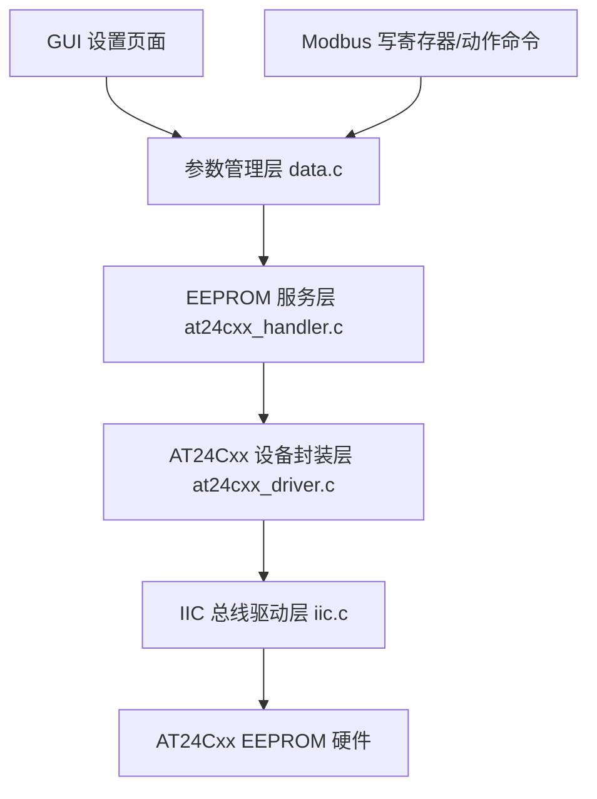
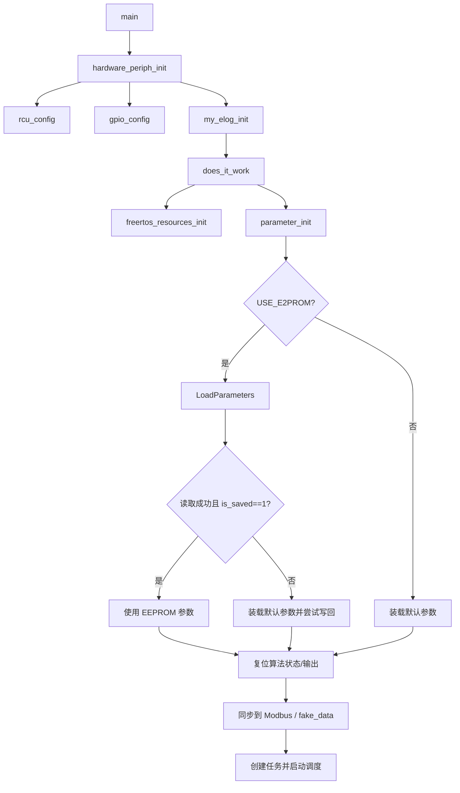

# EEPROM 参数存储子系统设计与实现分析文档

## 1. 文档说明与分析范围

本文档基于当前工作区中的 MCU 工程源码，对项目中的 EEPROM 参数存储子系统进行系统性分析。文档目标不是简单列举函数或源文件，而是从毕业设计论文撰写的角度，说明该子系统在整机软件架构中的定位、从应用层到驱动层的实现链路、与 Modbus 和图形界面的协同关系，以及其在参数掉电保存、配置管理和系统一致性方面所发挥的作用。

本文重点分析以下文件和模块：

- 应用层与参数层：`App/src/data.c`、`App/inc/data.h`、`App/inc/app_config.h`
- EEPROM 服务层与底层驱动层：`BSP/at24cxx/inc/*.h`、`BSP/at24cxx/src/*.c`
- IIC 驱动与硬件支撑：`periph/inc/iic.h`、`periph/src/iic.c`、`periph/src/gpio.c`、`periph/src/rcu.c`、`periph/src/periph_link.c`
- 系统启动与任务层：`User/main.c`、`TestTask/src/does_it_work.c`、`TestTask/src/task_e2prom.c`
- 与 EEPROM 有关的上层触发路径：`Middlewares/Modbus/src/modbus_execute.c`、`Middlewares/Modbus/src/modbus_frame_process.c`、`Middlewares/LVGL/GUI_APP/code/src/menu_setting_backend.c`、`Middlewares/LVGL/GUI_APP/code/src/menu_setting_session.c`

需要特别说明的是，工程中文件命名存在一定历史痕迹。用户需求中提到的 `i2c.c/i2c.h`，在当前工程中对应的实际文件是 `periph/src/iic.c` 与 `periph/inc/iic.h`。从代码内容看，这一组文件承担的正是 EEPROM 访问所依赖的 I2C 总线驱动职责。

## 2. EEPROM 子系统在整体软件架构中的定位

从软件分层角度看，EEPROM 子系统并不是一个孤立的驱动模块，而是由“参数管理层 + 存储服务层 + AT24Cxx 设备封装层 + IIC 总线驱动层”共同组成的纵向链路。它在整个系统中的位置可以概括为：上承参数系统、Modbus 通信和 GUI 设置，下接 AT24Cxx 型 EEPROM 器件与 IIC 硬件外设，承担系统运行参数的非易失性保存与恢复工作。

在业务意义上，该项目需要长期保存的并非瞬时测量结果，而是与测量行为密切相关的一组配置参数，例如管道内径、壁厚、流量报警上下限、零点学习参数、显示刷新率、Modbus 地址、流量单位等。这些参数一旦修改，如果仅保存在 RAM 中，那么复位或断电后将全部丢失，不利于设备工程化使用。因此，引入 EEPROM 的根本目的，是为配置参数提供一种掉电不丢失的存储载体，使设备具备“参数可配置、参数可保留、参数可恢复”的完整能力。

在系统关系上，EEPROM 子系统与多个模块形成协同：

- 与参数系统的关系最为紧密。`g_parameters` 作为全局参数结构体，是 EEPROM 读写的核心对象，参数层负责决定何时读取、何时保存以及保存失败时如何处理。
- 与 Modbus 的关系表现为：Modbus 写寄存器或执行“保存参数”“恢复默认”“软复位”等命令时，最终都会落到参数层，再由参数层决定是否写 EEPROM。
- 与 GUI 的关系表现为：设置页面确认某一项修改后，并不直接操作 EEPROM，而是调用参数系统统一提交接口，由参数系统决定是否持久化。
- 与 IIC 驱动的关系表现为：EEPROM 服务层并不自己操控寄存器，而是通过 `iic_driver_t` 提供的函数指针访问总线，保持了设备访问与总线访问之间的边界。
- 与任务层的关系则相对克制。当前正式主流程中，EEPROM 读写采用同步接口，不依赖独立后台服务任务；仅保留了测试任务和一条旧的异步备用路径。

从论文表达角度，可以将这一设计概括为：系统采用统一参数对象作为业务核心，通过参数管理层屏蔽上层来源差异，并通过 EEPROM 服务层与 IIC 驱动层实现参数的非易失性存储，从而构建出一条自上而下清晰分层的参数保存链路。



## 3. EEPROM 软件结构与模块职责划分

### 3.1 参数管理层

参数管理层集中在 `App/src/data.c`。该文件并不仅仅负责数据保存，而是维护了系统运行中的多个关键状态，包括：

- 全局参数结构体 `g_parameters`
- 算法状态 `g_algo_state`
- 算法输出 `g_algo_out`
- 报警状态 `g_alarm`

其中与 EEPROM 直接相关的接口主要包括：

- `parameter_init()`
- `parameter_commit()`
- `parameter_save_current()`
- `parameter_execute_action()`
- `SaveParameters()`
- `LoadParameters()`
- `parameter_storage_is_persistent()`

这说明 EEPROM 在当前工程中是“参数系统的一部分能力”，而不是一个完全独立的业务对象。也就是说，系统设计者并未让 GUI、Modbus 或其他模块直接面对 EEPROM 读写细节，而是将其收敛到统一的参数后端中，这种设计可以有效减少上层模块与底层存储的耦合。

### 3.2 EEPROM 访问封装层

`BSP/at24cxx/src/at24cxx_handler.c` 位于参数层与器件层之间，可以理解为 EEPROM 的服务层。其职责主要有两类：

1. 向上提供简单、统一的 EEPROM 读写接口
   - `eeprom_write_sync()`
   - `eeprom_read_sync()`
2. 保留一条历史异步访问能力
   - `e2prom_write_async()`
   - `e2prom_read_async()`
   - `task_e2prom_handler()`

当前正式链路实际上使用的是同步接口。同步接口内部会临时构造 `iic_driver_t`、`eeprom_chip_driver_t`、`eeprom_chip_config_t` 三类对象，然后完成一次 AT24Cxx 读写调用。其优点是调用简单、结构直观，不必引入额外任务和状态管理；代价是每次读写都会在调用现场阻塞等待 EEPROM 完成访问。

### 3.3 AT24Cxx 设备封装层

`BSP/at24cxx/src/at24cxx_driver.c` 对 AT24Cxx 类器件进行了专门封装。其职责包括：

- 初始化 EEPROM 设备默认参数
- 检查内存地址、页大小、地址宽度是否合法
- 按 AT24Cxx 写页规则分段写入
- 在每次写页之后轮询器件 ready 状态
- 在读写前检查 IIC 驱动资源是否完整

该层的意义在于将“AT24Cxx 这类 EEPROM 器件的协议特性”从通用 IIC 驱动中剥离出来。例如分页写、内部写周期等待、地址溢出检查等都属于器件级规则，而不应由通用 IIC 驱动承担。

### 3.4 底层 IIC 驱动层

底层 IIC 驱动由 `periph/inc/iic.h` 和 `periph/src/iic.c` 构成。它负责：

- 初始化 I2C0 外设
- 检查器件是否 ready
- 根据 8 位或 16 位内部地址格式执行内存读写
- 处理 START、重复 START、ACK、STOP 等总线时序
- 在总线 BUSY 或异常时执行总线恢复

从实现细节看，这一层是基于 GD32 标准外设库寄存器接口的阻塞式 I2C 驱动，而不是中断驱动或 DMA 驱动。对于 EEPROM 这种低速、低频、配置型访问对象而言，这种设计是合理的，因为它可以显著降低软件复杂度。

### 3.5 分层结构的工程作用

这一套分层结构的工程意义在于：

- 参数系统只关心“是否需要保存”和“保存结果如何”
- EEPROM 服务层只关心“调用哪种 EEPROM 访问方式”
- AT24Cxx 封装层只关心“页写、ready、器件边界”
- IIC 驱动层只关心“总线时序和硬件访问”

这种分工使每一层都围绕相对单一的职责展开，便于后续替换某一层而不破坏其他模块。例如，若后续更换为其他 EEPROM 型号或 SPI Flash，参数系统接口未必需要改变；若后续将阻塞式 IIC 改成中断式 IIC，AT24Cxx 与参数层接口也可以尽量保持不变。

## 4. 系统启动后参数初始化与加载流程

### 4.1 启动顺序

结合 `User/main.c`、`periph/src/periph_link.c` 和 `TestTask/src/does_it_work.c`，系统启动后与 EEPROM 有关的真实执行顺序如下：

1. `main()`
   - 调用 `hardware_periph_init()`
   - 调用 `my_elog_init()`
   - 调用 `does_it_work()`

2. `hardware_periph_init()`
   - 执行 `SystemInit()`
   - 调用 `rcu_config()` 开启外设时钟
   - 调用 `gpio_config()` 配置 GPIO
   - 初始化其他运行所需外设

3. `rcu_config()`
   - 打开 `RCU_GPIO_EEPROM_I2C_PORT`
   - 打开 `RCU_EEPROM_I2C`

4. `gpio_config()`
   - 将 `EEPROM_I2C_SCL_PIN`、`EEPROM_I2C_SDA_PIN` 配置为 `GPIO_MODE_AF_OD`
   - 将两根线置高，释放总线

5. `does_it_work()`
   - 调用 `freertos_resources_init()`
   - 调用 `parameter_init()`
   - 调用 `init_modbus_data()`
   - 创建任务并启动调度器

可见，参数初始化发生在任务创建之前。这一点十分关键，因为这样可以保证后续 GUI、Modbus、假数据、算法等模块在启动后看到的是已经确定好的参数状态，而不是边运行边等待参数装载完成。

### 4.2 板卡能力判断

工程通过 `App/inc/app_config.h` 中的宏定义区分板卡能力：

```c
#if defined(CCT6)
#define BOARD_HAS_E2PROM 1
#elif defined(RCT6)
#define BOARD_HAS_E2PROM 0
#else
#define BOARD_HAS_E2PROM 1
#endif

#ifndef USE_E2PROM
#define USE_E2PROM BOARD_HAS_E2PROM
...
#endif
```

由此可以推断，当前工程依赖构建目标或编译选项定义 `CCT6`/`RCT6` 宏。随后 `USE_E2PROM` 再继承该板级能力，从而决定参数系统和 EEPROM 服务层是否真的启用非易失性保存功能。

### 4.3 `parameter_init()` 的实际行为

`parameter_init()` 是系统启动后参数加载的总入口，其设计思路为：

- 若当前板卡支持 EEPROM，则优先尝试从 EEPROM 读取 `g_parameters`
- 若读取失败，则退回默认参数，并尝试写回默认值
- 若读取成功但 `is_saved != 1`，则认为 EEPROM 中没有有效参数，仍回退默认值并写回
- 若板卡不支持 EEPROM，则直接使用默认参数

在非 EEPROM 板卡上，日志会输出：

`parameter init: use default, eeprom disabled on this board`

随后，参数层还会初始化算法状态、算法输出和报警状态，并调用 `parameter_sync_external_state()` 将参数同步给：

- Modbus holding registers
- Modbus input registers
- fake_data 配置刷新请求

这意味着参数加载完成后，系统并不是只更新 `g_parameters`，而是会把它转化为多处外部可见状态，保证上电后 GUI、Modbus 和模拟数据链路尽快进入一致状态。



### 4.4 一个值得指出的代码现象

根据 `App/src/data.c` 当前实现推断，在 `USE_E2PROM` 为真且 `LoadParameters()` 失败时，`parameter_init()` 会在写回默认参数后直接 `return`。这会导致后续的：

- `kf = make_default_kalman_state();`
- `g_algo_state = make_default_algo_state();`
- `g_algo_out = make_default_algo_out(&g_parameters);`
- `parameter_sync_external_state();`

这些步骤被跳过。该行为在当前 `RCT6` 无 EEPROM 的主测试链中不会触发，但在 `CCT6` 上首次装机或 EEPROM 异常时可能带来初始化不完整的风险。对于论文中的“可优化点”部分，这是一个值得客观指出的实现细节。

## 5. EEPROM 读取机制分析

### 5.1 读取入口

EEPROM 读取的上层入口是 `LoadParameters(Pipe_Parameters_t *para)`。该函数位于 `App/src/data.c`，本身只做最薄的一层封装：

- 检查参数指针是否为空
- 如果 `USE_E2PROM` 为真，则调用 `eeprom_read_sync(E2PROM_PIPE_PARA_START_ADDR, ...)`
- 如果 `USE_E2PROM` 为假，则返回 `E2PROM_ERROR_RESOURCE`

因此，参数系统并不自己实现 EEPROM 时序，而是把具体读操作交给 EEPROM 服务层。

### 5.2 读取数据的存储形式

当前工程采用的是最直接的存储策略：将 `Pipe_Parameters_t` 结构体按内存布局整体写入 EEPROM，读取时再整体读回。具体表现为：

```c
return eeprom_read_sync(E2PROM_PIPE_PARA_START_ADDR,
                        (uint8_t *)para,
                        sizeof(Pipe_Parameters_t));
```

这种设计的优点是实现简单、代码量小、参数增删时上层改动少；但它也有明显前提：

- 编译器、ABI、结构体对齐方式需要保持一致
- `double`、枚举和整数类型的布局必须在读写两端一致
- 结构体版本变化时，旧数据可能无法兼容

因此，这种“按结构体整体镜像存储”的方案非常适合当前单 MCU、单编译链、阶段性验证的项目环境，但若后续考虑跨版本升级或长期维护，就需要进一步增强版本兼容和数据完整性设计。

### 5.3 EEPROM 服务层读取过程

`eeprom_read_sync()` 会进入 `BSP/at24cxx/src/at24cxx_handler.c` 中的 `eeprom_access_sync_internal()`。该函数的执行过程如下：

1. 在栈上创建一个 `iic_driver_t`
2. 在栈上创建一个 `eeprom_chip_driver_t`
3. 在栈上创建一个 `eeprom_chip_config_t`
4. 调用 `iic_driver_init(&i2c_driver)`
5. 调用 `at24cxx_driver_init(&eeprom_chip_driver)`
6. 调用 `eeprom_chip_driver.pf_init(&eeprom_chip_config)` 初始化器件参数
7. 调用 `i2c_driver.pf_iic_init(...)` 初始化 IIC 外设
8. 若操作类型为读，则调用 `eeprom_chip_driver.pf_read(...)`

从结构上看，服务层每次访问 EEPROM 都临时构造一次设备与驱动对象，而不是依赖全局单例。这种方式简化了生命周期管理，也避免了系统初始化顺序耦合，但代价是每次读写都要重复初始化访问上下文。

### 5.4 AT24Cxx 设备层读取过程

`at24cxx_read()` 是具体读流程的关键。它大致执行以下步骤：

1. 检查缓冲区指针是否为空
2. 调用 `at24cxx_check_args()` 检查地址范围、页配置、长度是否合法
3. 调用 `at24cxx_check_iic_driver()` 检查 IIC 驱动对象是否有效
4. 调用 `at24cxx_wait_ready()` 等待 EEPROM ready
5. 调用 `pf_iic_mem_read()` 执行底层内存读
6. 将 IIC 返回码映射为 AT24Cxx 状态码

这里体现出一个明显的工程思想：器件层负责把“总线访问成功”进一步解释为“器件访问成功”，从而为上层屏蔽底层 IIC 错误细节。

### 5.5 底层 IIC 读时序

`iic_mem_read()` 是 EEPROM 读链的最底层关键函数。其典型时序为：

1. 检查总线是否空闲
2. 若 BUSY，则执行 `iic_bus_recover()` 尝试恢复总线
3. 发送 START
4. 发送器件地址 + 写方向
5. 发送 EEPROM 内部地址（8 位或 16 位）
6. 发送重复 START
7. 发送器件地址 + 读方向
8. 按字节接收数据
9. 在最后一个字节前关闭 ACK 并发 STOP

这一流程符合典型的 EEPROM 随机地址读协议。由于 EEPROM 访问并不依赖中断，整个过程在调用现场阻塞完成。

### 5.6 读取失败后的回退策略

当前工程的回退策略比较直接：

- 只要 `LoadParameters()` 失败，就使用默认参数
- 若读到的数据中 `is_saved != 1`，也使用默认参数
- 使用默认参数后，会尝试将默认参数重新写入 EEPROM

这种策略的优点是简单、行为明确、不会因为 EEPROM 异常导致系统无参数可用；但局限也很明显：

- 没有对读取出的参数结构体做 `parameter_validate()`
- 没有 CRC、版本号或长度签名
- 仅凭 `is_saved` 一个标志位来判断参数是否有效

这意味着如果 EEPROM 中数据发生部分损坏，但 `is_saved` 恰好仍为 1，那么当前代码有可能将损坏参数当作有效参数接受。根据代码推断，这是当前 EEPROM 可靠性设计中最明显的增强空间之一。

## 6. EEPROM 写入机制分析

### 6.1 写入触发来源

当前工程中，EEPROM 写入触发并不是由一个单独的“存储任务”统一发起，而是由多个上层业务入口汇聚到参数系统后，再由参数系统同步写入。主要触发来源包括：

1. 系统启动时
   - EEPROM 读取失败后写入默认参数
   - EEPROM 空白时写入默认参数

2. 参数提交时
   - `parameter_commit()` 内部会调用 `parameter_try_save_current_state()`

3. 显式保存命令时
   - `parameter_save_current()`

4. Modbus 动作命令时
   - `MODBUS_CMD_SAVE_PARAMETERS`
   - `MODBUS_CMD_SOFT_RESET`（在持久化板卡上复位前先保存）

5. GUI 设置确认时
   - 当前 GUI 并没有单独的“保存参数”菜单项
   - 但数值和选项确认最终会进入 `parameter_set_double()` 或 `parameter_set_u32()`，再汇聚到 `parameter_commit()`
   - 因而在持久化板卡上，GUI 修改也会触发 EEPROM 保存

### 6.2 写入入口

写入的直接上层入口是 `SaveParameters(Pipe_Parameters_t *para)`。该函数同样位于 `App/src/data.c`，最终调用：

```c
eeprom_write_sync(E2PROM_PIPE_PARA_START_ADDR,
                  (const uint8_t *)para,
                  sizeof(Pipe_Parameters_t));
```

可以看到，当前工程采用的是“整结构体整体写入”的方式，而不是按字段或按脏区增量写入。

### 6.3 `parameter_commit()` 如何触发写入

`parameter_commit()` 是当前参数系统的核心接口。其流程为：

1. 复制候选参数
2. 根据板卡设置 `is_saved`
3. 对单位切换导致的流量报警阈值自动换算
4. 调用 `parameter_validate()` 检查合法性
5. 判断本次修改是否需要复位测量状态
6. 将候选参数写入 `g_parameters`
7. 调用 `parameter_try_save_current_state(&g_parameters)`
8. 若保存失败，则回滚旧参数并同步外部状态
9. 若成功，则必要时复位测量状态并同步外部状态

这一设计体现出一个非常重要的思想：参数提交与参数持久化是在同一条主流程中完成的，但逻辑上又被清晰分为“先校验、再应用、后保存、失败回滚”。也就是说，EEPROM 保存不是孤立动作，而是参数状态机的一部分。

### 6.4 `parameter_try_save_current_state()` 的板卡分流

`parameter_try_save_current_state()` 的逻辑非常关键：

- 若当前板卡不支持持久化，则直接返回 `PARAMETER_APPLY_OK`，同时强制 `is_saved = 0`
- 若当前板卡支持持久化，则将 `is_saved = 1`，调用 `SaveParameters()`
- 若写入失败，则把 `is_saved` 重新清零

因此，`is_saved` 在当前工程中不只是一个显示字段，更是参数持久化结果的状态标志。它能够把 EEPROM 真实写入结果反馈给上层 GUI、Modbus 离散输入和保持寄存器。

### 6.5 EEPROM 服务层写入过程

同步写入由 `eeprom_write_sync()` 进入 `eeprom_access_sync_internal()`，随后调用 `at24cxx_write()` 完成。该流程与读过程类似，但器件层多了一层分页写逻辑。

### 6.6 AT24Cxx 写页机制

`at24cxx_write()` 的核心是按页写入。其内部会不断循环，直到所有数据写完。每一轮都会计算：

- 当前地址在页内的偏移 `page_offset`
- 当前页剩余可写空间 `page_left`
- 剩余待写字节数 `remain`
- 本轮实际写入长度 `chunk`

随后，函数只写当前页允许的那一段，写完以后调用 `at24cxx_wait_ready()` 轮询 EEPROM 是否完成内部写周期，再继续下一页。

这种分页写策略与 AT24Cxx 器件的物理特性密切相关：如果跨页连续写而不分段，器件地址可能发生页内回卷，从而导致数据错乱。因此，这一实现既体现了对器件协议特性的理解，也构成了 EEPROM 可靠写入的重要保障。

### 6.7 底层 IIC 写过程

`iic_mem_write()` 执行阻塞式写时序，包括：

1. 等待总线空闲
2. 若 BUSY，则执行总线恢复
3. 发送 START
4. 发送器件地址 + 写方向
5. 发送 EEPROM 内部地址
6. 逐字节发送数据
7. 等待 `BTC`
8. 发送 STOP

该函数本身不做分页，而是由 AT24Cxx 层决定每一轮传入多少数据。也就是说，分页属于器件层语义，字节时序属于总线层语义，职责划分较为清晰。

### 6.8 写入结果如何反馈给上层

写入结果通过多级状态码映射返回上层：

- IIC 层：`IIC_OK / IIC_BUSY / IIC_TIMEOUT / ...`
- AT24Cxx 层：`AT24CXX_OK / AT24CXX_TIMEOUT / ...`
- EEPROM 服务层：`E2PROM_OK / E2PROM_ERROR_RESOURCE / ...`
- 参数层：`PARAMETER_APPLY_OK / PARAMETER_APPLY_BUSY / PARAMETER_APPLY_SAVE_FAILED`

最终，GUI 设置会显示 `SAVE OK`、`SAVE FAIL`、`STORAGE BUSY` 等文本；Modbus 则会把参数保存失败映射为相应异常码或状态位。这种逐层映射方式使不同上层模块可以根据自身表现形式处理同一底层错误。

## 7. 参数系统与 EEPROM 的衔接分析

### 7.1 `Pipe_Parameters_t` 是核心存储对象

EEPROM 保存的核心对象是 `Pipe_Parameters_t`。该结构体包含：

- 几何与物理参数
- 流速上下限
- 流量报警上下限
- 零点学习参数
- 系统固定误差参数
- 保存状态、输出模式、显示灵敏度等整型配置
- `modbus_addr`
- 单位与管材枚举

可以看出，系统并未采用“多个分散配置项分别读写”的思路，而是用一个统一参数对象承载全部持久化配置。这样做的好处是数据组织集中，易于整体提交和整体恢复，也便于 GUI 和 Modbus 使用统一的参数视图。

### 7.2 参数合法性与存储动作分离

`parameter_commit()` 与 `SaveParameters()` 的分工体现了明显的层次设计：

- `parameter_commit()` 负责业务逻辑：
  - 参数校验
  - 参数对比
  - 单位换算
  - 测量状态重置
  - 外部状态同步
- `SaveParameters()` 负责存储动作：
  - 指定 EEPROM 起始地址
  - 调用同步写接口

这一设计非常适合论文中提炼为“业务层与存储层解耦”。也就是说，参数是否合理由参数系统决定，参数如何写到器件上由存储层决定，两者不相互侵入。

### 7.3 立即生效与持久化存储的关系

当前参数修改分为两个结果：

1. 运行时立即生效
   - `g_parameters` 更新
   - 必要时 `parameter_reset_measurement_state()`
   - `parameter_sync_external_state()` 同步到 Modbus 和 fake_data

2. 持久化生效
   - 若板卡支持 EEPROM，则尝试写入 EEPROM
   - 若成功，`is_saved = 1`
   - 若失败，参数回滚

这种设计意味着：系统并没有把“写 EEPROM”作为参数生效的唯一条件，而是先形成新的运行时状态，再视情况持久化。如果持久化失败，则整体回滚。这个策略兼顾了实时运行一致性与掉电保存一致性。

### 7.4 默认值恢复的实现

当前代码中没有独立的 `parameter_load_defaults()` 函数。与用户表述相对应的实际实现是：

- `parameter_execute_action(PARAMETER_ACTION_LOAD_DEFAULTS)`
- 内部再调用 `parameter_commit(get_default_pipe_parameters_ptr())`

因此，恢复默认值本质上仍然是一次参数提交，而不是旁路操作。这使得默认值恢复、GUI 修改和 Modbus 改写三类来源最终都走统一校验与同步流程，保证系统行为一致。

## 8. `RCT6` 与 `CCT6` 板卡差异化逻辑分析

### 8.1 差异化宏定义

板卡差异是通过 `app_config.h` 中的条件编译宏控制的。其效果可以概括为：

- `CCT6`：`BOARD_HAS_E2PROM = 1`
- `RCT6`：`BOARD_HAS_E2PROM = 0`
- `USE_E2PROM` 默认继承该能力

### 8.2 `RCT6` 下的行为

在 `RCT6` 无 EEPROM 条件下：

- `parameter_storage_is_persistent()` 返回 `false`
- `parameter_try_save_current_state()` 直接返回成功，但会强制 `is_saved = 0`
- `SaveParameters()` 和 `LoadParameters()` 返回 `E2PROM_ERROR_RESOURCE`
- `parameter_init()` 直接装载默认参数，不尝试访问 EEPROM

这意味着 `RCT6` 可以完成 GUI、Modbus、算法链路的运行时参数联调，但不会发生真正的掉电保存。这个设计非常适合当前项目的开发阶段：即使硬件上未接 EEPROM，也能先验证上层配置逻辑是否正确。

### 8.3 `CCT6` 下的行为

在 `CCT6` 下，若构建目标启用了 EEPROM：

- 系统上电时优先尝试从 EEPROM 读取参数
- GUI 或 Modbus 修改参数后会触发真正的 EEPROM 写入
- `is_saved` 可被置为 1
- 软复位前会尝试保存当前参数

### 8.4 条件编译方式的工程意义

这种条件编译方式的优点在于：

- 上层参数接口保持不变
- 运行逻辑在不同板卡之间尽量一致
- 仅在存储能力存在与否上分叉
- 便于在开发板资源不完整时先验证软件主链

在毕业设计论文中，可以将其提炼为“面向多板卡资源差异的软件适配设计”。即：通过板级宏定义控制非易失性资源能力，使上层参数管理与通信界面逻辑无需因硬件差异而大范围重写。

## 9. EEPROM 与 Modbus、GUI 的关系

### 9.1 Modbus 到 EEPROM 的触发链

Modbus 与 EEPROM 的关系主要通过参数层建立：

1. 写保持寄存器时，`modbus_frame_process.c` 会先更新 holding register 镜像
2. 调用 `fill_parameters_from_holding_registers()` 还原一份参数结构
3. 调用 `parameter_commit(&new_parameters)`
4. 参数层根据板卡能力决定是否写 EEPROM

此外，某些线圈动作命令会进入 `task_modbus_execute()`：

- `MODBUS_CMD_SAVE_PARAMETERS` -> `parameter_save_current()`
- `MODBUS_CMD_LOAD_DEFAULT_PARAMETERS` -> `parameter_execute_action(PARAMETER_ACTION_LOAD_DEFAULTS)`
- `MODBUS_CMD_SOFT_RESET` -> 若支持持久化则先 `parameter_save_current()`

可以看到，Modbus 并不直接依赖 EEPROM 驱动，而是依赖统一参数接口。这种设计避免了协议层与存储层直接耦合。

### 9.2 GUI 到 EEPROM 的触发链

GUI 当前菜单系统中，数值设置和选项设置的确认动作最终会走：

- `menu_setting_backend_commit_numeric()` -> `parameter_set_double()`
- `menu_setting_backend_commit_option()` -> `parameter_set_u32()`

而这两个接口最终都会进入 `parameter_commit()`。因此，在持久化板卡上，GUI 的参数确认也会触发 EEPROM 写入。

需要客观指出的是，根据当前 `menu_data.c` 的菜单树定义，GUI 菜单中并没有显式暴露“保存参数”或“恢复默认值”的独立菜单项。也就是说，GUI 当前更偏向“修改即提交”的模式，而不是“先编辑多项，再统一保存”的模式。这是当前 GUI 工程实现的一个实际特点。

### 9.3 系统一致性价值

GUI 与 Modbus 虽然是两条完全不同的人机交互入口，但在底层它们共用同一套参数与存储后端，这带来三方面价值：

1. 一致性
   - 任何入口修改参数，最终结果都写回 `g_parameters`
   - `is_saved`、Modbus holding registers、GUI 显示状态能保持一致

2. 可维护性
   - 参数校验、回滚、同步逻辑只实现一遍
   - 不会出现“GUI 一套保存逻辑、Modbus 另一套保存逻辑”的分裂

3. 可扩展性
   - 后续若新增串口调试命令、上位机配置工具或蓝牙配置入口，也可以继续复用 `parameter_commit()`


## 10. IIC 驱动与底层硬件支撑分析

### 10.1 硬件初始化支撑

EEPROM 底层访问依赖 `periph_link.c` 调起的基础硬件初始化。其中：

- `rcu_config()` 负责开启 GPIOB 和 I2C0 时钟
- `gpio_config()` 将 PB6/PB7 配置为开漏复用功能

从命名与引脚定义可知，当前 EEPROM 使用的是：

- `EEPROM_I2C = I2C0`
- `EEPROM_I2C_SCL_PIN = GPIO_PIN_6`
- `EEPROM_I2C_SDA_PIN = GPIO_PIN_7`

### 10.2 总线恢复机制

`iic.c` 中最值得关注的实现之一是 `iic_bus_recover()`。其大致流程为：

1. 关闭 I2C 外设
2. 将 SCL/SDA 切换为 GPIO 开漏输出
3. 释放总线
4. 如果 SDA 仍被拉低，则手动向 SCL 输出最多 9 个脉冲
5. 人工构造 STOP：SDA low -> SCL high -> SDA high
6. 再切回 AF_OD 模式

这是一种典型的 I2C 总线卡死恢复策略，常用于从机异常占线或上一次传输中断导致 BUSY 无法释放的场景。对于 EEPROM 这种需要长期稳定访问的器件来说，这一恢复机制对现场可靠性很有价值。

### 10.3 阻塞式 IIC 的工程取舍

当前 EEPROM 访问并未使用 I2C 中断或 DMA，而是使用基于状态标志位轮询的阻塞式实现。其优点是：

- 实现简单
- 调试容易
- 状态可控
- 更适合低频配置型访问

缺点则是：

- 访问期间会占用调用现场 CPU
- 若未来 EEPROM 操作频率增加，可能影响系统实时性

但结合当前项目实际情况，EEPROM 写入通常只发生在参数保存、恢复默认、初始化装载等低频场景，因此阻塞式实现是一个合理的工程取舍。

### 10.4 对平台和器件替换的适应性

从接口层次看，当前设计已经具备一定的可替换性：

- `iic_driver_t` 封装了底层 IIC 操作函数
- `at24cxx_driver_t` 封装了器件级访问逻辑
- EEPROM 服务层依赖的是这两类抽象对象

因此，如果后续更换 EEPROM 型号，只要新的器件仍使用 I2C 且支持类似随机读写模型，就可以优先替换 `at24cxx_driver` 层；若更换主控平台，则可以优先替换 `iic.c` 层，而尽量保持参数与 EEPROM 服务层接口不变。

## 11. 任务协同、实时性与工程取舍分析

### 11.1 当前是否依赖独立 EEPROM 任务

当前正式主流程并不依赖独立 EEPROM 任务。`does_it_work.c` 中：

- `task_e2prom` 的创建代码被注释掉
- `task_e2prom_handler` 也没有被创建

这意味着正式参数保存链路采用的是同步阻塞式访问，而不是后台任务式访问。

### 11.2 `task_e2prom.c` 的定位

`TestTask/src/task_e2prom.c` 是一个典型的测试任务。其逻辑为：

1. 构造一段测试数据
2. 写入固定地址 `0x0040`
3. 延时等待内部写周期结束
4. 再读回相同长度数据
5. 比较写入与读出结果

这一任务显然不属于正式参数存储主链，而是用于早期验证 EEPROM 硬件连通性和同步读写 API 是否可用。因此，在论文分析中应将其归类为“测试验证链”，而不应误判为系统正式架构的一部分。

### 11.3 异步 EEPROM 服务的定位

`at24cxx_handler.c` 中保留了：

- `task_e2prom_handler()`
- `e2prom_write_async()`
- `e2prom_read_async()`

根据代码和注释推断，这是一条“历史异步备用路径”或“回滚路径”。其特点是：

- 通过队列提交 EEPROM 事件
- 由后台任务统一执行

但在当前工程中，这条路径没有接入主流程，因此更适合被视为预留方案，而不是当前正式实现。

### 11.4 对实时性的影响

同步 EEPROM 访问对实时性的影响主要体现在：

- GUI 确认参数时会在当前任务中同步写入
- Modbus 执行保存命令时会在任务上下文中同步写入
- 系统初始化时也会同步读写 EEPROM

这种实现对实时性并非最优，但胜在简单、易控、故障面小。考虑到 EEPROM 写入属于低频操作，且写一整份参数结构体的耗时相对可接受，这种设计在当前阶段是合理的。对于论文而言，可以将其表述为“在系统复杂度与实时性需求之间的折中取舍”。

## 12. 当前实现的工程特点、亮点与可优化点

### 12.1 主要工程特点

当前 EEPROM 子系统的工程特点可以概括为以下几点：

1. 以参数对象为中心
   - 参数系统是核心，EEPROM 只是参数系统的一项能力

2. 分层比较清晰
   - 参数层、服务层、器件层、总线层分工明确

3. 板卡差异处理自然
   - 通过 `USE_E2PROM` 屏蔽 RCT6/CCT6 差异

4. 正式主链偏同步、偏简单
   - 适合当前开发阶段的稳定联调

5. 保留测试与备用实现
   - 有利于阶段性验证，也保留后续扩展空间

### 12.2 亮点

从论文角度看，这部分代码的亮点主要体现在：

- 通过统一参数接口把 GUI、Modbus 和 EEPROM 串联起来，体现了模块解耦思想
- 通过板级宏定义支持多硬件版本差异，体现了条件编译适配能力
- 通过 AT24Cxx 分页写与 ready 轮询，体现了对非易失性器件访问特性的理解
- 通过 I2C 总线恢复机制增强了现场鲁棒性
- 通过 `is_saved` 状态把底层存储结果反馈到上层显示与通信侧，形成闭环

### 12.3 需要客观指出的可优化点

1. 启动读取后缺少完整合法性校验
   - 读取到参数后并未调用 `parameter_validate()`

2. 缺少数据完整性校验
   - 没有 CRC、签名或校验和

3. 缺少版本管理
   - 结构体字段变化后可能导致旧数据不兼容

4. 缺少双备份或冗余区
   - 一旦单份数据损坏，恢复能力有限

5. 结构体整体镜像依赖 ABI 稳定
   - `double`、对齐与填充都可能带来兼容性风险

6. 同步写入对实时性仍有一定影响
   - 尽管当前频率低，但若未来保存更频繁，可考虑启用异步后台任务

7. `parameter_init()` 在 EEPROM 读失败分支存在提前返回
   - 可能造成初始化链不完整

这些问题并不意味着当前设计不可用，而是说明当前实现更适合“单平台、单编译环境、开发与验证阶段”的工程目标。对于毕业设计论文，客观指出这些可优化方向反而能体现分析深度。

## 13. 可直接支撑毕业论文撰写的内容提炼

基于当前源码，EEPROM 子系统可以在论文中提炼出以下几个较完整的设计点。

### 13.1 面向测量设备的非易失性参数存储设计

本项目将管道几何参数、报警阈值、零点学习参数、通信地址与显示配置统一封装为 `Pipe_Parameters_t`，并通过 EEPROM 实现掉电保存。该设计保证了设备在重新上电后能够快速恢复到上次配置状态，避免了重复配置，提高了测量设备的工程实用性。

### 13.2 参数管理与底层存储解耦设计

系统没有让 GUI、Modbus 或其他上层模块直接调用底层 EEPROM 接口，而是通过 `parameter_commit()`、`parameter_save_current()` 等统一参数接口完成参数合法性检查、状态同步和持久化控制。该设计有效降低了业务层与硬件驱动层之间的耦合，提高了软件结构的可维护性。

### 13.3 多板卡条件编译适配的参数保存架构

通过 `BOARD_HAS_E2PROM` 与 `USE_E2PROM` 宏定义，系统能够在 `RCT6` 与 `CCT6` 等不同硬件平台之间切换参数持久化能力。该机制使软件框架能够在硬件资源不完全一致的情况下保持统一的参数接口和上层行为，体现了嵌入式系统中软硬件协同适配的设计思想。

### 13.4 GUI/Modbus 共用参数与存储后端的统一设计

GUI 菜单设置与 Modbus 通信写寄存器虽然来源不同，但最终都汇聚到同一参数系统，并共享同一 EEPROM 保存后端。这种设计保证了不同交互入口在参数修改、保存状态显示和掉电恢复方面的一致性，是系统集成设计中的一个重要亮点。

### 13.5 参数初始化、默认值恢复与掉电保存机制

系统启动时优先加载 EEPROM 中的历史参数；若读取失败或参数无效，则回退到默认参数，并在支持 EEPROM 的板卡上写回默认值。该机制在保证系统可启动性的同时，为参数恢复提供了兜底路径，体现了嵌入式设备在异常条件下的鲁棒性设计思想。

### 13.6 非易失性存储在系统可靠性中的作用

EEPROM 子系统不仅用于掉电保存，还通过 ready 轮询、页写控制、总线恢复和状态标记等机制，提升了参数存储链路的可靠性。对于毕业设计论文而言，可以将其总结为“在资源受限 MCU 平台上实现稳定参数持久化”的工程实践。

## 14. 结论

综合当前工程源码可以看出，本项目的 EEPROM 子系统已经形成了一条较完整的“应用层参数管理 -> EEPROM 服务层 -> AT24Cxx 器件封装层 -> IIC 总线驱动层 -> 硬件器件”的实现链路。它并非孤立的存储驱动，而是深度嵌入到参数系统、Modbus 通信和图形界面之中的一项系统级能力。

从正式主链来看，当前工程采用的是同步阻塞式 EEPROM 访问模式。该模式结构简单、容易验证，适合当前毕业设计的开发与联调阶段。与此同时，工程又通过板级宏定义对 `RCT6` 与 `CCT6` 的硬件差异进行了适配，使得在无 EEPROM 的开发板上也能先验证参数读写逻辑和上层交互流程。

从软件架构角度看，这一实现体现了以下几个较为明确的设计思想：以统一参数对象为核心、以统一提交接口为收口、通过服务层与器件层分离硬件细节、通过条件编译适配多板卡能力、通过状态同步维持 GUI/Modbus/参数系统一致性。上述内容不仅支撑了工程当前功能实现，也能够较自然地转化为毕业设计论文中关于“参数存储设计”“掉电保存机制”“分层软件架构”“系统可靠性设计”的分析内容。

同时也应客观看到，当前实现仍保留若干可提升空间，例如缺少 EEPROM 数据完整性校验、缺少版本管理和双备份机制、启动读取后的参数合法性判断不够完整等。这些问题并不削弱当前实现的工程价值，反而为论文中的“后续优化方向”提供了较明确的技术切入点。
