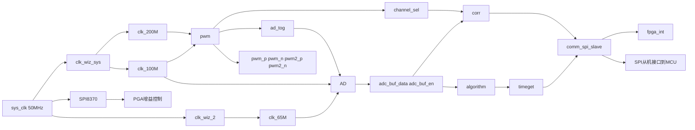
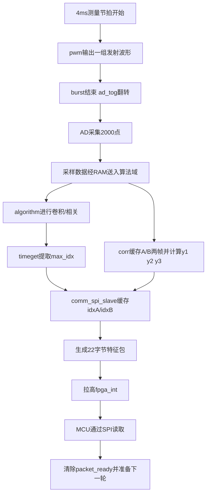
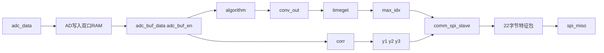
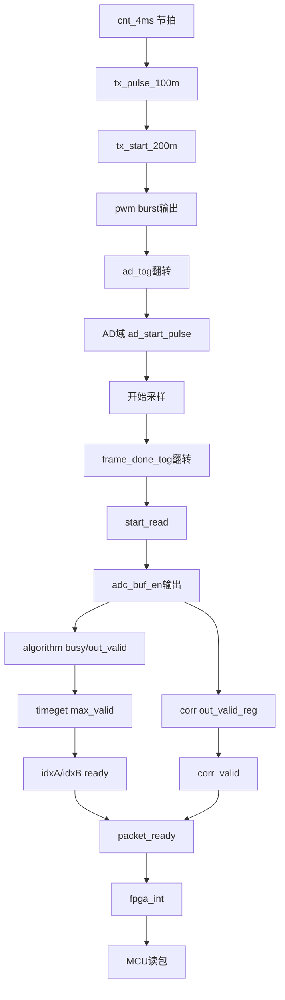

# FPGA核心模块结构与运行逻辑分析文档

## 1. 文档说明与分析范围

本文档基于当前工作区中的 FPGA 工程源码，对本项目 FPGA 侧的核心 Verilog 代码与运行逻辑进行系统分析。文档的目标不是简单罗列模块名称，而是形成一份能够直接服务于毕业设计写作的“FPGA 核心模块结构与运行逻辑分析文档”，重点说明 FPGA 在整机测量主链中的定位、内部模块分工、运行流程、数据流、控制流以及与 MCU 的接口关系。

本次分析主要覆盖以下源码文件：

- `FPGA_prj_code/RUF_MIX.srcs/sources_1/new/RUF.v`
- `FPGA_prj_code/RUF_MIX.srcs/sources_1/new/Top.v`
- `FPGA_prj_code/RUF_MIX.srcs/sources_1/new/pwm.v`
- `FPGA_prj_code/RUF_MIX.srcs/sources_1/new/AD.v`
- `FPGA_prj_code/RUF_MIX.srcs/sources_1/new/algorithm.v`
- `FPGA_prj_code/RUF_MIX.srcs/sources_1/new/timeget.v`
- `FPGA_prj_code/RUF_MIX.srcs/sources_1/new/corr.v`
- `FPGA_prj_code/RUF_MIX.srcs/sources_1/new/DeltaT.v`
- `FPGA_prj_code/RUF_MIX.srcs/sources_1/new/comm_spi_slave.v`
- `FPGA_prj_code/RUF_MIX.srcs/sources_1/new/communication.v`
- `FPGA_prj_code/RUF_MIX.srcs/sources_1/new/SPI8370.v`

同时，文档参考了目录 `FPGA代码的markdown文档/` 中已有的模块设计说明文档。这些已有文档在模块设计目标、架构设计、详细逻辑分析等方面提供了较好的写作风格参考，但本文所有结论均以当前 Verilog 源码为准。需要特别指出的是，已有 Markdown 文档与当前源码之间存在一定版本差异，尤其体现在顶层集成方式、通信模块以及时差提取模块的实现路径上，后文会专门说明。

---

## 2. FPGA 在整机系统中的定位

### 2.1 模块设计目标

从整机角度看，本项目是一套基于 FPGA 与 MCU 协同工作的超声流量计系统。其中 FPGA 并不直接完成最终流量值输出，而是承担超声测量前端中最强调实时性、并行性和时序一致性的部分，包括：

- 发射控制与双通道切换
- ADC 采样触发与高速数据采集
- 参考卷积或相关计算
- 峰值索引提取
- 互相关特征值提取
- 特征数据打包
- 与 MCU 的 SPI 接口协同

因此，FPGA 在整机中的定位可以概括为“测量特征前处理核心”。它将原始超声回波信号转换为可供 MCU 继续解释和换算的特征量数据包。

### 2.2 FPGA 与 MCU 的分工边界

根据当前代码，可以将软硬件分工概括如下：

| 处理阶段 | FPGA 负责内容 | MCU 负责内容 |
| --- | --- | --- |
| 前端激励 | 产生超声驱动波形、节拍控制、通道轮换 | 不直接参与 |
| 数据采样 | 触发 ADC、采集回波、缓冲存储 | 不直接参与 |
| 特征提取 | 卷积/相关、峰值定位、互相关三点值生成 | 不直接参与 |
| 数据交互 | 特征量打包、SPI 从机输出、事件中断 | SPI 主机读取 |
| 物理量解释 | 不负责最终流量解释 | 根据特征量换算 `t1/t2/dt`、流速、流量、累计量、报警 |

可以看到，FPGA 负责的是“从原始回波到时差特征”的阶段，而 MCU 负责“从时差特征到工程量输出”的阶段。

### 2.3 为什么 FPGA 输出给 MCU 的不是最终流量值

这是本项目架构中的关键设计点。FPGA 输出给 MCU 的数据并不是“最终流量值”，而是由 `idxA / idxB / y1 / y2 / y3` 组成的特征数据包，原因主要有以下几点：

1. 最终流量结果强依赖管径、壁厚、声程角、管材、单位制、零漂参数、报警阈值等可配置参数，这些内容更适合由 MCU 参数系统统一管理。
2. MCU 侧还需要负责 GUI、Modbus、EEPROM、日志和任务调度等系统级功能，因此让 MCU 掌握最终结果的解释权更有利于整机软件结构统一。
3. 如果把所有换算逻辑固化在 FPGA 中，则每次修改参数模型或算法后处理方式都需要修改 HDL，灵活性较差。
4. 当前 FPGA 输出的特征量已经足够表达测量本质，MCU 只需做时间差细化换算与工程量计算即可。

因此，这种结构体现的并不是 FPGA 计算能力不足，而是一种更合理的软硬件协同设计策略。

---

## 3. FPGA 顶层结构总体分析

### 3.1 当前顶层主实现：`RUF.v`

从当前源码结构看，`RUF.v` 更接近整机正式主链路的顶层集成版本。该文件已经完整连接了以下模块：

- `clk_wiz_sys` 和 `clk_wiz_2`：完成系统时钟规划
- `pwm`：完成激励控制与通道切换
- `SPI8370`：完成前端增益控制
- `AD`：完成 ADC 数据采集和跨时钟域搬运
- `algorithm`：完成参考卷积或相关计算
- `timeget`：完成峰值位置提取
- `corr`：完成互相关三点值生成
- `comm_spi_slave`：完成 MCU 接口数据打包与 SPI 从机通信

此外，`RUF.v` 明确将 FPGA 与 MCU 的关系定义为“MCU 为主机、FPGA 为从机、SPI Mode 0”，并导出 `fpga_int` 作为事件通知信号。这些特征表明该顶层已经不是单纯的模块联调平台，而是面向实际系统联调的集成版本。

### 3.2 历史或验证型顶层：`Top.v`

相比之下，`Top.v` 更像项目早期或阶段性验证使用的顶层，其主要特征包括：

- 仍然保留较旧版本的 `pwm` 接口形式，即输出 `ad_start` 而不是 `ad_tog`
- 使用 `DeltaT.v` 而不是 `corr.v`
- 使用 `communication.v`，并仅向外发送 `max_idx`
- FPGA 侧在该路径中更像 SPI 主机，通过 `communication.v` 主动发送 16 位索引数据

这说明 `Top.v` 更偏向“先打通峰值索引提取与通信验证”的思路，而 `RUF.v` 则已经进一步扩展为“同时输出粗定位索引与互相关特征”的完整前端处理链。

### 3.3 顶层架构关系图

结合 `RUF.v` 的当前连接关系，可以将 FPGA 顶层结构概括为下图：

从这张结构图可以清楚看出，`RUF.v` 并不是若干互不相干模块的简单堆叠，而是一条以“发射、采样、特征提取、打包输出”为主线的完整处理链。

---

## 4. FPGA 主链路的整体工作流程

### 4.1 总体流程

当前 FPGA 主链路可以按实际运行顺序概括为：

1. 时钟模块产生 200 MHz、100 MHz 和 65 MHz 三类工作时钟。
2. `pwm.v` 在 100 MHz 域建立测量节拍，在 200 MHz 域输出超声驱动 burst。
3. burst 结束时，`pwm.v` 通过 `ad_tog` 触发 `AD.v` 启动一次采样窗口。
4. `AD.v` 在 65 MHz 域采集 2000 个 ADC 点，并写入双口 RAM。
5. 写满后，`AD.v` 将“本帧完成”事件跨域到 100 MHz 算法域，并按分频节拍输出采样数据。
6. `algorithm.v` 读取采样流，与参考系数卷积，连续输出相关值。
7. `timeget.v` 在一帧相关结果中寻找峰值，得到当前通道的 `max_idx`。
8. 与此同时，`corr.v` 将 A/B 两路采样帧分别缓存，并在双路齐备后计算 `y1 / y2 / y3`。
9. `comm_spi_slave.v` 收集两路 `max_idx` 以及互相关结果，打包成固定 22 字节数据包。
10. 数据包就绪后，`comm_spi_slave.v` 拉高 `fpga_int` 通知 MCU。
11. MCU 通过 SPI 主机读走这 22 字节数据，FPGA 清空状态，准备下一轮测量。

### 4.2 运行流程图

### 4.3 节拍与通道切换的理解

`pwm.v` 中的 `cnt_4ms` 实际是以 100 MHz 时钟建立的 4 ms 周期计数器。系统每个 4 ms 周期开始时发起一次 burst 发射，而 `channel_sel` 在周期中部翻转一次。这样设计的结果是：虽然通道选择发生在 2 ms 处，但真正的发射事件发生在每个 4 ms 周期起点，因此连续两次 burst 使用的是不同通道。换言之，系统通过“周期起点发射 + 周期中部切换通道”的方式实现相邻测量帧的 A/B 通道交替。

这意味着 FPGA 侧天然以一对 A/B 测量帧为一轮完整时差测量单元，而不是只处理单个通道的独立事件。

---

## 5. 时钟系统与全局控制基础

### 5.1 时钟规划

`RUF.v` 中的时钟规划非常清晰：

- `clk_200M`：由 `clk_wiz_sys` 产生，用于发射驱动波形输出
- `clk_100M`：由 `clk_wiz_sys` 产生，用于算法计算和主控制逻辑
- `clk_65M`：由 `clk_wiz_2` 产生，用于 ADC 采样驱动

其中 200 MHz 与 100 MHz 分别服务于“高速 burst 输出”和“中速算法处理”，65 MHz 则与 ADC 数据采样率一致。这样的时钟分工体现出 FPGA 设计中常见的“按功能负载划分时钟域”思想。

### 5.2 复位与锁相稳定

`RUF.v` 中还定义了：

`wire rst_n_100M = rst_n & locked;`

这说明算法域和主控制域并不是在外部复位释放后立即运行，而是必须等待 `clk_wiz_sys` 锁定稳定之后再进入正常工作状态。这样能够避免 PLL 尚未锁定时模块误启动。

### 5.3 多时钟域协同的重要性

本项目 FPGA 设计并不是单时钟系统，而是至少同时存在以下时钟或异步边界：

- 200 MHz 发射域
- 100 MHz 算法域
- 65 MHz ADC 采样域
- 外部 MCU SPI 时钟域

因此，整个系统的关键并不只是“每个模块能不能工作”，更在于“事件如何跨域传播、数据如何跨域保持一致”。当前源码中，`ad_tog`、`frame_done_tog`、`rd_done_tgl_sclk` 等信号都以 toggle 或同步链的方式完成跨域通信，说明设计者已经明确意识到跨时钟域同步是主链设计中的核心问题之一。

---

## 6. `pwm.v` 模块运行逻辑分析

### 6.1 模块设计目标

`pwm.v` 的任务不是普通意义上的占空比 PWM，而是用来驱动超声发射、建立测量节拍、切换收发通道，并在发射结束时触发 ADC 开始采样。因此，它本质上是整条测量链的前端时序控制器。

### 6.2 模块架构设计

当前 `pwm.v` 可以分为四个部分：

1. 100 MHz 域：建立 4 ms 测量节拍并管理通道切换
2. 100 MHz 到 200 MHz 的 CDC：将发射事件同步到高速驱动域
3. 200 MHz 域：读取 ROM 输出 500 点 burst 波形
4. 发射结束事件输出：通过 `ad_tog` 通知采样模块

### 6.3 详细逻辑分析

#### 6.3.1 4 ms 节拍建立

模块中 `cnt_4ms` 在 100 MHz 域计数到 `2 * cycle - 1`，而当前 `RUF.v` 例化时设置 `cycle = 200000`。因此：

- 一个完整周期计数范围约为 0 到 399999
- 对应 100 MHz 下约 4 ms

在 `cnt_4ms == 0` 时，`tx_pulse_100m` 置高一个时钟周期，用作发射开始触发脉冲。

#### 6.3.2 通道切换逻辑

`channel_sel_100m` 在 `cnt_4ms == cycle` 时翻转，即在周期中部翻转一次。初始值为 1，因此系统会在相邻测量周期之间交替使用两个通道。

这里值得注意的是，通道切换并不是在发射瞬间发生，而是在两次 burst 之间提前完成，从而保证下一个 burst 到来时通道选择已经稳定。

#### 6.3.3 发射触发跨域

由于实际 burst 输出在 200 MHz 域进行，`tx_pulse_100m` 必须被同步到 200 MHz 域。源码通过双触发器同步和边沿检测生成 `tx_start_200m`，这是一种标准且可靠的事件跨域方法。

#### 6.3.4 ROM 驱动 burst 输出

在 200 MHz 域中：

- `pwm_en` 表示当前是否处于发射 burst 状态
- `addra` 作为 ROM 地址，从 0 递增到 499
- `blk_mem_gen_0` 与 `blk_mem_gen_1` 提供两路互补或配对驱动波形

因此，每次发射会输出 500 个点。若以 200 MHz 计，500 点对应约 2.5 us 的 burst 长度。这非常符合“短时激励后等待回波”的超声测量思路。

#### 6.3.5 双通道波形输出

模块内根据 `channel_sel_200m` 判断当前波形输出应送往：

- `fre1_p / fre1_n`
- 或 `fre2_p / fre2_n`

另一组通道保持 0。这样可以确保同一时刻仅有一个通道被激励，避免双路同时发射造成测量歧义。

#### 6.3.6 `ad_tog` 的意义

当前版本 `pwm.v` 不再输出固定宽度的 `ad_start` 脉冲，而是在 burst 最后一个点结束时翻转 `ad_tog_reg`。这种设计的优点在于：

- toggle 事件更适合跨时钟域同步
- 接收端只需检测翻转即可得到“一次新的采样启动事件”
- 不需要担心短脉冲在异步域中被漏采样

这说明当前 `pwm.v` 相比旧版本已经做了面向跨时钟域可靠性的改进。

### 6.4 主要信号说明

| 信号 | 作用 |
| --- | --- |
| `cnt_4ms` | 建立 4 ms 测量节拍 |
| `channel_sel_100m` | 当前逻辑层通道选择 |
| `tx_pulse_100m` | 发射开始触发脉冲 |
| `tx_start_200m` | 同步到 200 MHz 域后的发射事件 |
| `pwm_en` | burst 输出使能 |
| `addra` | 发射 ROM 地址 |
| `ad_tog` | 发射结束后触发 ADC 的 toggle 事件 |

### 6.5 补充说明

`pwm.v` 接口中保留了 `start` 输入，但从当前实现看，该输入并未真正参与控制逻辑，而 `RUF.v` 例化时也直接连接为 `1'b0`。这说明该信号更像早期测试保留接口，在当前主链中并未起决定性作用。

---

## 7. `SPI8370.v` 模块运行逻辑分析

### 7.1 模块设计目标

`SPI8370.v` 用于驱动前端可编程增益器件，向其写入 8 位配置数据。虽然它不直接参与主测量数据流，但它属于前端模拟链路控制的重要组成部分。

### 7.2 模块架构设计

该模块内部主要由以下逻辑组成：

- 分频计数器 `cnt`
- SPI 时钟产生逻辑
- 请求缓存 `req`
- 数据缓存 `dat`
- 位计数器 `dnt`
- 写完成标志 `wr_fin`

### 7.3 详细逻辑分析

模块通过 `DIV` 参数对系统时钟分频，生成 `sclk`。在 `ltch` 拉低期间，`mosi` 输出 `dat[7-dnt]`，从而完成串行移位发送。`dnt` 从 0 计到 7 后，模块认为一次 8 位数据发送完成，并拉高 `wr_fin`。

在 `RUF.v` 中，`SPI8370` 被固定配置为：

- `wr_en = 1'b1`
- `wr_dat = 8'd99`
- `PGA_en = 1'b1`

根据当前代码推断，这意味着 FPGA 会反复或持续触发对同一增益值的写入，以维持前端增益配置。它更像一种“固定参数持续配置”策略，而不是根据测量状态动态调节增益。

### 7.4 工程意义

虽然 `SPI8370.v` 不是测量主链的核心计算模块，但它说明 FPGA 侧不仅负责数字信号处理，也承担一部分前端模拟链路控制职责，这使 FPGA 真正成为“测量前端主控”而不仅是“算法加速器”。

---

## 8. `AD.v` 模块运行逻辑分析

### 8.1 模块设计目标

`AD.v` 负责在 ADC 时钟域中采集回波数据，在算法时钟域中输出标准化后的数据流，是连接模拟采样前端与数字算法后端的桥梁模块。

### 8.2 模块架构设计

当前 `AD.v` 可以划分为以下五个部分：

1. `ad_tog` 跨域同步与采样启动脉冲生成
2. 65 MHz 域下的采样写入控制
3. ADC 原始 12 位偏移二进制到 16 位有符号数据的转换
4. 采样完成事件从 ADC 域跨到算法域
5. 100 MHz 域下对 RAM 的节拍化读出

### 8.3 详细逻辑分析

#### 8.3.1 `ad_tog` 到 `ad_start_pulse`

`AD.v` 并不直接使用短脉冲触发，而是将来自 `pwm.v` 的 `ad_tog` 同步到 65 MHz `adc_clk` 域后，用异或方式检测翻转，得到一个 1 个 ADC 时钟周期宽度的 `ad_start_pulse`。这意味着每当发射结束，ADC 域都能可靠检测到一次新的采样启动事件。

#### 8.3.2 采样写入控制

当 `ad_start_pulse` 到来后：

- `ad_en` 置高
- 写地址 `addra` 从 0 开始递增
- 每拍将一组采样写入 RAM

当写到 `AD_LEN - 1` 时，`ad_en` 拉低，本次采样结束。当前 `RUF.v` 例化中 `AD_LEN = 2000`，因此每次采样窗口固定采 2000 个点。

#### 8.3.3 ADC 数据格式转换

源码中明确将 ADC 输入视为“offset-binary”格式，即中间值对应零点，最低端与最高端分别对应负最大值与正最大值。为便于后续数学运算，模块首先：

- 取反最高位，将其变成 12 位补码形式
- 再做符号扩展，扩成 16 位有符号数

这一步非常关键，因为卷积、相关与互相关都需要使用带符号的数值表示。

#### 8.3.4 写满事件跨域

当采样写满 2000 点后，`AD.v` 在 ADC 域翻转 `frame_done_tog`。随后在 100 MHz `al_clk` 域通过双触发器同步并检测翻转，生成 `start_read`。这样可以把“本帧采样完成”的事件可靠地从采样域传递到算法域。

#### 8.3.5 算法域节拍化读出

进入 100 MHz 域后，`AD.v` 使用：

- `trans_flag`：表示当前是否处于读出阶段
- `clk_cnt`：分频计数
- `enb`：RAM 读使能
- `addrb`：读地址

建立了节拍化输出逻辑。当前 `CNT = 50`，因此：

- `enb` 每 50 个 100 MHz 周期有效一次
- 实际输出节拍为 `100 MHz / 50 = 2 MHz`

这意味着采样虽然以 65 MHz 存入，但输出给算法模块时已经被节拍化为 2 MHz 数据流。需要指出的是，`RUF.v` 中的注释仍写着“5 MHz”，这与当前代码中的 `CNT=50` 不一致。根据源码实际计算，应以 2 MHz 为准。

#### 8.3.6 双口 RAM 的作用

`AD_RAM` 的 A 口工作在 `adc_clk` 域，用于高速写入采样数据；B 口工作在 `al_clk` 域，用于低速稳定读出。这是典型的“双时钟域双口 RAM 解耦”设计，既满足前端高速采样需求，也满足后端算法节拍化处理需求。

### 8.4 主要信号说明

| 信号 | 作用 |
| --- | --- |
| `ad_tog` | 来自发射模块的采样触发事件 |
| `ad_start_pulse` | ADC 域中的采样启动脉冲 |
| `ad_en` | 采样写入使能 |
| `addra` | 采样写地址 |
| `adc_data_wide` | 转换后的 16 位有符号采样值 |
| `frame_done_tog` | 写满事件跨域标志 |
| `start_read` | 算法域读出启动脉冲 |
| `trans_flag` | 读出过程标志 |
| `enb` | RAM 读有效脉冲 |
| `adc_buf_en` | 输出数据有效位 |
| `adc_buf_data` | 输出给算法模块的 16 位采样流 |

### 8.5 工程意义

`AD.v` 体现出本项目 FPGA 设计中的一个重要思想：采样域和算法域必须解耦，但又不能丢失帧边界语义。当前代码通过“toggle 事件 + 双口 RAM + 节拍化读出”的组合，较好地解决了这一问题。

---

## 9. `algorithm.v` 与 `timeget.v` 模块运行逻辑分析

### 9.1 模块设计目标

`algorithm.v` 负责对采样数据与参考信号进行卷积或相关计算，输出一帧相关结果；`timeget.v` 负责在这帧相关结果中提取最大值及其位置索引。二者组合后，就形成了“粗时间定位”路径。

### 9.2 `algorithm.v` 的架构设计

当前 `algorithm.v` 的内部主要包括以下部分：

1. 滑动窗口寄存器组 `window`
2. 参考系数 ROM 及 `coeff` 寄存器组
3. 控制 FSM 与状态量 `busy / round_cnt / produced_cnt`
4. 并行乘法阵列
5. 加法器树与累加输出 `conv_out`
6. 输出对齐信号 `out_valid_reg / produced_cnt_reg / frame_end`

### 9.3 详细逻辑分析

#### 9.3.1 输入窗口组织

`window[0]` 存最新样本，`window[TAPS-1]` 存最旧样本。每当 `sample_valid` 到来时，窗口整体移位一次，并把新的 `sample_in` 写入 `window[0]`。这样，模块始终保持最近 `TAPS` 个采样点的滑动窗口。

当前 `RUF.v` 实例参数为：

- `DATAW = 16`
- `COEFFW = 16`
- `TAPS = 150`
- `P = 5`
- `DATA_LEN = 2000`
- `ACCW = 42`

因此，当前设计实际上是一个 150 点参考模板与 2000 点采样帧之间的卷积或相关计算器，每个时钟周期并行使用 5 个 DSP 乘法器。

#### 9.3.2 参考系数预加载

模块内部通过 `blk_mem_gen_2 rom_ref` 读取参考系数，并将其依次写入本地寄存器数组 `coeff[0:TAPS-1]`。这意味着参考模板在系统启动后先被固化到寄存器组中，后续计算过程中直接从寄存器读取，避免重复访问 ROM。

#### 9.3.3 卷积控制 FSM

当满足以下三个条件时：

- `sample_valid` 为高
- 当前 `busy` 为低
- 已接收样本数 `sample_received >= TAPS - 1`

模块启动一次新的卷积计算。此后：

- `busy` 拉高，表示当前处于卷积计算阶段
- `round_cnt` 从 0 开始递增
- 当 `round_cnt == ROUNDS - 1` 时，本次卷积完成，`out_valid` 置高一个周期
- `produced_cnt` 自增，表示本帧内已经输出了多少个卷积结果

其中：

- `ROUNDS = (TAPS + P - 1) / P = (150 + 5 - 1) / 5 = 30`
- `NUM = DATA_LEN - TAPS + 1 = 1851`

也就是说，当前一帧 2000 点采样会产生 1851 个有效卷积结果。

#### 9.3.4 并行乘法阵列

模块通过 `generate-for` 语句生成 `P` 个并行乘法器。对于第 `k` 个乘法器，其索引为：

`idx_full = round_cnt * P + k`

只有当 `idx_full < TAPS` 时，这个索引才有效；否则强制乘法输入为 0，以避免边界越界。这种做法既实现了并行计算，也兼顾了参数可配置性。

#### 9.3.5 加法器树与累加输出

同一轮中的 `P` 个乘法结果先通过组合逻辑相加形成 `cycle_partial`，再经过符号扩展形成 `cycle_ext`，最终在 `busy_reg` 为高时累加进 `conv_out`。因此，`conv_out` 代表本轮卷积的累加总和。

#### 9.3.6 输出对齐与帧结束

为了对齐时序，模块对 `busy`、`out_valid`、`produced_cnt` 分别做了寄存，输出为：

- `busy_reg`
- `out_valid_reg`
- `produced_cnt_reg`

而 `frame_end` 则在 `produced_cnt_reg >= NUM` 时拉高。由于 `produced_cnt` 达到 `NUM` 后下一拍会被清零，因此 `frame_end` 实际表现为一拍宽的帧结束脉冲。这正好满足 `timeget.v` 对帧边界的需要。

### 9.4 `timeget.v` 的运行逻辑

`timeget.v` 的逻辑相对简洁，但在系统中意义非常重要。其工作方式是：

- 在 `data_valid` 有效期间，对输入的 `data_in` 做有符号比较
- 始终保存本帧的最大值 `curr_max`
- 同时保存最大值出现时的索引 `curr_idx`
- 当 `frame_end` 到来时，输出 `max_out`、`max_idx`，并将 `max_valid` 置高一个周期
- 输出后立即清空内部状态，准备下一帧

因此，`timeget.v` 负责把整帧相关序列压缩为一个“粗时间特征”，即峰值位置 `max_idx`。

### 9.5 主要信号说明

| 模块 | 信号 | 作用 |
| --- | --- | --- |
| `algorithm` | `window` | 最近 150 点采样窗口 |
| `algorithm` | `coeff` | 参考模板系数 |
| `algorithm` | `busy` | 当前是否在计算卷积 |
| `algorithm` | `out_valid_reg` | 当前卷积结果有效 |
| `algorithm` | `conv_out` | 当前卷积结果 |
| `algorithm` | `produced_cnt_reg` | 当前结果索引 |
| `algorithm` | `frame_end` | 本帧卷积输出结束 |
| `timeget` | `curr_max` | 本帧最大相关值 |
| `timeget` | `curr_idx` | 本帧最大相关值对应位置 |
| `timeget` | `max_idx` | 输出给后级的粗时间索引 |
| `timeget` | `max_valid` | `max_idx` 有效脉冲 |

### 9.6 工程意义

`algorithm + timeget` 这一对模块把“整帧采样数据”变成了“单个主峰索引”，极大压缩了数据量，并且为后续更细粒度的时差提取提供了粗定位基准。这正是 FPGA 作为前级特征提取器的核心体现。

---

## 10. `corr.v` 与 `DeltaT.v` 模块运行逻辑分析

### 10.1 模块设计目标

如果说 `algorithm + timeget` 提供了粗时间定位，那么 `corr.v` 或 `DeltaT.v` 则负责提供更精细的时差估计基础。其输出不是单一索引，而是互相关三点值 `y1 / y2 / y3`，供 MCU 使用抛物线插值进一步求出亚采样级的时间差。

### 10.2 `corr.v`：当前主实现分析

#### 10.2.1 架构设计

`corr.v` 当前是 `RUF.v` 采用的实现路径。它内部建立了两块独立的 RAM：

- `RAM_A`
- `RAM_B`

并通过输入 `channel_seg` 判断当前有效样本属于哪一个通道：

- `channel_seg = 1` 时写入 A 通道 RAM
- `channel_seg = 0` 时写入 B 通道 RAM

当 `fullA` 和 `fullB` 都置高后，FSM 才开始进入互相关计算阶段。

#### 10.2.2 详细逻辑分析

`corr.v` 的状态机包含：

- `S_CAP`：采集 A/B 两路数据
- `S_Y1`：计算 `y1`
- `S_Y2`：计算 `y2`
- `S_Y3`：计算 `y3`
- `S_DONE`：输出有效脉冲并清理状态

其中三组互相关量分别定义为：

- `y1 = A[1..1999] * B[0..1998]`
- `y2 = A[0..1999] * B[0..1999]`
- `y3 = A[0..1998] * B[1..1999]`

这三组数据对应互相关主峰附近的三个离散点，恰好构成抛物线插值所需的局部邻域数据。

#### 10.2.3 RAM 读取与乘法流水

`corr.v` 中的 RAM 读取存在 1 拍延迟，乘法器 `CORR_MULT` 又具有 2 拍流水延迟，因此从发起一次读请求到乘积 `mult_p` 有效，总共需要 3 拍。源码中通过 `v1 / v2 / v3` 三级延迟链保证累加时序与乘法输出对齐，这是该模块设计中最关键的时序细节之一。

#### 10.2.4 计算完成与结果输出

当三组互相关值都计算完成后：

- `conv_out_y1 / conv_out_y2 / conv_out_y3` 被锁存
- `out_valid_reg` 拉高 1 拍
- FSM 回到 `S_CAP`
- `fullA / fullB` 清零

这意味着模块会重新开始下一对 A/B 帧的采集。

#### 10.2.5 为什么 `corr.v` 更像当前主路径

从当前源码连接关系看，`corr.v` 与 `comm_spi_slave.v` 直接配合使用，而且输出位宽也与 `comm_spi_slave.v` 中的 48 位打包格式严格一致。因此可以判断，`corr.v` 更像当前正式路径中的细时差特征提取实现。

### 10.3 `DeltaT.v`：历史或备用实现分析

#### 10.3.1 模块结构

`DeltaT.v` 采用了另一种不同的思路：

- 使用一块容量为 `2 * DATA_LEN` 的 RAM
- 通过地址高位或 `trans_flag` 区分两路通道数据
- 在 RAM 读出后，经过若干级缓存构造出三组乘法输入
- 分别由 `mult_gen_1` 计算 `y1 / y2 / y3`
- 通过累加器得到 `conv_out_y1 / conv_out_y2 / conv_out_y3`

#### 10.3.2 运行特点

`DeltaT.v` 中的实现明显带有较强实验和调试色彩，具体表现为：

- 大量使用 `delta_ila`
- 使用统一 RAM 存储双通道数据
- 输出位宽为 50 位，与 `corr.v` 的 48 位略有不同
- 在 `Top.v` 中被直接使用，但没有接入当前 `RUF.v` 的 SPI 从机打包链路

#### 10.3.3 代码地位判断

根据当前工程结构推断，`DeltaT.v` 更像项目早期或某一阶段的时差特征计算实现，用于验证 `y1 / y2 / y3` 的计算逻辑是否正确。而当前正式主链更可能已经切换到结构更清晰、接口更直接的 `corr.v` 实现。

### 10.4 两种实现的区别总结

| 对比项 | `corr.v` | `DeltaT.v` |
| --- | --- | --- |
| 当前顶层使用情况 | 被 `RUF.v` 使用 | 被 `Top.v` 使用 |
| 存储结构 | A/B 两块 RAM 分离 | 单块 RAM 分区存储 |
| 输出位宽 | 48 位 | 50 位 |
| 与 MCU 通信路径耦合 | 直接连到 `comm_spi_slave` | 未直接接入当前主通信链 |
| 代码风格 | 明确 FSM 分状态计算 | 调试痕迹较重 |

因此，从当前代码组织看，`corr.v` 更适合作为论文中“当前主实现”的重点分析对象，而 `DeltaT.v` 可作为“历史或备选实现”进行补充说明。

---

## 11. FPGA 与 MCU 通信接口分析

### 11.1 当前主通信路径：`comm_spi_slave.v`

`comm_spi_slave.v` 是当前 `RUF.v` 路径中最关键的接口模块。它将 FPGA 内部产生的两类特征量统一打包：

- 来自 `timeget.v` 的 `max_idx`
- 来自 `corr.v` 的 `y1 / y2 / y3`

并通过 SPI 从机方式提供给 MCU 读取。

### 11.2 模块架构设计

该模块内部主要包含三部分逻辑：

1. 100 MHz 域中的 `idxA / idxB` 缓存
2. 100 MHz 域中的组包与 `fpga_int` 生成
3. SPI 时钟域中的 Mode 0 从机发送逻辑

### 11.3 `idxA / idxB` 的缓存机制

模块根据 `channel_sel` 区分当前 `max_idx` 属于哪一路：

- `channel_sel = 1` 时锁存为 `idx_A_reg`
- `channel_sel = 0` 时锁存为 `idx_B_reg`

同时维护 `idxA_ready` 和 `idxB_ready`，只有当两路索引都已到位时，才允许继续组包。

这意味着系统并不是在单个通道测量完成后立即上传数据，而是等待“一对顺逆流通道测量结果齐备”之后再组合成一份完整包。

### 11.4 组包触发条件

组包触发条件为：

`corr_valid && idxA_ready && idxB_ready && !packet_ready`

只有在以下条件同时满足时才会冻结数据包：

- 互相关三点值已就绪
- A、B 两路的峰值索引都已准备好
- 当前没有尚未被 MCU 读取的旧包

这保证了每个数据包内部的 `idxA / idxB / y1 / y2 / y3` 属于同一轮测量周期，避免混包。

### 11.5 原始包格式

根据源码，当前固定输出包为 22 字节，共 176 bit，且无 Header、无 CRC。具体格式如下：

| 字节范围 | 字段 | 位宽 | 含义 |
| --- | --- | --- | --- |
| byte0~1 | `idxA` | 16 bit | A 通道粗时间峰值索引 |
| byte2~3 | `idxB` | 16 bit | B 通道粗时间峰值索引 |
| byte4~9 | `y1` | 48 bit | 互相关第一个局部点 |
| byte10~15 | `y2` | 48 bit | 互相关中心点 |
| byte16~21 | `y3` | 48 bit | 互相关第三个局部点 |

这组数据实际上就是“粗定位 + 细插值”的完整前端特征集合。

### 11.6 `fpga_int` 的作用

在 `packet_ready` 置位时，模块同时将 `fpga_int` 置高。该信号的作用非常明确：

- 它不是时钟
- 也不是数据位
- 而是一个“有新包可读”的事件通知信号

MCU 可以通过外部中断捕获它，从而避免持续轮询 SPI，从系统层面减轻 MCU 负担。

### 11.7 SPI 从机发送逻辑

模块采用 SPI Mode 0，从机发送逻辑为：

- `CS` 下降沿：将 `packet_buf` 快照装载进 `shift_reg`，同时先送出最高位
- `SCLK` 下降沿：移位并更新 `spi_miso`
- `CS` 上升沿：如果本次已经完整发完 176 bit，则翻转 `rd_done_tgl_sclk`
- `rd_done_tgl_sclk` 再被同步回 100 MHz 域，用于清除 `packet_ready` 和 `fpga_int`

这种设计有三个重要优点：

1. 包在 `packet_ready = 1` 期间保持稳定，可安全快照
2. MCU 读完一包后，FPGA 自动清理状态，准备下一轮
3. 读包完成事件通过 toggle 跨域同步，避免直接用脉冲跨域带来的风险

### 11.8 `communication.v`：历史通信路径

与之相比，`communication.v` 是一套完全不同的通信实现：

- 它由 FPGA 主动发起传输
- 传输对象只有 16 位 `tx_data`
- 在 `Top.v` 中被连接为发送 `max_idx`

这说明它更适合作为早期“先把最大峰值索引送给 GD32”这一阶段的验证性通信模块，而不适合作为当前完整特征包上传的正式方案。

### 11.9 通信模块路径对比总结

| 对比项 | `comm_spi_slave.v` | `communication.v` |
| --- | --- | --- |
| 接口角色 | FPGA 从机，MCU 主机 | FPGA 主机 |
| 传输内容 | 22 字节完整特征包 | 16 位 `max_idx` |
| 事件通知 | `fpga_int` | `start` 触发 |
| 当前顶层使用情况 | `RUF.v` | `Top.v` |
| 工程成熟度判断 | 更接近正式主链 | 更像验证链 |

---

## 12. FPGA 内部数据流与控制流分析

### 12.1 数据流分析

当前 FPGA 主路径的数据流可以概括为：

从数据流角度看，FPGA 侧完成了从原始 ADC 采样流到结构化特征包的完整变换。这说明它不仅进行简单缓冲，而是真正执行了特征压缩与信息提炼。

### 12.2 控制流分析

控制流则可以概括为：

这条控制流清楚表明：

- 发射模块驱动采样启动
- 采样模块驱动算法数据流
- 算法模块驱动特征提取
- 接口模块再驱动 MCU 读取

因此，整个系统是一个典型的事件驱动型硬件流水系统。

### 12.3 数据信号与控制信号的区分

从工程分析角度，可以将关键内部信号分为两类：

数据类信号：

- `adc_data`
- `adc_buf_data`
- `conv_out`
- `max_idx`
- `conv_out_y1 / conv_out_y2 / conv_out_y3`
- `packet_buf`

控制类信号：

- `tx_pulse_100m`
- `tx_start_200m`
- `ad_tog`
- `ad_start_pulse`
- `frame_done_tog`
- `start_read`
- `sample_valid`
- `out_valid`
- `max_valid`
- `corr_valid`
- `packet_ready`
- `fpga_int`

这种明确的数据流与控制流分离，是 FPGA 设计可维护性的体现。

### 12.4 多时钟域协同方式

当前设计中，多时钟域协同主要体现为：

- `tx_pulse_100m -> tx_start_200m`
- `ad_tog -> ad_start_pulse`
- `frame_done_tog -> start_read`
- `rd_done_tgl_sclk -> rd_done_clk`

这些都采用了“同步链 + 边沿检测”或“toggle + 同步链”的可靠方式，而不是直接跨域拉脉冲。这说明当前设计者对 CDC 问题有较明确的处理意识。

### 12.5 FPGA 适合做并行实时处理的体现

本项目中最能体现 FPGA 优势的地方主要有：

- `algorithm.v` 中的并行乘法阵列
- `corr.v` 中的 RAM + DSP + FSM 配合
- 多个时钟域同时运行且互不阻塞
- 在采样、计算、打包之间形成自然流水

这些特点如果完全放到 MCU 中实现，不仅实时压力大，而且系统结构会明显复杂化。因此，从工程合理性上看，将这部分功能放到 FPGA 是非常合适的。

---

## 13. 当前主实现与历史/备用实现区分

### 13.1 `RUF.v` 与 `Top.v`

根据当前源码判断：

- `RUF.v` 更像当前主链集成版本
- `Top.v` 更像早期验证顶层

其核心差异包括：

- `RUF.v` 使用 `ad_tog`，`Top.v` 使用 `ad_start`
- `RUF.v` 使用 `corr.v`，`Top.v` 使用 `DeltaT.v`
- `RUF.v` 使用 `comm_spi_slave.v`，`Top.v` 使用 `communication.v`
- `RUF.v` 输出 22 字节特征包，`Top.v` 只输出 `max_idx`

### 13.2 `corr.v` 与 `DeltaT.v`

从当前顶层连接关系和输出位宽一致性判断：

- `corr.v` 是当前主实现
- `DeltaT.v` 是历史或备用实现

### 13.3 `comm_spi_slave.v` 与 `communication.v`

从接口角色、传输内容和顶层调用方式判断：

- `comm_spi_slave.v` 是当前面向 MCU 主链的正式通信实现
- `communication.v` 更像历史验证阶段的 SPI 主机发送模块

### 13.4 现有 FPGA Markdown 文档与当前源码的关系

当前 `FPGA代码的markdown文档/` 中已有文档大多仍然围绕旧版结构展开，例如：

- 提到 `ad_start`
- 提到 `Top.v`
- 提到 `communication.v`
- 提到只上传 `max_idx`

而当前源码中的主链已经演进为：

- `ad_tog`
- `RUF.v`
- `corr.v`
- `comm_spi_slave.v`
- 上传 `idxA / idxB / y1 / y2 / y3`

因此，可以认为现有 Markdown 文档更多反映了项目早期或中间阶段的设计说明，而当前 Verilog 源码则体现了系统在“真实整机协同”方向上的进一步完善。对于毕业设计写作而言，最合理的做法是：

- 保留已有文档中的模块设计风格
- 但在内容上以当前源码为准
- 对版本演进做必要说明

---

## 14. 面向毕业设计的工程意义分析

### 14.1 体现了清晰的软硬件协同思想

本项目不是简单把 FPGA 当作“信号搬运器”，也不是把 MCU 当作“显示终端”，而是建立了清晰的软硬件协同边界：

- FPGA 负责强实时、强并行、强时序的部分
- MCU 负责强配置、强交互、强业务逻辑的部分

这一点非常适合作为论文中“系统总体方案设计”的亮点。

### 14.2 体现了模块化与分层设计

从代码结构看，当前 FPGA 设计至少已经形成：

- 时钟层
- 发射控制层
- 采样层
- 粗时间特征提取层
- 细时间特征提取层
- 接口打包层

这使得整条测量链结构清晰、易于论述，也便于单模块调试和替换。

### 14.3 体现了实时性设计

实时性体现在多个方面：

- 多时钟域按功能划分
- 事件驱动采样
- 并行乘法加速卷积
- RAM 解耦前后级速率差
- 特征量上传代替原始波形上传

这些内容都可以作为论文中“实时性设计”或“硬件加速设计”的支撑材料。

### 14.4 体现了面向整机联调的接口设计

`comm_spi_slave.v` 与 `fpga_int` 的设计说明 FPGA 侧并不是闭门计算，而是充分考虑了 MCU 侧的接入方式。固定包长、固定字段顺序、事件驱动读包，这种设计方式非常有利于整机联调和接口说明，也非常适合在毕业设计中作为“系统接口设计”内容展开。

### 14.5 体现了版本迭代与工程演进过程

当前工程中同时保留：

- `Top.v` 与 `RUF.v`
- `communication.v` 与 `comm_spi_slave.v`
- `DeltaT.v` 与 `corr.v`

这从侧面反映出项目并非一次成型，而是经历了从单点验证、模块调试到完整主链整合的逐步演进过程。对毕业设计而言，这种“有演进痕迹的工程实现”反而更真实，也更有展示价值。

---

## 15. 结论

综合当前 FPGA 源码可以得出如下结论：本项目 FPGA 侧已经形成了一条相对完整的超声测量前端处理主链，即通过 `pwm.v` 完成激励与通道切换，通过 `AD.v` 完成采样与跨域搬运，通过 `algorithm.v + timeget.v` 提取粗时间特征，通过 `corr.v` 提取细时间特征，再通过 `comm_spi_slave.v` 打包并上传给 MCU。

从工程实现角度看，`RUF.v + corr.v + comm_spi_slave.v` 应当被视为当前更接近正式主链路的实现；而 `Top.v + DeltaT.v + communication.v` 更像早期验证或备用实现。当前 `FPGA代码的markdown文档/` 中已有文档虽然仍有较高参考价值，但与现有源码之间存在一定版本差异，因此论文写作时应以当前 Verilog 代码为主要依据。

从毕业设计表达角度看，这套 FPGA 设计具有以下几个鲜明特点：

- 前端测量链完整
- 多时钟域组织清晰
- 模块分工明确
- 特征提取逻辑具有层次性
- MCU 接口设计成熟
- 软硬件协同边界合理

因此，这部分内容完全可以作为论文中“FPGA 硬件设计”“系统工作原理”“关键模块设计”“数据流与控制流分析”“系统接口设计”等章节的重要技术支撑材料。
