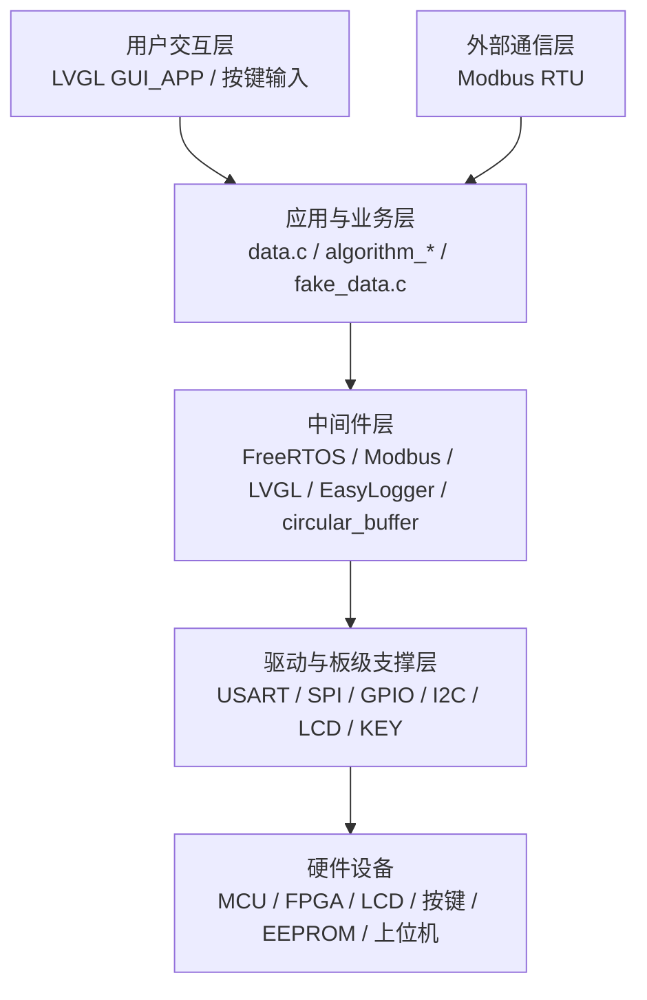
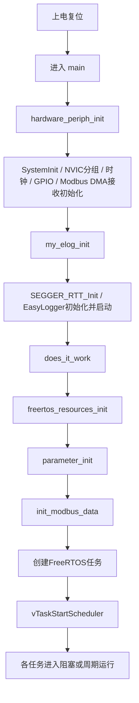
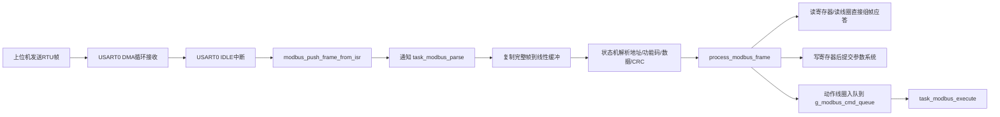
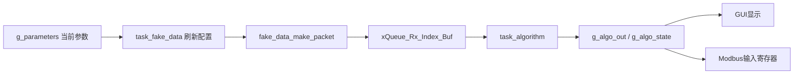
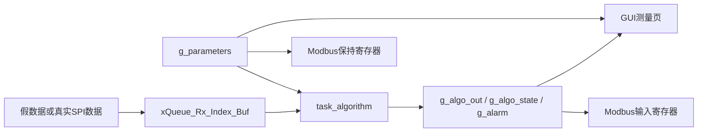

# MCU软件系统设计与实现分析文档

## 1. 项目总体说明

本工程是一个面向管道流量测量设备的 MCU 软件系统。结合 `App/src/algorithm_packet.c`、`App/src/algorithm_flow.c`、`App/src/algorithm_process.c` 中关于 `t1`、`t2`、`dt`、`pipe_type`、`zero_learn`、`flow_speed`、`flow_rate_instant` 等变量和算法过程的命名与实现方式，可以推断该系统面向基于传播时差或相近思路的流量测量装置，其核心任务是对外部采集到的原始时序数据进行解包、计算、滤波、限幅与状态判断，最终形成可供本地界面显示和上位机通信读取的测量结果。

从工程组织上看，该项目并不是简单的“驱动叠加应用”，而是形成了较为清晰的软件分层：底层以 `periph` 和 `BSP` 为主，负责时钟、GPIO、串口、SPI、I2C、LCD、按键等硬件控制；中间层以 `FreeRTOS`、`Modbus`、`LVGL`、`EasyLogger`、`circular_buffer` 等中间件为核心，承担调度、协议解析、图形界面、日志输出和缓冲管理；应用层则集中在 `App` 目录，对参数、算法状态、假数据和 FreeRTOS 共享资源进行统一管理；任务层位于 `TestTask` 与部分 `BSP`/中间件任务入口中，用于将各个功能模块组织成可运行系统；界面层位于 `Middlewares/LVGL/GUI_APP`，负责本地菜单、测量页、设置页和参数交互。

需要特别指出的是，当前工作区所对应的固件并非单一“最终量产态”，而是带有明显的联调与验证特征。根据 `TestTask/src/does_it_work.c` 的当前任务创建逻辑，系统实际上运行的是“GUI + Modbus + 按键 + 假数据 + 算法 + 日志”的综合测试固件：真实的 SPI 接收任务、EEPROM 测试任务、时钟测试任务等并未启用，而是保留为辅助或后续联调用途。这一点对于毕业设计文档的分析非常重要，因为它说明当前代码既包含主业务主链路，也包含为验证、替代真实硬件、提高调试效率而设置的辅助链路。

就毕业设计论文而言，本工程的价值不只在于完成单个算法或单个界面，而在于形成了一个较完整的嵌入式软件系统：它能够完成硬件初始化、外设配置、实时任务调度、数据采集与处理、参数管理、Modbus 对外通信、图形界面显示和调试诊断，并且在没有完整硬件条件时通过假数据链路支撑系统联调。这种“可运行、可调试、可验证、可展示”的系统完整性，是本项目软件部分最值得提炼的工程特征之一。

## 2. 工程目录与软件分层结构

### 2.1 目录职责划分

从目录结构来看，工程大致可以分为六个层次：

| 目录 | 主要职责 | 在系统中的角色 |
| --- | --- | --- |
| `User` | 主函数、异常与中断入口 | 软件启动入口与中断汇聚层 |
| `periph` | 时钟、GPIO、USART、SPI、I2C、延时、外设初始化链接 | 底层硬件驱动层 |
| `BSP` | 板级设备封装，如按键、LCD、EEPROM | 面向具体板卡的外设适配层 |
| `App` | 参数系统、算法流程、假数据、共享资源 | 应用层与业务处理层 |
| `Middlewares` | FreeRTOS、Modbus、LVGL、EasyLogger、SEGGER_RTT、circular_buffer | 公共中间件支撑层 |
| `TestTask` / 部分任务入口 | 任务创建与测试型系统组合 | 系统运行组织层 |

这种分层方式的优势在于能够将“硬件访问”“通用中间件”“业务算法”“界面表现”“任务调度”进行相对独立的隔离。驱动层负责让硬件可用，应用层负责定义系统状态和业务规则，中间件层负责提供成熟的基础能力，任务层负责把这些模块组合成具备实时性的运行系统，界面层则承担人机交互。对于毕业设计论文而言，这种分层能够直接支撑“软件总体架构设计”部分的论述。

### 2.2 软件系统层次关系

如果进一步从“系统运行主链”和“辅助调试链”来划分，可以得到以下认识：

- 当前主流程是：硬件初始化 -> 创建任务 -> 假数据产生 -> 算法处理 -> GUI 与 Modbus 展示/交互。
- 预留真实链路是：FPGA 产生中断 -> SPI 接收真实数据 -> 算法处理 -> GUI 与 Modbus 展示/交互。
- 调试辅助链路是：EasyLogger 通过 RTT 输出日志，诊断任务周期性采集系统状态，异常 Hook 在 Ozone 中保留故障信息。

这表明工程已经形成了“真实业务链、仿真替代链、调试诊断链”并存的结构，这是一种典型而实用的嵌入式系统开发策略。

## 3. 系统启动与初始化流程分析

### 3.1 上电后的整体执行顺序

当前工程的启动入口位于 `User/main.c`。`main()` 的实现非常简洁，仅依次调用三个核心函数：

1. `hardware_periph_init()`
2. `my_elog_init()`
3. `does_it_work()`

这种写法体现出很明确的分工思想：先让硬件可用，再让日志系统可用，最后启动应用级资源和任务。与将所有初始化都塞进 `main()` 相比，这种方式更有利于结构清晰和后续维护。

### 3.2 `hardware_periph_init()` 的作用

`periph/src/periph_link.c` 中的 `hardware_periph_init()` 是系统硬件准备阶段的总入口。它的执行顺序为：

- 调用 `SystemInit()` 完成系统基础初始化。
- 调用 `nvic_priority_group_set(NVIC_PRIGROUP_PRE4_SUB0)` 设定中断优先级分组。
- 调用 `rcu_config()` 使能各类外设时钟。
- 调用 `gpio_config()` 完成按键、USART、SPI、EEPROM I2C、FPGA 中断等引脚配置。
- 调用 `modbus_buf_init()` 初始化 Modbus 接收缓冲结构。
- 调用 `usart0_dma_modbus_init()` 使 USART0 进入 DMA 循环接收模式。

值得注意的是，这里的初始化并没有把所有外设都一次性完成。例如 LCD 的初始化不在这里执行，而是在 LVGL 显示端口初始化时通过 `lv_port_disp_init()` 间接调用 `LCD_Init()`；SPI 读取 FPGA 数据的任务也未在当前构建中启用。这说明工程采用的是“基础硬件先初始化，具体业务相关外设在对应子系统启动时初始化”的策略。这样的设计既减少了上电时的集中复杂度，也让各个子系统对硬件的依赖更加显式。

### 3.3 `my_elog_init()` 的作用

日志系统初始化位于 `Middlewares/easylogger/src/elog.c` 中的 `my_elog_init()`。它执行 `SEGGER_RTT_Init()` 初始化 RTT 通道，再调用 `elog_init()` 与 `elog_start()` 完成 EasyLogger 启动，并设置各级日志输出格式。由此，系统在任务启动前就具备了输出调试信息的能力。

这一步对于嵌入式项目极其关键。因为一旦调度器启动，系统就进入多任务并发状态，如果没有基础日志能力，后续问题定位会明显困难。当前工程中大量启动信息、假数据配置、算法输出以及任务诊断信息，都是依赖这一初始化过程才能输出到 Ozone 的 RTT Terminal。

### 3.4 `does_it_work()` 的系统组装作用

`TestTask/src/does_it_work.c` 中的 `does_it_work()` 可以视为当前固件的“系统装配入口”。它做了三件关键工作：

- `freertos_resources_init()`：创建共享队列资源。
- `parameter_init()`：加载或构造默认参数，并同步外部状态。
- `init_modbus_data()`：建立 Modbus 协议镜像区与命令队列。

随后它调用内部的 `task_test()` 创建当前实际启用的 FreeRTOS 任务，并通过 `vTaskStartScheduler()` 启动调度器。

从系统设计角度看，`does_it_work()` 的意义不在于函数名本身，而在于它承担了“将多个子系统组合为当前测试固件”的职责。对于毕业设计论文而言，可以将其理解为“任务调度层的系统配置与启动入口”。

## 4. 底层外设驱动层设计

### 4.1 时钟与外设时钟管理

`periph/src/rcu.c` 负责开启 GPIO、AFIO、SPI、I2C、USART、DMA 等外设时钟。时钟初始化是所有底层外设能否工作的前提，其设计特点是集中式打开本项目需要的硬件资源，而不把时钟使能分散到过多模块中。这种做法有利于在调试阶段快速确认硬件资源是否被打开，也利于后续扩展新的外设。

### 4.2 GPIO 配置与板卡差异化适配

`periph/src/gpio.c` 对工程中多数关键引脚进行了配置，包括：

- FPGA 中断输入与 EXTI 配置
- FPGA 片选与控制引脚
- LCD 相关引脚
- 按键输入与双边沿 EXTI
- EEPROM I2C 引脚
- USART0 通信引脚
- CCT6 板卡上的 485 方向控制引脚

该文件体现了明显的板卡适配思想。尤其是按键和 RS485 方向控制部分，会根据 `CCT6` 与 `RCT6` 宏进行差异化处理。对于论文而言，这种通过宏定义屏蔽硬件差异的方式，可以提炼为“同一软件框架对不同硬件资源配置进行条件编译适配”的设计思路。

### 4.3 USART 与 Modbus 接收基础

`periph/src/usart.c` 中最重要的函数是 `usart0_dma_modbus_init()`。它将 USART0 配置为 `9600-8N1`，打开 IDLE 中断，并启动 DMA 循环接收到 `g_modbus_rx_cb->buffer` 中。这意味着 MCU 不再采用“每接收到一个字节就中断处理”的方式，而是让 DMA 持续搬运数据、由 IDLE 中断作为“可能一帧结束”的信号。

这种设计的优点是：

- 降低串口中断频率，减轻 CPU 负担。
- 允许协议解析任务在任务上下文中完成复杂处理。
- 更适合 Modbus RTU 这类按帧处理的通信协议。

在发送侧，`usart0_send_modbus_bytes()` 在 CCT6 板卡上会配合 485 收发方向控制引脚，而在 RCT6 上则直接发送。这说明当前代码已经将“是否需要 RS485 方向控制”作为硬件差异的一部分进行了隔离。

### 4.4 SPI 接收链与外部 FPGA 交互

`periph/src/spi.c` 提供了 `spi1_init()`、`spi_master_read_packet_timeout()` 和 `fpga_spi_read_packet()` 等函数，用于从外部 FPGA 或前端采集逻辑中读取原始数据包。代码逻辑体现出典型的主机 SPI 读取过程：等待中断提示有数据可取、拉低片选、按固定包长读取、释放片选。

当前固件虽然没有启用真实 SPI 接收任务，但 SPI 驱动本身已经具备完整数据读取能力，因此从系统完整性角度看，真实测量链路是已经预留好的，只是在当前 RCT6 联调阶段用假数据链路替代了输入源。

### 4.5 I2C 与 EEPROM 访问支撑

`periph/src/iic.c` 提供了较完整的 I2C 主机访问与总线恢复逻辑。尤其是 `iic_bus_recover()` 会在 SDA 被拉低时手工产生时钟脉冲和 STOP 条件，这是典型的 I2C 总线可靠性设计。对毕业设计而言，这一点很值得保留，因为它体现了软件对现场硬件异常状态的应对能力，而不只是停留在理想情况下的驱动实现。

结合 `App/inc/app_config.h` 中 `BOARD_HAS_E2PROM` 与 `USE_E2PROM` 宏可见，CCT6 板卡支持 EEPROM 持久化，而当前 RCT6 板卡则不具备 EEPROM 资源。因此，I2C 与 EEPROM 相关模块更多是为后续完整硬件联调做准备，而不是当前运行主链的核心依赖。

### 4.6 LCD 驱动与显示刷新

`BSP/LCD/lcd_init.c` 与 `Middlewares/LVGL/GUI/lvgl/examples/porting/lv_port_disp_template.c` 共同完成本地图形界面的显示输出。其工作方式可以概括为：

- `LCD_Init()` 初始化屏幕控制器和 SPI 外设。
- LVGL 在 `lv_port_disp_init()` 中注册显示驱动与绘图缓冲区。
- 当 LVGL 生成待刷新的像素块后，`disp_flush()` 会设置地址窗口，并优先尝试 `LCD_WriteColors_DMA()` 进行 DMA 发送。
- DMA 不可用时，回退到阻塞方式逐像素输出。

目前的实现采用了“DMA 启动 + 任务上下文等待 DMA 空闲 + `lv_disp_flush_ready()` 通知 LVGL 完成”的方式，其优点是避免了在 DMA 中断中直接触碰 LVGL 内部状态，降低了图形栈与中断上下文耦合的风险。这种处理方式虽然不是极限性能追求型方案，但对于当前项目规模和可靠性目标而言是较合理的折中。

## 5. FreeRTOS任务设计与运行机制分析

### 5.1 当前实际启用任务一览

根据 `TestTask/src/does_it_work.c` 的当前配置，系统实际创建的任务如下表所示：

| 任务名 | 入口函数 | 创建位置 | 优先级 | 栈大小（word） | 运行方式 | 当前角色 |
| --- | --- | --- | --- | --- | --- | --- |
| `task_modbus` | `task_modbus_parse()` | `does_it_work.c` | 5 | 768 | 事件唤醒 | Modbus 帧解析主任务 |
| `task_elog` | `task_elog()` | `does_it_work.c` | 3 | 384 | 周期运行 | 系统诊断与日志摘要 |
| `task_lvgl_test` | `task_lvgl_test()` | `does_it_work.c` | 6 | 1024 | 周期运行 | GUI 主任务 |
| `task_key` | `task_key()` | `does_it_work.c` | 5 | 384 | 队列阻塞 | 按键事件处理 |
| `task_modbus_execute` | `task_modbus_execute()` | `does_it_work.c` | 5 | 384 | 队列阻塞 | Modbus 动作命令执行 |
| `task_fake_data` | `task_fake_data()` | `does_it_work.c` | 4 | 384 | 固定周期 | 假数据输入源 |
| `task_algorithm` | `task_algorithm()` | `does_it_work.c` | 5 | 512 | 队列阻塞 | 算法处理主任务 |

除了这些任务外，FreeRTOS 本身还会创建 Idle Task 和 Timer Task。结合 `Middlewares/FreeRTOS/FreeRTOSConfig.h` 可知，系统采用抢占式调度，节拍频率为 `1000Hz`，总堆大小为 `20KB`，并打开了栈溢出检测与 `malloc failed` Hook。这些配置说明系统强调实时响应和运行期可诊断性。

### 5.2 当前未启用但具有工程意义的任务

工程中还保留了若干未在当前组合中启用的任务，这些任务主要用于专项测试或后续硬件联调：

| 任务 | 作用 | 当前状态 |
| --- | --- | --- |
| `task_clock()` | 输出系统时钟与 RCU 状态 | 调试辅助，未启用 |
| `task_e2prom()` | EEPROM 读写验证 | 调试辅助，未启用 |
| `task_spi_rx()` | 真实 FPGA/SPI 原始包接收 | 预留真实采集链路，未启用 |
| `task_modbus.c` 中测试逻辑 | 早期 Modbus 链路测试 | 历史/测试用途，非当前主链 |
| `task_key_test()` | 独立按键测试输出 | 测试用途，未启用 |

从论文写作角度看，这类任务不宜直接描述成“系统主任务”，但应该作为“调试验证支撑模块”进行区分，说明项目在开发阶段采用了模块化联调与分层验证的策略。

### 5.3 `task_modbus_parse()`：事件驱动的协议解析任务

`Middlewares/Modbus/src/modbus_parse.c` 中的 `task_modbus_parse()` 是当前 Modbus 通信链路的核心任务。它的运行模式不是固定周期轮询，而是阻塞在 `ulTaskNotifyTake(pdTRUE, portMAX_DELAY)` 上，只有当 USART0 的 IDLE 中断判定一帧到达后才会被唤醒。

被唤醒后，它会：

1. 检查 `g_modbus_rx_cb` 中是否已有完整帧描述。
2. 通过 `modbus_get_frame()` 从环形 DMA 缓冲中复制出一帧线性数据。
3. 使用状态机逐字节解析地址、功能码、数据区和 CRC。
4. 在 CRC 校验通过后调用 `process_modbus_frame()`。

这一设计有两个明显优点。其一，中断只负责“记录一帧在哪里、通知任务来处理”，真正复杂的解析在任务上下文完成，减少中断负担；其二，协议解析与 DMA 环形缓冲区之间通过帧 FIFO 解耦，既保留了 DMA 的高效性，又控制了并发复杂度。这种“中断轻量化 + 任务完成协议解析”的模式，是较为标准且适合论文表述的实时通信设计。

### 5.4 `task_modbus_execute()`：动作命令与协议解析解耦

`Middlewares/Modbus/src/modbus_execute.c` 中的 `task_modbus_execute()` 用于执行由 Modbus 线圈命令触发的动作，例如：

- 清零累计量
- 启动零点学习
- 保存参数
- 恢复默认参数
- 清除报警
- 软复位

之所以单独设置该任务，而不是在 `process_modbus_frame()` 中直接完成所有动作，是因为部分动作可能涉及全局参数修改、状态重置，甚至软件复位，不适合全部堆叠在协议解析流程中。通过命令队列 `g_modbus_cmd_queue` 将“协议层收到动作请求”和“系统真正执行动作”解耦，可以让协议处理链更短、职责更清晰，也降低了复杂功能在通信上下文中直接执行的风险。

### 5.5 `task_key()`：按键事件的去抖与语义化处理

当前真正运行的按键任务位于 `BSP/KEY/src/bsp_key.c`。这个设计非常值得单独分析，因为它没有采用简单轮询，而是将按键处理拆分为两个层次：

- EXTI 中断只负责记录边沿事件、时间戳，并将事件指针送入 `key_inner_queue`。
- `task_key()` 在任务上下文中完成去抖、短按/长按判定，并将统一键值送入 `key_queue`。

这种结构的意义在于：

- 中断层足够轻量，保证响应及时。
- 去抖和时长计算不在中断中执行，降低中断执行时间。
- 对上层 GUI 而言，拿到的已经是逻辑键值，而不是原始电平变化。

因此，`task_key()` 实际上承担了“将物理按键事件转换为上层菜单可理解语义”的职责，是人机交互链路中的关键桥梁。

### 5.6 `task_fake_data()`：测试阶段的数据输入替代源

`TestTask/src/task_fake_data.c` 中的 `task_fake_data()` 是当前固件非常重要的测试支撑任务。它通过 `vTaskDelayUntil()` 按 `GROUP_PERIOD_MS=8ms` 的节拍生成假数据包，并以 `xQueueOverwrite(xQueue_Rx_Index_Buf, &raw)` 的方式将数据送入算法任务。

该任务并不是简单输出固定值，而是会：

- 从 `g_parameters` 中读取当前管道参数与报警阈值。
- 根据上下限构造合理的目标速度/流量范围。
- 通过 `fake_data_make_packet()` 生成符合真实接收格式的原始数据包。

因此，从算法任务往上看，它并不知道当前数据来自真实 FPGA 还是假数据发生器，这体现了良好的数据接口统一性。对于毕业设计论文来说，假数据模块的意义在于：在硬件不完整或采集链未联通时，仍能提前完成 GUI、Modbus、参数联动和算法输出链路的系统联调。

### 5.7 `task_algorithm()`：测量处理主任务

`TestTask/src/task_algorithm.c` 中的 `task_algorithm()` 是整个业务处理链的核心任务之一。它阻塞等待 `xQueue_Rx_Index_Buf` 中的新原始包，一旦接收到数据，就按如下流程运行：

1. 解包 `rufx_unpack_packet()`。
2. 计算 `t1`、`t2` 和 `dt`。
3. 检查序号重复、超时等异常情况。
4. 调用 `algorithm_process_group()` 完成算法计算。
5. 如产生新的输出结果，则用 `xQueueOverwrite(xQueue_AlgoOut, &g_algo_out)` 发布。
6. 定期输出算法日志。

该任务的核心特点是：它既承担原始测量数据处理，也承担全局输出结果的更新，因此是“数据采集链”与“显示/通信链”的连接点。其上游可以是真实 SPI，也可以是假数据；其下游既可以是 GUI，也可以是 Modbus 输入寄存器映射。这种中心地位决定了算法任务在系统中的重要性。

### 5.8 `task_lvgl_test()`：图形界面主任务

`Middlewares/LVGL/GUI_APP/code/src/lvgl_app_test.c` 中的 `task_lvgl_test()` 只是对 `menu_app_task()` 的简单封装，而真正的 GUI 主逻辑位于 `menu_app.c`。

GUI 任务启动后会执行：

- `lv_init()`
- `lv_port_disp_init()`
- 创建测量页、列表页、设置页等界面对象
- 创建一个 `lv_timer` 定期调用 `menu_app_tick_cb()`
- 在 `while(1)` 中反复执行 `lv_timer_handler()` 并 `vTaskDelay(5ms)`

这意味着 GUI 是以典型的 LVGL 事件循环方式运行的：界面逻辑与渲染驱动封装在 LVGL 内部，应用侧主要负责周期性处理输入事件与更新界面数据。

### 5.9 `task_elog()`：运行诊断与状态快照

`TestTask/src/task_elog.c` 中的 `task_elog()` 并不直接参与业务功能，而是周期性统计：

- 当前任务数
- 各任务高水位栈余量
- FreeRTOS 堆使用情况
- 历史最小空闲堆大小
- 任务状态快照

并将结果写入全局可观察变量 `g_task_diag_snapshot`，同时以简洁日志形式输出。这种任务的工程价值在于为调试与稳定性验证提供了可观测性，使系统不仅“能运行”，还“能被分析”。在毕业设计中，这一设计可以作为系统可靠性与调试支撑能力的一部分来描述。

## 6. 中断机制与任务协同分析

### 6.1 中断总体分工

从 `User/gd32f30x_it.c` 可见，当前系统中断并不承担复杂业务逻辑，而主要负责以下三类工作：

- 感知外部事件
- 记录必要状态
- 唤醒或通知相应任务

这种设计体现了中断与任务分工合理的原则：中断求快，任务求完整。

### 6.2 按键 EXTI 中断链

按键相关 EXTI 中断在 `gd32f30x_it.c` 中被分别挂接到对应的外部中断入口，最终统一调用 `key_gpio_exti_handler()`。该 ISR 并不直接处理短按、长按等逻辑，而只是：

- 识别是哪一个按键
- 记录当前时间
- 判断当前是按下边沿还是释放边沿
- 将事件送入 `key_inner_queue`

随后 `task_key()` 完成去抖和按键语义化。这种中断与任务协同方式降低了中断复杂度，提高了整体实时性。

### 6.3 USART0 IDLE 中断与 Modbus 任务协同

Modbus 接收链的中断设计体现出较强的工程针对性。USART0 DMA 持续接收数据，IDLE 中断一旦触发，就意味着“总线空闲，可能一帧结束”。ISR 随后会：

- 读取 DMA 当前位置
- 调用 `modbus_push_frame_from_isr()` 在帧 FIFO 中登记一帧的起止位置
- 通过 `vTaskNotifyGiveFromISR()` 唤醒 Modbus 解析任务

于是，“字节搬运”由 DMA 完成，“帧边界发现”由 IDLE 中断完成，“协议解析”由任务完成。这是一条较为成熟的嵌入式串口协议处理链。

### 6.4 FPGA_INT 中断与 SPI 接收协同

当前 `gd32f30x_it.c` 中已保留 `fpga_int_gpio_exti_handler()`。它的逻辑非常简单：拿到 SPI 接收任务句柄后通过 `vTaskNotifyGiveFromISR()` 通知任务运行。这说明真实采集链预期是“FPGA 准备好数据后，借助中断通知 MCU 去拉 SPI 包”，而不是让 MCU 持续轮询是否有数据。

虽然当前任务组装中没有启用 SPI 接收任务，但该链路的设计思想已经非常明确：使用外部中断作为采集节拍的同步源，在事件到来时再进入数据读取。

### 6.5 LCD DMA 中断

LCD 刷新链中，DMA 完成中断由 `DMA1_Channel1_IRQHandler()` 转入 `LCD_SPI2_DMA_IRQHandler()`。这里的中断职责主要是：

- 清中断标志
- 关闭 DMA 通道与 SPI DMA 发送
- 恢复片选状态
- 更新 LCD DMA 忙标志
- 如注册了回调则调用回调

而 LVGL 的 `lv_disp_flush_ready()` 并不直接在 DMA ISR 内部调用，而是在 GUI 任务侧等待 DMA 空闲后调用。这说明设计者刻意避免在 DMA 中断中直接进入 LVGL，这对于图形中间件的稳定运行是有利的。

### 6.6 FreeRTOS 故障 Hook

`Middlewares/FreeRTOS/hook/src/hook.c` 中实现了 `vApplicationMallocFailedHook()` 和 `vApplicationStackOverflowHook()`，并将故障信息保存到 `g_rtos_fault_diag` 中。后者还会打印 `Stack overflow in task: ...`。这部分机制在前期联调中已经发挥过实际作用，说明系统并非完全依赖“现象观察”，而是具备运行期故障定位能力。

## 7. 关键执行链路分析

### 7.1 系统初始化链路

系统初始化链路是整套固件的第一条主链路，其过程为：

- `main()` 进入后调用 `hardware_periph_init()`，完成时钟、GPIO、Modbus DMA 接收基础配置。
- 调用 `my_elog_init()`，建立 RTT 日志通道。
- 调用 `does_it_work()`，创建共享队列、参数系统、Modbus 镜像与各任务。
- 启动调度器后，各任务开始依据自身类型进入阻塞等待或周期运行。

这一过程体现了典型的“先硬件、后支撑、再应用、最后调度”的嵌入式启动组织方式。

### 7.2 按键处理链路

按键处理从硬件触发到界面响应的完整过程如下：

其中，`key_gpio_exti_handler()` 与 `task_key()` 的分工极为关键：前者只记录边沿和时间，后者完成去抖、短按/长按判断。GUI 侧并不直接接触硬件按键电平，而是通过 `key_scan()` 获取统一逻辑键值，再映射为 `MENU_KEY_OK`、`MENU_KEY_UP`、`MENU_KEY_DOWN`、`MENU_KEY_BACK`。

这一链路的系统意义在于，它把“物理按键输入”“按键语义化”“界面操作”分离成三个层次，提高了系统的模块边界清晰度。

### 7.3 Modbus 接收、解析与响应链路

Modbus 通信是当前系统对外部上位机开放的重要接口。其主链路如下：

在 `process_modbus_frame()` 中，不同功能码对应不同处理方式：

- `0x01`/`0x02`：读取线圈或离散输入，直接回包。
- `0x03`/`0x04`：读取保持寄存器或输入寄存器，先准备镜像区再回包。
- `0x05`：写单线圈，若是命令型线圈则入命令队列。
- `0x06`/`0x10`：写保持寄存器，最终转化为 `parameter_commit()`。

这一实现的亮点在于：Modbus 协议层并不直接分散修改大量业务变量，而是通过寄存器镜像和统一参数提交函数，把协议写入操作收束到参数系统中，从而保证数据一致性。

### 7.4 参数写入与统一提交链路

无论参数来自 GUI 设置页还是 Modbus 写寄存器，当前工程都尽量收束到 `App/src/data.c` 的参数系统中。这条链路通常表现为：

- GUI 侧通过 `menu_setting_backend_commit_numeric()` 或 `menu_setting_backend_commit_option()` 调用 `parameter_set_*()`。
- Modbus 侧通过 `apply_holding_registers_to_parameters()` 调用 `parameter_commit()`。
- `parameter_commit()` 负责校验、比较、写入、可选保存、失败回滚、状态同步。

这是一条非常关键的设计主线。它意味着系统没有让 GUI 与 Modbus 各自维护一套独立参数逻辑，而是让二者共享同一个参数核心。这样既降低了重复代码，也减少了不同接口间参数状态不一致的风险。

### 7.5 SPI 与外部设备数据接收链路

根据 `Task/src/task_spi_rx.c` 与中断文件中的通知逻辑推断，真实采集链路预期如下：

- FPGA 在有一帧原始测量数据可供读取时，拉低 `FPGA_INT`。
- MCU EXTI 中断唤醒 `task_spi_rx()`。
- 任务通过 SPI 读取固定长度的 `rufx_raw_packet_t`。
- 数据通过 `xQueueOverwrite(xQueue_Rx_Index_Buf, &packet)` 送入算法任务。

当前这条链路没有在 `does_it_work.c` 中启用，因此它应被视为“预留真实链路”，而不是当前实际运行主链。不过，其存在说明工程的最终目标并非停留在假数据演示，而是已经为外部采集设备联调做好了接口准备。

### 7.6 假数据注入链路

当前实际运行的采集替代链路如下：

该链路的价值在于，在缺少真实 FPGA 数据时，仍可保持算法、GUI、Modbus 三个子系统全部联动。换言之，假数据模块不是孤立的演示组件，而是整个系统联调阶段的输入源替代器。

### 7.7 算法数据处理链路

`task_algorithm()` 和 `algorithm_process_group()` 构成了算法处理主链。其执行过程可以概括为：

1. 从原始包中提取索引和采样点。
2. 根据插值计算更精确的时间差 `dt`。
3. 通过 `vel_calc_from_dt()` 换算速度。
4. 使用窗口平均和中值类滤除异常点。
5. 通过卡尔曼滤波平滑结果。
6. 依据零点学习逻辑做漂移补偿。
7. 限幅并计算体积流量。
8. 更新 `g_algo_out`、`g_algo_state`、`g_alarm`。

从论文表述角度，这里非常适合写成“算法软件实现流程”，突出以下思想：

- 原始数据解包与物理量换算分离。
- 窗口化处理与滤波提高数据稳定性。
- 自动零漂学习提高长期测量可靠性。
- 报警与状态量并行输出，便于上位机与界面统一获取。

### 7.8 日志输出链路

系统日志路径为：

- 各模块调用 `log_i()`、`log_e()` 等宏。
- EasyLogger 根据文件级 `LOG_TAG` 与 `LOG_LVL` 组织日志格式。
- `elog_port_output()` 通过 `SEGGER_RTT_Write(0, ...)` 输出到 RTT 通道。

当前工程的日志系统不仅输出普通文本，还会在 `task_elog()` 中形成系统级摘要，在算法与假数据任务中输出运行状态，在参数初始化阶段输出板卡模式。这种日志不仅用于调试，也能在开发阶段验证任务协同是否正常。

需要客观指出的是，`elog_port_output_lock()` 通过全局关中断实现输出锁，虽然简单有效，但在日志较密集时可能对时序带来额外扰动。因此在论文中可以将其描述为“调试便利性优先的设计”，同时指出正式阶段可进一步优化为更细粒度或异步日志输出方式。

### 7.9 GUI 刷新与页面交互链路

当前 GUI 主链路为：

- `task_lvgl_test()` 启动 `menu_app_task()`。
- 创建测量页、菜单页、设置页。
- 通过 `lv_timer_create(menu_app_tick_cb, MENU_KEY_POLL_PERIOD_MS, NULL)` 周期性驱动 GUI 应用逻辑。
- 在 `menu_app_tick_cb()` 中轮询按键队列、处理页面切换、根据 `display_sensitivity` 决定测量页刷新频率。
- `lv_timer_handler()` 驱动 LVGL 完成对象刷新与显示输出。

这条链路的重要性在于，它将“输入处理”“界面状态迁移”“数据刷新”和“实际图形渲染”分层处理，使 GUI 既具备交互能力，又不会与业务层形成过强耦合。

### 7.10 测量数据显示链路

当前测量数据显示不是直接从驱动层读值，而是由 GUI 在刷新时读取全局算法输出：

- `menu_app_render_measure()` 从 `g_algo_out` 和 `g_algo_state` 中读取 SQ、瞬时流量、累计流量。
- 将瞬时流量统一换算成 `m3/h` 显示。
- 将报警上限流量换算成弧形仪表的满量程。
- 调用 `menu_measure_page_render()` 更新标签与圆弧。

也就是说，GUI 并不是算法逻辑的一部分，而是算法输出的消费者。这种设计有利于后续把测量结果同时对接到更多通道，例如串口上报、存储记录或其他显示终端。

## 8. 应用层与业务处理模块分析

### 8.1 `data.c`：系统参数与状态中心

`App/src/data.c` 是当前工程最核心的业务支撑文件之一。它集中维护了：

- `g_parameters`：当前参数集
- `g_algo_state`：算法运行状态
- `g_algo_out`：当前输出结果
- `g_alarm`：当前报警状态
- 卡尔曼滤波状态与单位转换辅助逻辑

该文件的重要性在于，它不是单纯的数据定义处，而是“参数生命周期管理中心”。其代表性能力包括：

- 默认参数构造
- EEPROM 加载与保存
- 参数合法性校验
- 参数变更后的测量状态重置
- 参数变更后向 Modbus 镜像与假数据配置同步

从系统设计角度看，`data.c` 将“参数是如何定义的”“参数是否有效”“参数修改后要联动哪些子系统”统一管理起来，极大提升了软件结构的内聚性。

### 8.2 `algorithm_packet.c`：原始包解包与时差计算前处理

该文件负责把原始字节流恢复成结构化测量数据，并计算更精细的时间差估计。其作用相当于算法链路的“输入整形层”。如果没有这一层，后续的流速计算、滤波与报警判断都无法获得结构化且可解释的输入。

### 8.3 `algorithm_flow.c`：流量计算核心步骤集合

`algorithm_flow.c` 中集中实现了多个关键算法环节，包括：

- SQ 质量窗口统计
- 壁厚传播时间计算
- 由 `dt` 到流速的换算
- 窗口化滑动平均
- 卡尔曼滤波
- 零漂自动学习
- 体积流量与累计量更新
- 报警判断

这类函数虽然在代码层面是独立函数，但在系统层面共同构成了“将一次测量样本加工为稳定输出”的完整数学处理流程。对于毕业论文来说，该文件非常适合作为“核心算法软件实现”的重点分析对象。

### 8.4 `algorithm_process.c`：算法流程编排器

如果把 `algorithm_flow.c` 看作算法部件库，那么 `algorithm_process.c` 中的 `algorithm_process_group()` 就是流程编排器。它负责决定在一次新样本到来时，哪些步骤按什么顺序执行、哪些条件下判定样本无效、何时产生新输出。这种组织方式让复杂算法流程具备较好的可读性和可维护性。

### 8.5 `fake_data.c`：真实数据接口的测试替身

`fake_data.c` 的价值不只是“生成一些数”，而是尽量按真实输入数据的结构来构造原始包，这意味着上层算法任务不需要因为测试模式而修改处理逻辑。这样的设计体现出良好的接口抽象能力：同一个算法输入接口既可以接真实 SPI 包，也可以接模拟包。

### 8.6 `freertos_resources.c`：共享队列统一创建点

该文件目前只创建了两个核心队列：

- `xQueue_Rx_Index_Buf`
- `xQueue_AlgoOut`

虽然规模不大，但它体现出“共享资源集中初始化”的思想。与把队列散落在各任务文件里相比，这种集中方式更利于后续统一调整系统资源和理解数据流。

## 9. Modbus通信设计分析

### 9.1 Modbus 在工程中的定位

Modbus 子系统位于 `Middlewares/Modbus`，其定位不是简单的串口收发，而是对外部上位机提供结构化参数访问和状态读取接口。该子系统通过保持寄存器、输入寄存器、线圈和离散输入，将内部参数与状态映射为标准 Modbus RTU 协议对象。

这使得上位机无需理解 MCU 内部结构体布局，只需按 Modbus 地址表即可读取实时测量值、查询报警状态、修改参数或触发动作命令。这种标准化接口对于毕业设计的系统展示和后续扩展都很有价值。

### 9.2 协议映射结构

在 `modbus_frame_process.c` 中，工程维护了四类协议镜像区：

- `g_modbus_coils`
- `g_modbus_discrete_inputs`
- `g_modbus_holding_registers`
- `g_modbus_input_registers`

其地址定义集中于 `Middlewares/Modbus/inc/modbus_map.h`。这种设计的意义在于，协议层对外暴露的是标准寄存器和位，而内部则是参数结构体与算法状态。协议镜像区起到了中间桥梁作用，使内部实现不必直接受通信协议约束。

### 9.3 读写功能码处理逻辑

当前系统已经实现并验证的功能码包括：

- `0x01` 读线圈
- `0x02` 读离散输入
- `0x03` 读保持寄存器
- `0x04` 读输入寄存器
- `0x05` 写单线圈
- `0x06` 写单寄存器
- `0x10` 写多个寄存器

其中，读操作多为“从镜像区取值并组包返回”，写操作则会进一步触发业务参数更新或系统动作。尤其是 `0x06` 与 `0x10` 并不是直接对全局参数逐字段改写，而是先更新保持寄存器镜像，再统一提交到参数系统。这体现出较好的参数一致性设计。

### 9.4 异常响应与可靠性

`process_modbus_frame()` 中对数量越界、地址越界、参数非法等情况均给出了标准异常响应。结合此前测试结果可知，系统能够正确返回：

- `Illegal Data Address`
- `Illegal Data Value`

这说明该 Modbus 实现并非“只实现正常路径”，而是具备基本完整的异常处理逻辑。对于论文中的“通信可靠性设计”部分，这一点可以作为重要内容展开。

### 9.5 RCT6 与 CCT6 板卡在参数保存上的差异

`App/inc/app_config.h` 中通过 `BOARD_HAS_E2PROM` 和 `USE_E2PROM` 宏区分了不同板卡：

- `RCT6`：无 EEPROM，参数修改仅作用于运行时。
- `CCT6`：具备 EEPROM 时，参数可以保存并掉电恢复。

这意味着当前 RCT6 上的 Modbus 写参数功能仍然是有效的，只是不会真正写入非易失存储。对于毕业设计而言，这种设计非常实用：在硬件不完整阶段，仍然可以验证 Modbus 的读写正确性和参数联动逻辑，而无需等待 EEPROM 硬件完全接通。

## 10. SPI与外部设备数据交互分析

### 10.1 真实采集链的定位

从当前代码结构看，SPI 与 FPGA 的交互代表系统预期的真实输入链。其主要组件包括：

- `periph/src/spi.c`：SPI 驱动
- `User/gd32f30x_it.c`：FPGA_INT 中断唤醒
- `Task/src/task_spi_rx.c` 或测试版 `TestTask/src/task_spi_rx.c`：任务侧读取原始包

这条链路的核心思想是“由外部设备通知 MCU 何时读数据”，而不是 MCU 自行轮询。这样的事件驱动结构更适合采集类应用，也有利于降低无意义 CPU 占用。

### 10.2 当前固件中的状态

需要明确指出，根据 `does_it_work.c` 当前任务创建代码，SPI 接收任务没有被启用。因此，在当前 RCT6 联调固件中，SPI 交互是“工程中已具备实现，但非当前主运行链”。这一判断对于文档准确性非常重要。

### 10.3 与算法链的接口统一

无论真实 SPI 还是假数据，最终都应向 `xQueue_Rx_Index_Buf` 提交 `rufx_raw_packet_t`。这使得算法任务完全不需要区分数据来源。这种统一接口的设计非常适合作为论文中“模块解耦与接口一致性”的体现。

## 11. 假数据与调试支撑模块分析

### 11.1 假数据模块的工程意义

在当前项目中，假数据模块不是简单的示意程序，而是整个系统联调的重要支撑模块。它使得以下子系统可以在真实采集链尚未完全闭合时提前联调：

- 算法任务
- GUI 测量页
- Modbus 输入寄存器输出
- 报警逻辑
- 参数联动逻辑

因此，从开发流程角度看，假数据模块扮演了“输入源虚拟化”的角色。

### 11.2 调试支撑模块

除了假数据，工程中还存在多个调试支撑模块：

- `task_clock()`：确认系统时钟配置
- `task_e2prom()`：验证 EEPROM 读写
- `task_key_test()`：观察按键事件输出
- `task_elog()`：记录系统运行快照
- FreeRTOS Hook：记录栈溢出和内存分配失败

这说明项目在开发过程中并未只依赖“整体一把过”，而是通过分模块测试任务逐步验证关键链路。这种开发方法完全符合毕业设计工程实现中“循序渐进集成”的特点。

## 12. 日志系统与调试机制分析

### 12.1 EasyLogger 的使用方式

EasyLogger 位于 `Middlewares/easylogger`，被作为整个工程的统一日志框架。其主要特点包括：

- 支持日志级别和标签
- 可带时间戳、函数名、文件行号等格式
- 底层输出通过 RTT 实现

工程中常见的日志包括：

- 启动日志
- 参数初始化日志
- 假数据配置日志
- 算法输出日志
- 系统诊断摘要日志

### 12.2 SEGGER RTT 的作用

`SEGGER_RTT` 是当前日志输出的物理通道。与传统串口日志相比，RTT 不占用业务串口资源，因此特别适合当前这种既要保留 Modbus 串口通信，又需要查看调试信息的场景。对于毕业设计演示和调试，这种方案具有明显优势。

### 12.3 日志对系统可观测性的提升

由于工程中加入了 `g_task_diag_snapshot`、`g_menu_app_diag_snapshot`、`g_lvgl_display_diag`、`g_rtos_fault_diag` 等全局诊断结构，系统在 Ozone 中不仅能显示普通日志，还能在变量窗口中直接观察任务堆栈余量、GUI 是否卡在 flush、是否发生 RTOS 故障等状态。这种“日志 + 可视化诊断变量”结合的调试方式，为系统稳定性分析提供了较好的支撑。

## 13. LVGL图形界面与菜单系统分析

### 13.1 GUI_APP 的总体定位

`Middlewares/LVGL/GUI_APP` 是本工程的人机交互界面层。它并不是一个完全通用化、抽象程度极高的 UI 框架，而是围绕当前项目需求构建的实用型菜单系统。其关注点主要包括：

- 测量结果显示
- 层次化菜单导航
- 参数设置与动作触发
- 系统状态与信息展示

从工程特点上看，这部分代码具有明显的“功能导向、快速落地、可运行优先”特征。页面组织与数据适配较实用化，命名总体清晰但并未追求极度抽象统一。这一点与其部分代码由需求驱动、并借助工具辅助生成的背景是相符的。客观来看，这种实现方式并不影响其作为毕业设计界面模块的价值，反而能更真实地体现嵌入式项目中“在资源和周期约束下实现可用界面”的工程特征。

### 13.2 GUI_APP 的模块分工

GUI_APP 主要由以下几类文件组成：

| 文件 | 作用 |
| --- | --- |
| `menu_app.c` | 顶层控制器，负责键值处理、页面切换、刷新调度 |
| `menu_data.c` | 静态菜单树与设置项定义 |
| `menu_nav.c` | 纯导航状态机 |
| `menu_measure_page.c` | 测量页组件创建与刷新 |
| `menu_list_page.c` | 菜单列表页渲染 |
| `menu_setting_page.c` | 设置页视图渲染 |
| `menu_setting_session.c` | 设置编辑会话状态机 |
| `menu_setting_backend.c` | GUI 与参数系统之间的后端适配层 |
| `lvgl_app_test.c` | GUI 任务入口封装 |

这种拆分方式总体上是比较合理的。它把“菜单数据”“导航状态”“页面渲染”“参数读写适配”“顶层调度”分开，实现了一个适合当前项目规模的界面分层结构。

### 13.3 菜单系统的组织方式

`menu_data.c` 采用静态数据方式描述整个菜单树。根页面包含：

- 测量页
- 管道参数页
- 输出设置页
- 报警设置页
- 系统信息页

而每个子页面再挂接若干 `menu_setting_desc_t` 描述具体设置项。这种做法的优点在于：

- 菜单内容集中定义，便于整体查看结构。
- 导航层只关心页面与项，不关心业务逻辑。
- 设置页渲染与后端提交都能围绕同一份设置描述展开。

从论文角度看，这可以提炼为“静态菜单树驱动的分层菜单组织方式”。

### 13.4 导航控制与页面切换

`menu_nav.c` 是一个很典型的轻量导航状态机。它维护导航栈、当前页、当前选中项、页码等信息，并提供：

- 上下移动
- 进入菜单项
- 返回上一级
- 计算当前页可见项

重要的是，`menu_nav.c` 不依赖 LVGL 控件，这意味着它本质上是纯逻辑层。界面层只需要根据导航状态来渲染列表页。这种“导航逻辑与界面控件解耦”的方式，是当前 GUI_APP 中比较成熟的一处设计。

### 13.5 测量页设计

`menu_measure_page.c` 负责创建并更新测量页控件，包括：

- SQ 标签
- 圆弧表盘
- 瞬时流量数值
- 累计流量文本

其中，测量页采用“只有文本或数值变化时才更新控件”的方式，减少了不必要的重绘和刷屏压力。这说明界面层已经兼顾了资源有限 MCU 上的显示效率问题。

### 13.6 设置页与会话状态机设计

设置页相关逻辑由 `menu_setting_page.c`、`menu_setting_session.c` 和 `menu_setting_backend.c` 共同完成。其设计特点是：

- 页面渲染层只负责显示当前值与编辑状态。
- 会话状态机负责维护“当前正在编辑哪个设置项、当前选中哪个数字位、最近一次提交结果如何”等临时状态。
- 后端适配层负责把设置项 ID 映射到参数系统字段。

这种方式比直接在页面代码里随处修改 `g_parameters` 更稳健，也更符合论文中可描述的“界面层与业务层分离”思想。

### 13.7 GUI 与业务层的衔接方式

GUI 与业务层的衔接主要体现在两个方向：

- 显示方向：从 `g_algo_out`、`g_algo_state` 和 `g_parameters` 读取当前状态。
- 写入方向：通过 `menu_setting_backend_*` 和 `parameter_*` 接口统一提交参数变更。

换言之，GUI 不是直接操作底层驱动或协议寄存器，而是建立在统一参数系统之上。这种设计使界面成为系统中的一个标准消费者/生产者，而不是破坏分层的特殊模块。

### 13.8 对毕业设计中“人机交互界面设计”的支撑价值

从毕业设计论文角度，这一部分完全可以提炼为“嵌入式图形人机交互界面设计”章节的核心内容，重点可写为：

- 基于 LVGL 的图形界面构建方法
- 分层菜单结构设计
- 页面导航状态机实现
- 测量数据显示页面设计
- 参数设置与动作触发的人机交互方式
- 后端参数管理与前端显示解耦

如果需要客观评价其工程特点，可以表述为：该界面模块更强调项目适配性与可运行性，采用了功能驱动的模块划分方式，虽然未追求高度通用框架化，但已经形成了适合本课题需求的清晰页面结构和交互流程。

## 14. 中间件与公共组件分析

### 14.1 FreeRTOS

FreeRTOS 是本工程的软件调度核心，位于 `Middlewares/FreeRTOS`。其在本项目中承担的职责包括：

- 提供多任务调度
- 提供队列、任务通知、软件定时器等通信机制
- 提供栈溢出和内存分配失败 Hook
- 支撑按键、Modbus、GUI、算法等模块并发运行

它非常适合本项目，因为本系统天然具有多个并发活动源：串口协议、按键输入、界面刷新、数据处理、日志监控等。若完全使用裸机循环，不仅结构会变得复杂，而且实时性与可维护性都较难保障。

### 14.2 circular_buffer

`Middlewares/circular_buffer` 当前主要服务于 Modbus 串口 DMA 接收。其内部结构不是传统意义上仅有 head/tail 的环形缓冲，而是增加了“帧描述 FIFO”。这使其既能作为 DMA 循环写入缓存，又能记录多帧消息的起止位置。

对于 Modbus 这类按帧解析的协议而言，这种设计非常适合：DMA 持续写入，IDLE 中断只需登记帧边界，任务再从 FIFO 中逐帧取出并解析。它在系统中起到了“数据搬运层与协议处理层之间的缓冲桥梁”作用。

### 14.3 EasyLogger

EasyLogger 为工程提供了统一日志 API，使各模块无需关心底层输出细节，只需通过 `log_i()`、`log_e()` 等宏进行输出。结合 RTT 后，它既便于开发调试，也能在一定程度上支持系统运行过程的分析。

### 14.4 Modbus

Modbus 中间件在本工程中的作用不仅是“收发串口数据”，更是建立设备与上位机之间的标准化参数访问接口。它把内部变量映射为标准寄存器和线圈，从而使设备具备较好的互操作性和可测性。

### 14.5 LVGL

LVGL 是本地图形界面的基础中间件。它负责对象管理、样式系统、重绘调度和显示驱动适配。对于本项目而言，LVGL 的价值在于：

- 在 MCU 上实现较完整的图形界面
- 支持页面对象化组织
- 与业务层保持相对清晰的边界

尤其是在当前带有测量页、菜单页和设置页的场景下，LVGL 显著提升了系统的可视化程度和演示完整性。

### 14.6 SEGGER_RTT

SEGGER_RTT 实际上是日志与调试信息的承载通道。它避免占用业务串口，适合当前“串口用于 Modbus，上位机仍需看调试信息”的场景。对于开发阶段来说，这种通道选择是比较合理的。

## 15. 数据流与控制流综合分析

### 15.1 数据流分析

当前固件中，最核心的数据流可以概括为：

这条数据流说明，系统围绕“统一参数集”和“统一算法输出集”组织上层功能。GUI 和 Modbus 不是各自维护数据，而是共享业务层中心状态。

### 15.2 控制流分析

控制流则主要来自以下几个事件源：

- 上电启动
- 按键 EXTI
- USART0 IDLE 中断
- FPGA_INT 中断
- GUI 定时器回调
- FreeRTOS 周期任务

这些事件在进入系统后，要么转化为任务通知，要么转化为队列消息，要么转化为 GUI 状态迁移。整体上，控制流相较于数据流更强调“事件驱动”，这体现了系统的实时性设计。

## 16. 系统特点、亮点、风险与可优化点

### 16.1 系统特点与亮点

结合当前源码，可以总结出以下几个值得在毕业设计论文中强调的特点：

- 软件分层较清晰，驱动层、中间件层、业务层、任务层、界面层职责明确。
- 参数系统被统一收束到 `data.c`，GUI 与 Modbus 共用同一参数管理核心。
- Modbus 通信采用 DMA + IDLE 中断 + 任务解析的结构，兼顾效率与可靠性。
- 真实采集链与假数据链共用统一算法输入接口，利于分阶段联调。
- GUI 采用 LVGL 实现本地测量显示与菜单式参数设置，增强了系统完整性和可演示性。
- 日志与诊断机制较完善，具备运行时可观测性。

### 16.2 实时性设计体现

系统的实时性设计主要体现在以下几方面：

- 按键与 FPGA 数据到达使用中断触发，保证事件响应及时。
- 串口接收使用 DMA，减少 CPU 被逐字节中断打断的频率。
- Modbus 解析与动作执行分为两个任务，避免长操作阻塞协议接收。
- 算法任务采用阻塞等待输入队列，只有新数据到来时才运行。
- GUI 刷新频率由 `display_sensitivity` 控制，并与按键轮询节拍分开管理。

这些设计说明系统已经体现出一定的实时系统思维，而不是简单的顺序执行程序。

### 16.3 当前实现中的风险与不足

结合代码与当前构建结果，还可以客观指出以下风险或可优化点：

- 当前 RAM 占用接近上限。结合最近构建结果，静态 RAM 使用量约为 `45.9KB/48KB`，系统可运行但内存裕量较小。
- 工程中保留了部分历史测试文件和多版本任务入口，理解成本相对较高。
- 某些初始化逻辑分散在不同子系统中，虽然有利于局部自治，但整体启动路径的集中程度一般。
- GUI_APP 更偏项目定制型实现，通用性与抽象性并非其主要目标。
- 日志锁采用全局关中断，在日志密集时可能对时序造成影响。
- 当前测量页单位显示等细节仍体现出“先满足项目功能”的工程取向，若后续继续通用化可进一步抽象。

### 16.4 可优化方向

如果后续要继续完善系统，可考虑以下方向：

- 在功能稳定后收缩调试诊断结构与任务栈，缓解 RAM 压力。
- 将当前未启用但保留的测试/历史任务进一步整理为独立测试工程或条件编译模块。
- 对 GUI_APP 的设置项定义、渲染与后端映射进一步模板化，提高可扩展性。
- 对日志输出做异步化或更细粒度锁优化，减少对系统时序的影响。
- 在切换到真实 SPI 与 EEPROM 联调后，重新评估优先级与任务节拍配置。

## 17. 可直接支撑毕业论文撰写的内容提炼

结合当前源码，以下内容可以直接转化为毕业论文中的章节材料：

### 17.1 软件总体架构设计

可围绕“驱动层 + 中间件层 + 应用层 + 任务层 + 界面层”的五层结构展开，突出分层清晰、职责明确、模块边界较好。

### 17.2 系统启动与任务设计

可详细描述从 `main()`、硬件初始化、日志初始化、共享资源创建、参数初始化、Modbus 镜像建立到任务启动的全过程，并结合任务表说明各任务的优先级、运行方式与协同关系。

### 17.3 通信设计

可重点描述 Modbus RTU 的实现方式，包括 DMA 接收、IDLE 中断分帧、任务状态机解析、寄存器镜像、异常响应和命令执行解耦等内容。

### 17.4 数据处理与算法实现

可基于 `algorithm_packet.c`、`algorithm_flow.c`、`algorithm_process.c` 描述从原始包解码、时间差计算、流速换算、滤波、零漂学习到流量输出和报警判断的完整软件实现。

### 17.5 人机交互界面设计

可围绕 `GUI_APP` 描述分层菜单设计、测量页显示、参数设置页、页面导航状态机、后端参数适配等内容，作为“嵌入式图形界面设计”的核心部分。

### 17.6 系统联调与测试支撑设计

可将假数据模块、日志系统、诊断任务、故障 Hook、EEPROM 测试任务等整理为“系统联调与测试支撑机制”，说明项目如何在硬件条件不完整的情况下推进整体软件开发。

## 18. 结论

总体来看，当前 MCU 工程已经形成了一套较完整的软件系统框架。它不是零散功能函数的堆叠，而是围绕“实时任务调度、统一参数管理、标准通信接口、图形界面展示、测试与调试支撑”构建起来的多模块协同系统。当前 RCT6 固件虽然仍保留较强的测试属性，例如使用假数据链路替代真实 SPI 输入、在无 EEPROM 条件下只进行运行时参数修改，但从软件体系结构上看，真实采集链、参数持久化链和对外通信链都已经具备了明确的扩展位置与接口。

从毕业设计的角度，这套软件实现最有价值的地方在于：它不仅完成了测量算法的软件化实现，也构建了任务协同、通信交互、人机界面、调试诊断和板级适配等完整系统能力。因此，该工程完全可以支撑论文中“软件设计与实现分析”相关章节的撰写，并可进一步提炼为系统架构设计、任务设计、通信设计、图形界面设计和综合分析等多个部分的核心素材。
