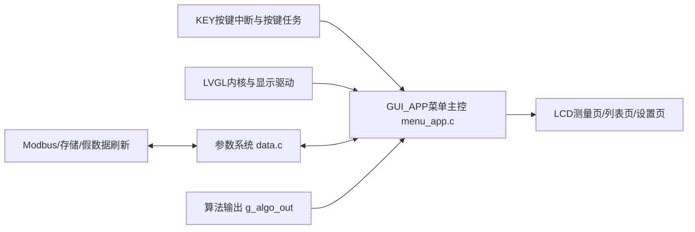
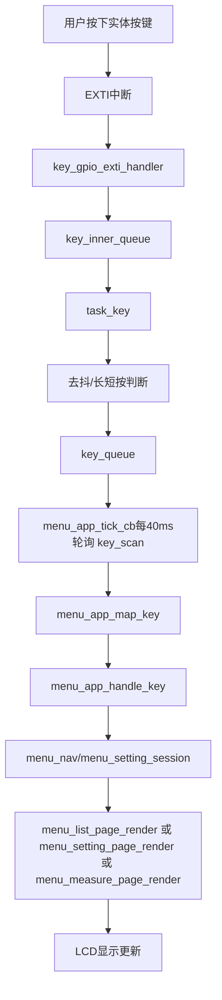
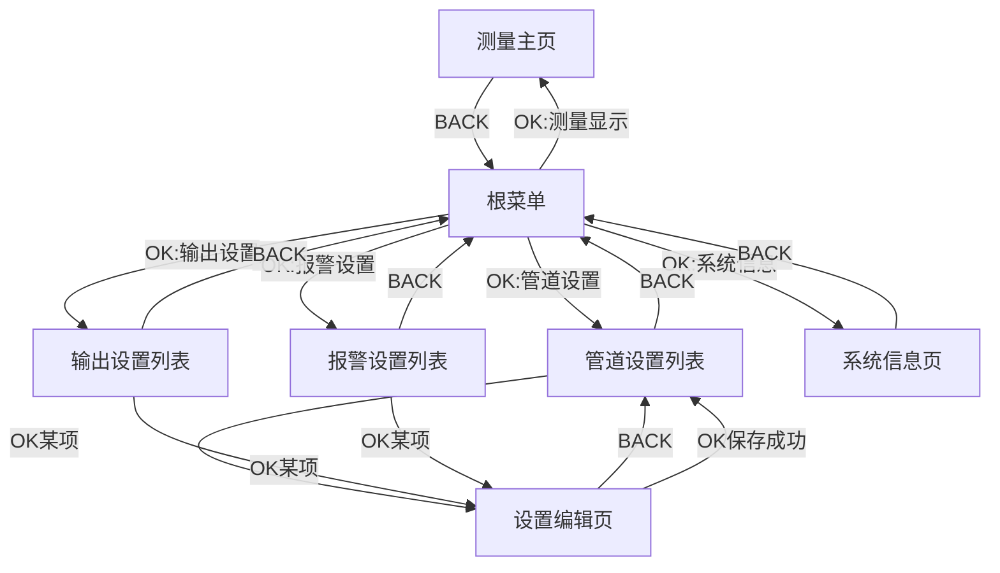
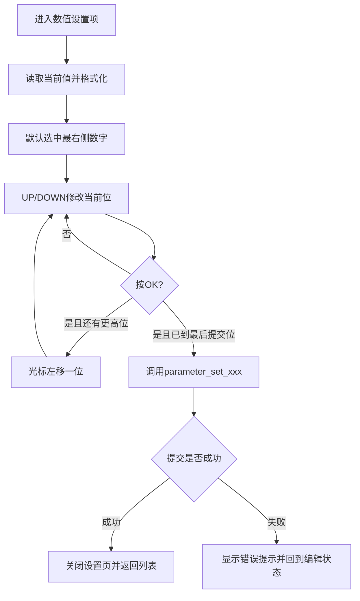

# MCU 菜单界面系统设计与实现分析文档

## 1. 文档目的与分析对象

本文档面向毕业设计论文写作，针对当前 MCU 工程中的 `Middlewares/LVGL/GUI_APP` 菜单界面系统进行系统化分析。文档目标不是简单罗列函数与文件，而是从“系统如何运行起来、界面如何组织、交互如何完成、显示数据如何与业务参数和算法输出联动”的角度，对菜单界面子系统的设计与实现进行较为完整的阐释，为后续论文中“人机交互界面设计”“菜单系统设计”“嵌入式图形界面实现”“设置项交互流程”等章节提供直接参考。

本文重点分析以下模块及其调用关系：

- `Middlewares/LVGL/GUI_APP/code/src/menu_app.c`
- `Middlewares/LVGL/GUI_APP/code/src/menu_data.c`
- `Middlewares/LVGL/GUI_APP/code/src/menu_nav.c`
- `Middlewares/LVGL/GUI_APP/code/src/menu_list_page.c`
- `Middlewares/LVGL/GUI_APP/code/src/menu_measure_page.c`
- `Middlewares/LVGL/GUI_APP/code/src/menu_setting_page.c`
- `Middlewares/LVGL/GUI_APP/code/src/menu_setting_backend.c`
- `Middlewares/LVGL/GUI_APP/code/src/menu_setting_session.c`
- `Middlewares/LVGL/GUI_APP/code/src/lvgl_app_test.c`
- `Middlewares/LVGL/GUI_APP/code/inc/*.h`

同时结合下列外围模块分析菜单系统的真实运行环境：

- `BSP/KEY/src/bsp_key.c`
- `BSP/KEY/inc/bsp_key.h`
- `TestTask/src/task_key.c`
- `TestTask/src/does_it_work.c`
- `User/main.c`
- `User/gd32f30x_it.c`
- `App/src/data.c`
- `App/src/algorithm_flow.c`
- `Middlewares/LVGL/GUI/lvgl/examples/porting/lv_port_disp_template.c`
- `Middlewares/LVGL/GUI/lvgl/lv_conf.h`

从代码组织上看，当前 GUI_APP 并不是一个追求高度通用化的图形框架，而是一套围绕本项目测量、参数设置与现场演示需求构建的、偏实用化和功能驱动的嵌入式菜单系统。其特点是结构清晰、链路短、可运行性强，便于在资源受限 MCU 平台上快速形成稳定可用的人机交互界面。

---

## 2. 菜单界面系统在 MCU 软件中的定位

从整个工程的软件分层来看，GUI_APP 位于图形界面层和人机交互层，是连接底层显示驱动、按键输入、参数系统和算法输出的重要上层模块。其本质职责不是参与流量测量算法本身，也不是直接控制底层硬件，而是对系统当前状态进行可视化呈现，并向用户提供参数浏览、菜单导航和设置修改入口。

在当前工程中，菜单系统与其他层之间的关系可以概括如下：

- 与任务层的关系：菜单界面运行在独立的 FreeRTOS 任务中，由 `task_lvgl_test()` 作为任务入口适配器，最终进入 `menu_app_task()`。因此它拥有独立的执行上下文，不会阻塞其他业务任务。
- 与显示驱动层的关系：GUI_APP 并不直接操作 LCD 寄存器或 SPI 总线，而是依赖 LVGL 内核和 `lv_port_disp_template.c` 中的显示端口适配，由 LVGL 完成绘图调度、脏区刷新和最终刷屏。
- 与按键输入层的关系：本项目没有将 4 个实体按键注册成 LVGL 的标准 `indev` 输入设备，而是由 `BSP/KEY` 子系统负责中断采集、去抖、长短按识别，再由 GUI_APP 定时轮询 `key_scan()` 读取抽象按键值。这是一种“底层事件驱动、上层轮询消费”的混合设计。
- 与参数系统的关系：菜单中的设置项本身并不持有参数存储逻辑。参数的读取、合法性校验、提交、保存和默认值恢复均由 `App/src/data.c` 提供统一接口。GUI 只是通过 `menu_setting_backend.c` 将界面上的设置项 ID 映射到参数系统字段。
- 与算法输出的关系：主测量页面显示的数据不通过消息队列逐帧推送，而是直接读取全局输出快照 `g_algo_out`。这样 GUI 始终展示“当前最近一次算法结果”，逻辑简单，适合仪表盘式显示。

从工程设计角度看，这种组织方式的作用主要体现在三方面。

第一，它使界面逻辑与算法、通信、存储等核心业务逻辑解耦。菜单页只负责显示和交互，不关心底层计算细节；参数系统只负责维护参数，不关心具体页面布局；按键系统只负责生成输入事件，不关心页面跳转。

第二，它降低了嵌入式图形界面开发的复杂度。由于本项目使用的是 240×240 小尺寸 LCD、4 个实体按键和层级较浅的菜单树，因此采用“静态页面对象 + 轻量状态机 + 定时轮询”的结构，比引入更复杂的通用 UI 框架更符合 MCU 场景。

第三，它增强了系统演示性与完整性。菜单系统不仅使测量结果可视化，还使参数设置、单位切换、报警阈值调整、系统信息查看等功能能在板上完成闭环，从而使整个毕业设计的软件系统更完整、更具展示价值。

下面给出菜单系统在整个软件中的大致位置关系。



---

## 3. 菜单系统的整体结构与模块划分

### 3.1 整体结构

GUI_APP 目录下的代码并不是按“完全严格的 MVC 框架”来组织的，而是采用一种更适合嵌入式场景的分层方式：

- `menu_app.c`：菜单应用主控层
- `menu_nav.c`：菜单导航状态机层
- `menu_data.c`：菜单树与设置项描述数据层
- `menu_measure_page.c`、`menu_list_page.c`、`menu_setting_page.c`：页面渲染层
- `menu_setting_backend.c`：设置项后端适配层
- `menu_setting_session.c`：设置项编辑会话层
- `menu_style.h`、`menu_strings.h`：界面公共资源层
- `lvgl_app_test.c`：任务入口适配层

这种拆分方式有明显的工程意图：将“页面怎么画”“页面切换由谁控制”“菜单树长什么样”“设置值怎么读写”“设置编辑时的临时状态怎么保存”分散到不同模块中，从而避免所有逻辑都集中堆叠在一个大文件里。

### 3.2 `menu_app.c` 的职责

`menu_app.c` 是整个菜单子系统的中枢。它承担的工作包括：

- 初始化 LVGL 和页面对象
- 维护当前所在页面状态
- 周期性轮询按键并分发给不同页面逻辑
- 控制测量页、列表页、设置页之间的切换
- 从 `g_algo_out` 与 `g_parameters` 中提取显示数据
- 维护 GUI 运行时诊断信息 `g_menu_app_diag_snapshot`

可以认为，`menu_app.c` 负责“界面运行时总调度”。

### 3.3 `menu_nav.c` 的职责

`menu_nav.c` 只关心菜单导航状态，不直接操作 LVGL 控件。它定义了 `menu_nav_state_t` 和 `menu_nav_frame_t`，负责维护：

- 当前处于哪一页
- 当前选中了哪一项
- 是否进入了子菜单
- 当前菜单栈深度是多少

这种设计使导航逻辑与页面显示逻辑解耦。也就是说，`menu_nav.c` 决定“应该显示什么”，而各 page 文件负责“如何显示出来”。

### 3.4 `menu_data.c` 的职责

`menu_data.c` 定义静态菜单树和设置项元数据，是整个菜单系统的数据源。其内容包括：

- 菜单根页 `s_menu_root_page`
- 子页 `s_menu_pipe_page`、`s_menu_output_page`、`s_menu_alarm_page`
- 菜单项数组 `s_menu_root_items` 等
- 设置项描述 `menu_setting_desc_t`
- 各种选项型设置的可选值表 `menu_setting_option_t`

这是一种典型的数据驱动组织方式。导航层和设置层都不需要硬编码“有哪些页面、每页有哪些项”，只需要读取这里提供的数据描述即可。

### 3.5 Page 文件的职责

三个 page 文件分别承担不同页面的可视化渲染职责：

- `menu_measure_page.c`：创建并更新测量主页控件
- `menu_list_page.c`：创建并更新菜单列表页控件
- `menu_setting_page.c`：创建并更新设置编辑页控件

这些文件的共同特点是只负责 LVGL 控件层，不处理复杂业务流程。它们基本遵循：

1. `*_create()`：启动时一次性创建所有控件
2. `*_set_visible()`：通过隐藏/显示切换页面可见性
3. `*_render()`：用外部传入的数据刷新界面内容

这种写法虽然不像通用 GUI 框架那样具备高度抽象，但对 MCU 工程来说非常实用：对象只创建一次，运行中只做内容更新和显示切换，减少了动态创建销毁带来的内存抖动和复杂性。

### 3.6 `menu_setting_backend.c` 与 `menu_setting_session.c`

这两部分构成了设置项系统的核心。

- `menu_setting_backend.c` 负责把界面设置项映射到参数系统字段。它知道：
  - 某个设置项应读哪个参数
  - 某个设置项保存时该调用哪个 `parameter_set_xxx()` 接口
  - 某个设置项应该如何构造显示内容、单位与提示语
- `menu_setting_session.c` 负责编辑过程中的临时状态。它知道：
  - 当前正在编辑哪个设置项
  - 当前值是多少
  - 数值编辑时高亮的是哪一位数字
  - 上一次保存结果是成功还是失败

从结构上看，这是本项目 GUI_APP 中最接近“前后端分层”的部分：设置页渲染层只展示 view，会话层维护编辑状态，后端层负责与参数系统交互。

### 3.7 适配层与公共资源层

`lvgl_app_test.c` 只是一个很薄的包装层，它把任务入口 `task_lvgl_test()` 转发给 `menu_app_task()`。这样任务创建层只需要知道“创建一个 LVGL 任务”，不必了解菜单实现细节。

`menu_style.h` 统一管理屏幕尺寸、颜色、字体、页面可见项数等公共样式宏，并提供：

- `menu_prepare_page_root()`
- `menu_set_page_hidden()`
- `menu_font_cn()` / `menu_font_latin_xx()`

`menu_strings.h` 则集中定义中文标题和提示文本。值得注意的是，该文件使用 UTF-8 字节序列形式定义字符串常量，有助于减小不同编译环境下的字符编码问题。

---

## 4. 菜单界面的启动与运行过程

菜单界面的启动不是孤立发生的，而是嵌入在整个 MCU 系统上电初始化流程之中。根据当前代码，其启动过程可以梳理如下。

### 4.1 从 `main()` 到任务创建

在 `User/main.c` 中，`main()` 的执行顺序非常清晰：

1. 调用 `hardware_periph_init()` 完成硬件外设初始化
2. 调用 `my_elog_init()` 初始化日志输出
3. 调用 `does_it_work()` 进入当前固件的测试型系统启动入口

`does_it_work()` 位于 `TestTask/src/does_it_work.c`，其主要工作是：

1. 调用 `freertos_resources_init()` 初始化 FreeRTOS 共享资源
2. 调用 `parameter_init()` 初始化参数系统
3. 调用 `init_modbus_data()` 初始化 Modbus 映射
4. 调用内部 `task_test()` 创建各个 FreeRTOS 任务

在 `task_test()` 中，当前与 GUI 直接相关的任务是：

- `task_lvgl_test`
- `task_key`

其中 `task_lvgl_test` 的优先级配置为 `TASK_LVGL_TEST_PRIO`，栈大小为 `TASK_LVGL_TEST_STACK_SIZE`；该任务本身并不实现界面逻辑，而是进入 `Middlewares/LVGL/GUI_APP/code/src/lvgl_app_test.c` 中的 `task_lvgl_test()`，然后立即转调 `menu_app_task()`。

### 4.2 `menu_app_task()` 的启动过程

`menu_app_task()` 位于 `menu_app.c`，是整个菜单系统的真正入口。其启动过程如下：

1. 调用 `lv_init()` 初始化 LVGL 内核
2. 调用 `lv_port_disp_init()` 初始化显示端口
3. 调用 `menu_app_create(&s_menu_app)` 创建所有页面对象和菜单上下文
4. 调用 `lv_timer_create(menu_app_tick_cb, MENU_KEY_POLL_PERIOD_MS, NULL)` 创建 GUI 业务定时器
5. 进入 `while(1)` 无限循环，循环中持续调用 `lv_timer_handler()`
6. 每轮循环后 `vTaskDelay(pdMS_TO_TICKS(5U))`，防止任务空转独占 CPU

这一流程可用下图表示。

```mermaid
flowchart TD
    A[main] --> B[hardware_periph_init]
    B --> C[my_elog_init]
    C --> D[does_it_work]
    D --> E[task_test创建task_lvgl_test]
    E --> F[task_lvgl_test]
    F --> G[menu_app_task]
    G --> H[lv_init]
    H --> I[lv_port_disp_init]
    I --> J[menu_app_create]
    J --> K[lv_timer_create menu_app_tick_cb 40ms]
    K --> L[while(1)]
    L --> M[lv_timer_handler]
    M --> N[vTaskDelay 5ms]
    N --> L
```

### 4.3 LVGL 运行机制与本项目的结合方式

本项目中，LVGL 的时间基准并没有通过手动调用 `lv_tick_inc()` 维护，而是通过 `lv_conf.h` 中的自定义 tick 配置直接使用 FreeRTOS 系统时钟：

- `LV_TICK_CUSTOM = 1`
- `LV_TICK_CUSTOM_SYS_TIME_EXPR = (xTaskGetTickCount() * portTICK_PERIOD_MS)`

这意味着 LVGL 的计时、动画、定时器超时、刷新间隔等都以 FreeRTOS tick 为时间基准。结合 `menu_app_task()` 中高频调用的 `lv_timer_handler()`，就形成了一个比较标准的“RTOS + LVGL”运行模式。

需要特别说明的是，本项目的按键输入并没有通过 LVGL 自带的 `indev` 设备层接入，而是由 GUI_APP 自己创建了一个定时器回调 `menu_app_tick_cb()` 来完成：

- 按键轮询
- 菜单事件分发
- 主测量页定时刷新
- GUI 诊断监测

因此，`menu_app_tick_cb()` 更接近“界面业务心跳”，而 `lv_timer_handler()` 是 LVGL 内核的总调度函数。两者的关系可以概括为：

- `lv_timer_handler()` 负责驱动 LVGL 内核执行到期定时器
- `menu_app_tick_cb()` 是其中一个由 LVGL 管理的业务定时器
- `menu_app_task` 通过循环调用 `lv_timer_handler()`，使 GUI_APP 业务逻辑获得周期性执行机会

### 4.4 页面对象创建与一次性布局

在 `menu_app_create()` 中，会一次性创建以下三个页面对象：

- `menu_measure_page_create()`
- `menu_list_page_create()`
- `menu_setting_page_create()`

之后通过 `menu_app_hide_all()` 隐藏所有页面，再调用：

- `menu_app_show_measure()`
- `menu_app_render_measure()`

把系统初始界面设置为测量主页。

这说明当前菜单系统采用的是“启动时全部创建，运行中只切换可见性”的策略，而不是按需进入页面后再临时创建对象。该方式在 MCU 平台上的优点很明显：

- 降低页面切换时的响应延迟
- 减少频繁申请释放 LVGL 内存的风险
- 简化对象生命周期管理

---

## 5. 菜单显示流程分析

### 5.1 主测量页面的显示逻辑

主测量页面由 `menu_measure_page.c` 实现。页面对象包括：

- `sq_label`：左上角 SQ 值
- `scale_label`：右上角满量程提示
- `arc`：中心圆弧仪表
- `value_label`：中心主数值
- `unit_label`：瞬时流量单位
- `total_label`：底部累计量文本

其中，`menu_measure_page_create()` 只负责对象创建和静态布局；真实数据刷新由 `menu_measure_page_render()` 完成。

在 `menu_app_render_measure()` 中，测量页的显示数据来源于两个全局状态：

- `g_algo_out`：算法输出快照
- `g_parameters`：系统参数，尤其是报警上限与单位配置

该函数的处理步骤大致为：

1. 读取 `g_algo_out.sq_value`
2. 读取 `g_algo_out.flow_rate_instant`
3. 读取 `g_algo_out.flow_rate_total`
4. 通过 `g_parameters.alarm_upper_rate_range` 计算 arc 满量程
5. 计算当前瞬时值相对于满量程的比例
6. 换算为 `MENU_ARC_VALUE_MAX` 对应的 arc 值
7. 将数值、单位、累计量和 arc 值传给 `menu_measure_page_render()`

需要注意两个设计细节。

第一，arc 的满量程并不是固定写死，而是通过 `menu_app_get_arc_full_scale()` 读取当前流量报警上限 `alarm_upper_rate_range` 计算而来。这意味着用户修改报警上限后，测量界面中的图形化仪表也会随之改变量程。

第二，`menu_measure_page_render()` 不会无条件重写所有标签，而是先比较字符串是否真的变化，再调用 `lv_label_set_text_static()` 更新文本；arc 也只有在数值变化时才重新设值。这种“先比较、后更新”的方式可以减少不必要的重绘和 LCD 刷新压力。

### 5.2 列表页的显示逻辑

列表页由 `menu_list_page.c` 实现。它的功能是把导航状态转化为可视化菜单列表。页面主要由三部分组成：

- 顶部左侧标题 `title_label`
- 顶部右侧页码 `page_label`
- 中间三行菜单项面板 `item_panels[]` 与标签 `item_labels[]`

当前系统在 `menu_style.h` 中定义：

- `MENU_VISIBLE_ITEMS = 3`

因此每页固定显示 3 条菜单项，超出的内容通过分页方式展示。在 `menu_list_page_render()` 中，会调用：

- `menu_nav_get_current_page()`
- `menu_nav_get_total_pages()`
- `menu_nav_get_current_page_index()`
- `menu_nav_get_visible_items()`

从导航状态中提取当前页标题、页码和本页可见菜单项，再逐行刷新面板内容与选中样式。当前选中项会通过 `menu_list_page_apply_style()` 加亮背景、显示绿色边框，从而形成明显的光标感。

### 5.3 设置页的显示逻辑

设置页由 `menu_setting_page.c` 实现，是三类页面中渲染逻辑最复杂的一个。其页面包含：

- 标题 `title_label`
- 值显示面板 `value_panel`
- 单位标签 `unit_label`
- 说明文本 `body_label`
- 底部返回提示 `footer_label`
- 若干字符框 `char_boxes[]` 与 `char_labels[]`

这里最有特点的实现是数值显示面板不是用一个整体字符串直接显示，而是把字符串拆分到多个字符框中逐位显示。这样可以对其中某一位高亮，形成类似老式仪表或数码管参数设置界面中的“逐位编辑”效果。

`menu_setting_page_render_value()` 的工作流程为：

1. 统计当前值字符串长度
2. 计算总宽度并让整个字符串水平居中
3. 逐字符创建/更新显示框
4. 若字符位置等于当前选中编辑位，则以白底黑字高亮
5. 若超出有效长度，则隐藏多余字符框

这使得设置页不仅能显示数值，还能直观表达“当前正在编辑哪一位”。

### 5.4 页面切换方式

页面切换并不是通过销毁旧页面、创建新页面来完成，而是由 `menu_app_hide_all()` 统一隐藏全部页面，然后只显示目标页面：

- `menu_measure_page_set_visible()`
- `menu_list_page_set_visible()`
- `menu_setting_page_set_visible()`

本质上，这是一种“页面常驻内存、切换时仅修改隐藏标志”的实现方式。它的优点是切换速度快、结构简单，也更适合资源受限 MCU 平台。其不足是三个页面对象会一直常驻 RAM 中，但在当前项目中，这种空间换时间的策略是合理的。

---

## 6. 按键输入与菜单交互流程分析

### 6.1 输入链路总体特征

本项目的按键链路不是完全意义上的“界面层直接扫描 GPIO”，而是一条分层比较明确的链路：

1. 外部中断采集物理按键边沿
2. `BSP/KEY` 中的 `task_key()` 完成去抖和长短按识别
3. GUI_APP 在自身定时器回调中轮询 `key_scan()` 获取抽象按键值
4. `menu_app_handle_key()` 根据当前页面状态做交互分发
5. 页面渲染函数刷新界面

因此，严格来说，当前菜单系统采用的是“中断驱动采集 + 任务完成按键语义识别 + 菜单层周期轮询消费”的混合机制。

### 6.2 中断层：从 GPIO 到边沿事件

在 `User/gd32f30x_it.c` 中，各个 EXTI 中断服务函数最终会调用统一入口 `GPIO_EXTI_IRQHandler()`。当 GPIO 来源属于 `KEY1~KEY4` 时，会进一步调用：

- `key_gpio_exti_handler(GPIO_PIN_x)`

`key_gpio_exti_handler()` 位于 `BSP/KEY/src/bsp_key.c`。该函数的职责非常克制，它不会在中断中直接判断长短按，也不会直接推动页面切换，而是只做以下轻量工作：

- 根据 GPIO 引脚识别是哪一个按键
- 根据当前期待边沿判断是按下还是释放
- 记录当前触发时刻
- 将边沿事件对象指针送入 `key_inner_queue`

这种做法避免了在中断中执行复杂逻辑，是较为合理的实时性设计。

### 6.3 按键任务：去抖与短按/长按识别

`task_key()` 是按键系统的核心任务。它创建了两个队列：

- `key_inner_queue`：中断送入的原始边沿事件
- `key_queue`：向上层提供的最终抽象按键值

其工作流程为：

1. 阻塞等待 `key_inner_queue` 中的新事件
2. 若收到下降沿且状态机处于空闲，则记录为“按下开始”
3. 若随后收到上升沿，则计算按下持续时间
4. 小于 `DEBOUNCE_TIME_MS` 则视为无效抖动
5. 位于 `SHORT_PRESS_THRESHOLD_MS` 与 `LONG_PRESS_THRESHOLD_MS` 之间则判为短按
6. 大于等于 `LONG_PRESS_THRESHOLD_MS` 则判为长按
7. 把最终的 `KEY1_PRESS`、`KEY2_LONG_PRESS` 等结果送入 `key_queue`

这一步完成后，GUI 不必再关心物理边沿，只需读取统一格式的键值。

### 6.4 菜单层：按键值映射与页面动作

GUI_APP 并不直接使用 `KEY1_PRESS` 这类底层定义，而是在 `menu_app_map_key()` 中把它们再次映射到菜单内部语义键：

- `KEY1_PRESS / KEY1_LONG_PRESS -> MENU_KEY_OK`
- `KEY2_PRESS / KEY2_LONG_PRESS -> MENU_KEY_UP`
- `KEY3_PRESS / KEY3_LONG_PRESS -> MENU_KEY_DOWN`
- `KEY4_PRESS / KEY4_LONG_PRESS -> MENU_KEY_BACK`

这说明当前菜单系统在上层没有区分长按和短按，所有长按都被等价处理成对应功能键。这是一种简化设计：对于 4 键菜单而言，当前版本更关注稳定完成基本导航，而不是扩展复杂手势语义。

### 6.5 菜单事件分发机制

`menu_app_tick_cb()` 每 `MENU_KEY_POLL_PERIOD_MS = 40ms` 执行一次。在该函数中，会调用：

- `key_scan(0U)`

以非阻塞方式尝试读取一个按键值。若读到非 `MENU_KEY_NONE`，则调用：

- `menu_app_handle_key(&s_menu_app, key)`

`menu_app_handle_key()` 是菜单交互的主分发函数。它根据 `current_screen` 进行三路分发。

#### 6.5.1 测量页上的按键行为

当前代码中，测量页只响应一个键：

- `BACK`：进入菜单根页

也就是说，测量页本质上被设计为默认仪表盘界面，平时只负责显示数据，不承担参数交互入口；用户需要按下返回键才能进入菜单浏览。

#### 6.5.2 列表页上的按键行为

列表页中：

- `UP`：`menu_nav_move_up()`，选中项上移
- `DOWN`：`menu_nav_move_down()`，选中项下移
- `OK`：调用 `menu_app_handle_ok()` 进入对应项
- `BACK`：
  - 若当前处于子菜单，则 `menu_app_back_to_parent()`
  - 若当前已是根菜单，则返回测量页

这里的 `menu_app_handle_ok()` 会根据选中项的 `menu_entry_type_t` 做进一步分支：

- `MENU_ENTRY_MEASURE`：回到测量页
- `MENU_ENTRY_SUBMENU`：进入子菜单，仍显示列表页
- `MENU_ENTRY_SETTING`：进入设置页

#### 6.5.3 设置页上的按键行为

设置页中：

- `BACK`：取消当前编辑，返回列表页
- `UP`：若当前会话有效，则对会话执行 `step_up`
- `DOWN`：若当前会话有效，则执行 `step_down`
- `OK`：调用 `menu_setting_session_confirm()` 完成“位移/保存/执行动作”

设置页中的 OK 键不是单纯“保存”键，而是一个和设置项类型强相关的复合键，其具体行为由会话层控制，后文将详细分析。

### 6.6 菜单交互全过程示意



### 6.7 这种输入联动方式的优缺点

优点在于：

- 中断中工作量小，实时性较好
- 按键识别与菜单业务解耦
- GUI 不需要直接处理去抖与长短按时序问题
- 4 键输入与菜单动作的映射关系非常清晰

不足在于：

- 菜单层是周期性轮询消费输入，而不是事件到达后立刻回调
- 长按与短按在当前菜单层被等价处理，功能扩展空间尚未使用
- 若多个键值短时间内堆积，`menu_app_tick_cb()` 每次只消费一个，理论上存在轻微输入排队现象

但考虑到人机操作频率远低于 40ms，这种实现对当前项目是足够的。

---

## 7. 导航状态管理机制分析

### 7.1 轻量级菜单栈设计

导航状态由 `menu_nav_state_t` 描述，其核心字段为：

- `frames[MENU_NAV_MAX_DEPTH]`
- `depth`

每个 `menu_nav_frame_t` 只包含：

- `page`
- `selected_index`

也就是说，每一层菜单只保存“当前页面”和“当前选中项”。页码起始位置、总页数、当前页号等信息都不是显式存储，而是通过 `selected_index` 和 `items_per_page` 动态推导。这使得导航状态结构非常轻量。

### 7.2 页面进入与返回

`menu_nav_enter()` 是导航进入函数。它会读取当前选中项，然后：

- 若选中的是子菜单，并且栈深未超限，则把子页压入栈中
- 若选中的是测量页或设置项，则仅把条目类型和对象指针返回给上层处理

`menu_nav_pop()` 则用于退回上一层页面，其实现仅仅是 `depth--`。说明导航栈本身是一个非常简洁的“页面轨迹记录器”。

### 7.3 选中项与分页计算

导航状态并不直接保存“当前第几页”，而是通过以下关系计算：

- 页大小：`menu_nav_resolve_page_size()`
- 页起始索引：`menu_nav_get_page_start()`
- 总页数：`menu_nav_get_total_pages()`
- 当前页号：`menu_nav_get_current_page_index()`

这样的设计避免了多个状态字段之间相互同步的问题。只要 `selected_index` 正确，分页相关信息都能被推导出来。

### 7.4 默认索引与返回行为

一个值得注意的实现细节是：页面回退后通常会调用 `menu_nav_reset_current_selection()`，把当前页选中项恢复到默认索引。也就是说，当前菜单系统并不刻意保留“用户返回前刚刚浏览到哪一项”的位置。

这种做法的好处是：

- 状态管理更简单
- 菜单回退后行为一致
- 对家电式、仪表式菜单更友好

但从交互细腻度来说，其代价是返回时不记忆上次光标位置。若未来需要增强可用性，可以考虑保留每层页面的光标状态而不是重置默认项。

### 7.5 菜单树是静态拓扑

当前菜单树在 `menu_data.c` 中静态定义，其根页包含 5 个条目：

- 测量显示
- 管道设置
- 输出设置
- 报警设置
- 系统信息

其中：

- 管道设置页下有外径、壁厚、材质
- 输出设置页下有输出模式、流量单位、刷新率
- 报警设置页下有下限报警、上限报警、零点学习

这说明当前菜单系统是典型的“固定拓扑菜单”。这种结构缺乏动态扩展性，但在 MCU 环境中非常稳健，且占用 RAM 极少。

菜单页面流转关系可以概括为下图。



注：从当前代码推断，设置页返回后会回到其所在列表页；系统信息页属于 `MENU_SETTING_KIND_INFO`，本质上也是设置页的一种只读形式。

---

## 8. 设置项系统分析

### 8.1 设置项描述数据的来源

设置项定义集中在 `menu_data.c` 中，核心数据结构是 `menu_setting_desc_t`。它描述了一个设置项的：

- ID
- 标题
- 类型
- 占位提示文本
- 数值规格
- 选项规格

当前支持的设置项类型由 `menu_setting_kind_t` 定义：

- `MENU_SETTING_KIND_INFO`
- `MENU_SETTING_KIND_NUMERIC`
- `MENU_SETTING_KIND_OPTION`
- `MENU_SETTING_KIND_ACTION`

这使得设置系统可以用统一的描述结构支撑多种交互形式，而不是为每个设置项单独写一个页面或一个处理函数。

### 8.2 设置后端层：从设置 ID 到参数字段

`menu_setting_backend.c` 是 GUI 与参数系统之间的桥梁。它负责三类工作。

第一，读取当前参数值：

- `menu_setting_backend_get_numeric_value()`
- `menu_setting_backend_get_option_value()`

第二，把界面修改后的值提交回参数系统：

- `menu_setting_backend_commit_numeric()`
- `menu_setting_backend_commit_option()`
- `menu_setting_backend_execute_action()`

第三，构造设置页展示所需的只读 view：

- `menu_setting_backend_build_view()`

例如：

- 管道外径、壁厚、报警上下限通过 `parameter_get_double()` 和 `parameter_set_double()` 访问
- 输出模式、流量单位、刷新率、材质通过 `parameter_get_u32()` 和 `parameter_set_u32()` 访问
- 零点学习通过 `parameter_execute_action(PARAMETER_ACTION_ZERO_LEARN_START)` 执行

这样，设置页本身并不知道 `g_parameters` 的具体字段名，也不直接触碰 EEPROM/Modbus 同步逻辑，而是通过后端层统一处理。

### 8.3 设置会话层：编辑过程状态管理

`menu_setting_session.c` 的作用非常关键。它将“设置项当前正在被编辑”这一过程抽象成 `menu_setting_session_t`。其中保存了：

- 当前设置项描述 `setting`
- 数值型临时值 `numeric_value`
- 选项型临时值 `option_value`
- 当前是否激活 `active`
- 是否修改过 `dirty`
- 当前编辑的是哪一位数字 `selected_digit_index`
- 数字字符对应位置 `digit_positions[]`
- 最近一次提交状态 `last_status`
- 当前显示字符串 `value_text`
- 当前说明文本 `detail_text`

换句话说，会话层承担了典型的人机交互编辑状态机职责。GUI 的按键不会直接修改全局参数，而是先驱动会话状态变化，只有在用户确认时，才把结果提交给后端。

### 8.4 数值设置项的编辑流程

数值设置项的编辑流程最能体现当前系统的设计特点。

当用户进入数值型设置项时，`menu_setting_session_begin()` 会：

1. 调用后端读取当前数值
2. 按整数位数和小数位数格式化为字符串
3. 扫描字符串中每一位数字的位置
4. 默认将选中位设为最右侧数字
5. 生成默认提示文本，如 `UP/DOWN EDIT`、`OK NEXT/SAVE`

之后：

- `UP` 调用 `menu_setting_session_step_up()`，本质是把当前位数字加一
- `DOWN` 调用 `menu_setting_session_step_down()`，本质是把当前位数字减一
- 修改后立即重新解析成 `double`，若越界则回滚修改

这里的数值编辑不是“整值加减”，而是“逐位数字编辑”。这非常适合 4 键、小屏幕、无触摸的嵌入式设备，因为用户不需要复杂输入法，仅凭上下和确认键即可完成参数设定。

当用户按 `OK` 时：

- 如果当前还没有移到最左侧数字，则仅把光标左移一位
- 只有在最后一位确认时，才真正调用后端提交参数

这是一种分阶段确认机制，可表达为下图。



### 8.5 选项设置项的编辑流程

对于枚举/选项型设置项，例如：

- 管道材质
- 输出模式
- 流量单位
- 刷新率

流程要简单得多。进入设置页后：

- `UP/DOWN` 只修改会话中的候选值
- `OK` 时一次性调用后端提交
- 成功则关闭页面，失败则显示错误

值得注意的是，虽然 `menu_setting_backend_step_option()` 提供了按步进直接提交的后端接口，但从当前 GUI 主链代码看，设置会话层并没有直接使用该函数，而是自己维护候选值，再由确认键统一提交。这说明当前实现更强调“先选择，再确认”，而不是边切换边写全局参数。

### 8.6 动作项与信息项

当前设置项中还存在两类特殊项目。

#### 8.6.1 动作项：零点学习

`MENU_SETTING_ID_ZERO_LEARN` 被定义为 `MENU_SETTING_KIND_ACTION`。它的特点是：

- 页面中仍可显示当前零偏相关数值
- `UP/DOWN` 不进行数值编辑
- `OK` 时执行后端动作 `PARAMETER_ACTION_ZERO_LEARN_START`

这说明设置页不仅用于修改参数，也能承载具有“命令型”特征的功能入口。

#### 8.6.2 信息项：系统信息

`MENU_SETTING_ID_SYSTEM` 被定义为 `MENU_SETTING_KIND_INFO`。它不会进入编辑状态，而是通过 `menu_setting_backend_build_view()` 直接构造只读文本，当前主要显示：

- Modbus 地址
- 存储方式是 EEPROM 还是 RUNTIME
- 参数是否已保存

该页本质上是一个只读信息展示页，适合用于毕业设计中的“系统状态查询界面”说明。

### 8.7 设置项与参数系统、单位切换的联动

GUI 设置最终都落在参数系统 `data.c` 中。关键提交接口是：

- `parameter_set_double()`
- `parameter_set_u32()`
- `parameter_commit()`
- `parameter_execute_action()`

其中 `parameter_commit()` 有一个很重要的逻辑：当只切换流量单位而报警上下限数值未显式修改时，会自动把报警阈值换算到新单位。这样可以保证物理报警点不变，只改变显示单位。这个机制对 GUI 十分关键，因为用户在菜单中切换单位后，测量页显示、报警设置页单位文本和阈值语义应当保持一致。

提交成功后，参数系统还会调用 `parameter_sync_external_state()` 同步：

- Modbus 保持寄存器
- Modbus 输入寄存器
- 假数据配置刷新请求

这意味着菜单设置不是孤立存在的，而是会同时影响通信侧、算法侧和显示侧，体现了界面与业务系统之间较强的联动关系。

---

## 9. 测量页面专项分析

### 9.1 页面布局组织

测量页在视觉上扮演系统“主界面”角色。其布局大致为：

- 顶部左侧：SQ
- 顶部右侧：满量程 `FS`
- 中央：圆弧仪表和主数值
- 主数值下方：瞬时流量单位
- 底部：累计流量与单位

这种布局将最核心的测量量放在中心位置，而把质量指标、量程信息和累计量放在边缘区域，符合仪表类界面的视觉习惯。

### 9.2 arc 仪表的实现逻辑

`menu_measure_page_create()` 中通过 `lv_arc_create()` 创建圆弧控件，并设置：

- 范围 `0 ~ MENU_ARC_VALUE_MAX`
- 背景角度 `130 -> 50`
- 主体与指示部分样式

圆弧不是直接用真实流量值驱动，而是由 `menu_app_render_measure()` 先按当前满量程换算成比例，再映射为 `0~1000` 的整数值。这是一种典型的“显示层归一化”做法，能让 arc 控件保持简单，不必知道真实物理单位和范围。

### 9.3 满量程的来源

当前 arc 满量程来源于：

- `g_parameters.alarm_upper_rate_range`

再经过 `menu_app_get_arc_full_scale()` 做绝对值与下限保护。由此可见，本项目把“上限报警值”同时作为仪表盘的视觉满量程参考值。这种设计的优点是：

- 仪表盘量程与报警阈值一致，便于理解
- 当用户调整上限阈值时，测量主界面能同步变化
- 不必为显示层再单独维护一套“仪表满量程参数”

这种实现非常适合毕业设计中的“参数设置与界面联动”论述。

### 9.4 单位切换与界面联动

从当前代码看，单位切换已经接入以下链路：

- 算法输出 `g_algo_out.flow_rate_unit`
- 算法输出 `g_algo_out.flow_total_unit`
- 测量页瞬时流量单位标签
- 测量页累计量单位标签
- arc 满量程文字 `FS: xx.x 单位`
- 设置页中的报警单位提示

`menu_app_render_measure()` 会直接使用：

- `rate_unit_to_str(g_algo_out.flow_rate_unit)`
- `volume_unit_to_str(g_algo_out.flow_total_unit)`

因此主测量页面的显示单位已经与算法输出联动，不再是简单的写死文本。与此同时，参数系统在单位切换时自动换算报警阈值，从而保证 arc 量程和报警设置仍然保持语义一致。

### 9.5 刷新频率与显示性能

测量页刷新由 `display_sensitivity` 决定，`menu_app_get_measure_refresh_period_ms()` 会把该参数视作 Hz，并进行上下限约束：

- 最小 1Hz
- 最大 25Hz
- 不能快于 `MENU_KEY_POLL_PERIOD_MS`

在 `menu_app_tick_cb()` 中，只有当前界面是测量页且达到设定刷新周期时，才会调用 `menu_app_render_measure()`。这说明测量页刷新并不是简单地每次 GUI 心跳都执行，而是受显示灵敏度参数约束。这既体现了参数可配置性，也体现了对 CPU 和刷屏负载的控制。

---

## 10. GUI_APP 的工程特点与代码组织风格

从当前代码实现来看，GUI_APP 具有较明显的“实用型嵌入式界面工程”特征。

### 10.1 偏功能驱动、偏静态配置

整个菜单拓扑、设置项、页面对象和样式基本都是静态定义的。这种方式不追求通用 UI 框架的动态配置能力，而是优先保证：

- 实现直观
- 内存行为可控
- 页面切换稳定
- 便于小团队或个人项目快速落地

这与毕业设计项目非常契合，因为其核心目标是围绕具体测量系统构建一套完整且可演示的人机交互方案，而不是实现一个可复用的通用图形界面平台。

### 10.2 分层较清晰，但不是严格教科书式架构

GUI_APP 的分层已经具备较强工程性：

- 菜单数据层
- 导航逻辑层
- 页面显示层
- 设置后端层
- 设置会话层
- 主控层

但它并非严格意义上的 MVC/MVVM 架构。例如：

- 页面渲染与部分视图格式化仍有耦合
- 菜单主控直接读取全局参数和算法输出
- 页面切换逻辑集中在 `menu_app.c`

这种做法在通用框架设计中可能显得抽象层次不够纯粹，但在资源受限 MCU 工程中恰恰体现了一种务实风格：优先保证路径短、对象少、状态清晰、调试方便。

### 10.3 输入机制是自定义的，而非完全依赖 LVGL 标准输入层

当前项目没有使用 LVGL 标准 indev/group/focus 机制完成菜单导航，而是通过：

- 实体键中断
- 独立按键任务
- GUI 心跳轮询
- 自定义状态机

来实现完整交互。这使得菜单系统对 4 键场景的适配更直接，也避免了为了有限交互需求而引入更复杂的 LVGL 输入抽象。

### 10.4 界面对象生命周期管理较稳妥

页面对象在启动时全部创建，运行中只进行：

- 隐藏/显示
- 文本刷新
- 样式切换

并且测量页对文本刷新采用“仅在变化时更新”的策略，体现出较强的资源意识。这种写法对于 MCU 平台十分重要。

### 10.5 一些可客观看待的局限

从工程分析角度，也应客观看到当前实现的一些特点与可优化空间。

1. 当前菜单返回后通常会重置选中项到默认值，未记忆上次光标位置，交互体验偏保守。
2. 菜单层把长按与短按统一映射，没有利用长按扩展快捷功能。
3. GUI 直接读取 `g_parameters` 和 `g_algo_out` 全局快照，而未通过消息队列或互斥机制获取一致性快照，逻辑上简单，但严格来说共享数据一致性保障较弱。
4. `output_mode` 等部分设置项已经进入菜单系统，但从当前 GUI 相关代码无法看出其是否已经完整联动到物理输出链路，因此在论文表述时应与“已完成显示与参数配置”区分开。

这些并不意味着设计不合理，而是体现了项目阶段性特征：当前更强调系统可运行、可联调、可展示。

---

## 11. 数据流与控制流综合分析

### 11.1 从算法到测量界面的数据流

当前主测量显示的数据流如下：

1. 原始数据由真实采集或假数据任务产生
2. 算法任务处理后更新全局输出 `g_algo_out`
3. `menu_app_tick_cb()` 在测量页刷新时触发 `menu_app_render_measure()`
4. `menu_app_render_measure()` 从 `g_algo_out` 读取瞬时流量、累计流量、SQ 与单位
5. 结果传入 `menu_measure_page_render()`
6. LVGL 更新控件并通过显示端口刷到 LCD

其特点是：

- 数据链路短
- 显示的是当前最新快照
- 没有在 GUI 中重复做算法计算

### 11.2 从用户按键到设置生效的控制流

用户修改设置项的控制链路为：

1. 按键中断产生边沿事件
2. `task_key()` 识别出抽象键值
3. `menu_app_tick_cb()` 读取该键值
4. `menu_app_handle_key()` 将其分派给当前页面
5. 若在设置页，则调用 `menu_setting_session_step_xxx()` 或 `confirm()`
6. 会话层根据设置项类型调用 `menu_setting_backend_*()`
7. 后端层调用 `parameter_set_double()` / `parameter_set_u32()` / `parameter_execute_action()`
8. `parameter_commit()` 完成校验、保存、同步与测量状态重置
9. 设置页根据返回状态刷新提示并关闭/保留页面

这条链路表明，设置界面并不是简单的“改个显示值”，而是与整个参数系统形成了完整闭环。

### 11.3 菜单界面与其他子系统的耦合方式

从代码结构上看，GUI_APP 与其他子系统的耦合总体上是“接口型耦合”，而不是“实现型耦合”。

- 对参数系统：通过 `parameter_get_xxx` / `parameter_set_xxx`
- 对算法系统：通过读取 `g_algo_out`
- 对按键系统：通过 `key_scan()`
- 对显示系统：通过 LVGL API 与 `lv_port_disp_init()`

这种边界划分使得 GUI_APP 能够较清晰地描述为一个独立子系统，适合作为毕业设计论文章节中的独立分析对象。

---

## 12. GUI_APP 在毕业设计论文中的写作提炼

从论文写作角度，当前 GUI_APP 代码可以提炼为以下几个有代表性的设计点。

### 12.1 菜单分层设计

可表述为：系统采用“菜单数据描述层—导航状态层—页面渲染层—设置后端层—设置会话层—菜单主控层”的层次化设计。该结构将菜单树定义、导航状态维护、页面显示、参数交互和运行时调度分离，降低了模块间耦合，便于后续扩展和维护。

### 12.2 面向嵌入式平台的轻量图形界面实现

可表述为：在资源有限的 GD32F303 平台上，采用 LVGL 作为轻量级图形库，通过一次性创建页面对象、运行时切换可见性、按需刷新内容的策略，实现了稳定的菜单切换与仪表盘显示，兼顾了图形表现力与资源约束。

### 12.3 按键驱动的人机交互机制

可表述为：系统将实体按键输入划分为中断采集、任务级去抖与长短按判定、菜单层按键轮询消费三个阶段，实现了底层输入采集与上层交互逻辑的解耦，保证了按键响应的可靠性与界面控制逻辑的清晰性。

### 12.4 参数设置与业务系统联动

可表述为：菜单设置项通过后端适配层统一映射到参数系统，用户在界面中的设置操作最终会进入参数提交流程，并进一步影响算法输出、显示刷新频率、Modbus 寄存器映射和测试数据生成范围，从而形成“界面—参数—业务逻辑”联动闭环。

### 12.5 测量数据显示与图形化表达

可表述为：系统将瞬时流量、累计流量、SQ 和报警上限等关键量转换为文本、单位标签与圆弧仪表等多种视觉元素，提高了测量结果的可读性和演示性。其中 arc 满量程与报警阈值联动的设计，有助于将参数配置与图形化显示统一起来。

### 12.6 数字逐位编辑的 4 键设置交互

可表述为：针对无触摸、无完整键盘的 MCU 平台，系统实现了基于上下键逐位修改、确认键逐位移动并最终提交的参数编辑机制，较好地适配了 4 键输入条件下的参数设定需求。这是嵌入式现场仪表界面中一种典型且实用的交互方式。

---

## 13. 适合在论文中强调的系统价值与亮点

综合代码分析，当前菜单界面系统至少具有以下几个可作为论文亮点的方向。

1. **界面分层明确**：虽然不是高度抽象的通用 GUI 框架，但已经实现了菜单树描述、导航状态管理、页面渲染和设置后端分离，具备较强工程组织性。
2. **交互链路完整**：从按键中断到菜单响应，再到参数提交与页面反馈，形成了完整闭环。
3. **与业务深度联动**：设置项并非停留在 UI 展示层，而是能真实影响参数系统、算法输出和通信映射。
4. **适配 MCU 资源环境**：采用页面常驻、定时轮询、按需刷新、静态菜单树等方法，在有限内存和运算能力下保证了稳定性。
5. **演示效果突出**：测量主页提供了较好的视觉中心，菜单结构清晰，有利于毕业设计答辩过程中的现场演示。

---

## 14. 可进一步优化的方向

根据当前代码，后续若继续完善 GUI_APP，可以考虑以下优化方向。

1. **增强页面状态记忆**  
   当前返回列表页时通常重置到默认项，未来可考虑保留光标位置，提高交互连续性。

2. **完善长按语义**  
   目前长按与短按在菜单层被统一映射，可扩展为长按快捷返回、快速步进等高级操作。

3. **提升共享数据一致性**  
   GUI 当前直接读取 `g_parameters` 和 `g_algo_out`，未来可考虑使用只读快照或轻量互斥，增强严格一致性。

4. **将部分菜单描述进一步参数化**  
   当前菜单树完全静态定义，若后续功能规模扩大，可考虑引入更统一的描述生成方式。

5. **补充图形层动画或状态提示**  
   当前界面强调可运行与清晰表达，若资源允许，可增加更细腻的页面过渡或状态反馈。

这些优化并不影响当前系统作为毕业设计原型的完整性，但可作为论文“后续改进方向”部分的内容。

---

## 15. 结论

综上所述，当前 `Middlewares/LVGL/GUI_APP` 菜单界面系统已经形成了一套较完整的嵌入式图形界面实现方案。它以 `menu_app.c` 为主控，以 `menu_nav.c` 为导航逻辑核心，以 `menu_data.c` 为静态菜单树数据源，以各 page 文件承担显示渲染，以 `menu_setting_backend.c` 和 `menu_setting_session.c` 完成设置项后端映射与编辑会话管理，并通过 `BSP/KEY` 子系统和 FreeRTOS 任务机制实现按键驱动的人机交互。

从系统设计思想上看，该菜单系统体现出以下特点：

- 面向 MCU 场景的轻量化设计
- 运行时对象生命周期清晰
- 页面显示、导航逻辑、参数读写相对解耦
- 与算法输出和参数系统形成闭环联动
- 能够较好支撑测量显示、参数设置、系统查询等核心界面需求

从毕业设计论文写作角度看，这部分代码不仅可以作为“界面设计与实现”的直接依据，也能够支撑“菜单分层设计”“键控交互流程”“参数设置闭环”“嵌入式图形界面实现方法”等多个章节内容。尽管其工程风格偏向实用主义和快速形成可运行结果，而非追求最大通用性，但这恰恰符合嵌入式仪表类项目对稳定性、清晰性和落地性的要求。

因此，当前 GUI_APP 可以被评价为：在资源受限 MCU 平台上，围绕具体测量系统需求构建的一套层次较清晰、交互闭环完整、具有工程实用价值和论文表述价值的菜单界面子系统。
