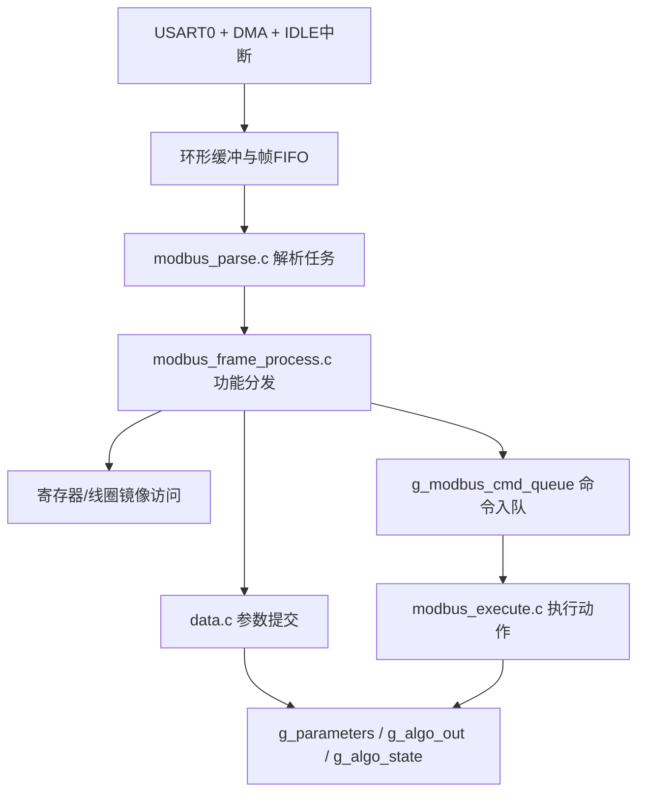
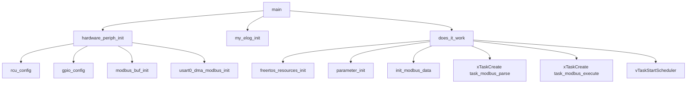

# Modbus 通信系统设计与实现分析文档

## 1. 文档说明与分析范围

本文档基于当前工作区中的 MCU 工程源码，对项目中的 Modbus 通信子系统进行专门分析。文档目标不是简单罗列函数和文件，而是从毕业设计论文写作的角度，系统说明该通信子系统在整机软件中的定位、结构划分、执行流程、任务协同、参数映射、异常处理与工程价值，为后续论文中“通信设计”“协议实现”“任务设计”“系统集成”“可靠性设计”等章节提供可直接引用或改写的技术材料。

本次分析的核心对象包括：

- `Middlewares/Modbus/inc/*.h`
- `Middlewares/Modbus/src/*.c`
- `TestTask/src/does_it_work.c`
- `TestTask/src/task_modbus.c`
- `App/src/data.c`
- `App/inc/data.h`
- `periph/src/usart.c`
- `periph/src/periph_link.c`
- `periph/src/gpio.c`
- `periph/src/rcu.c`
- `User/gd32f30x_it.c`
- `App/src/freertos_resources.c`
- `Middlewares/circular_buffer/*`

在分析过程中，本文特别区分了三类链路：

- 当前工程中实际启用的正式 Modbus 主链路
- 历史遗留但仍保留在源码中的测试验证链路
- 与 Modbus 相互关联但并非协议主链的辅助子系统，例如参数系统、算法输出、GUI 和日志系统

需要说明的是，本文结论均以当前源码状态为依据。对于少量未完全闭环或尚未在主流程中启用的机制，文中会明确写出“根据代码推断”或“当前为保留方案”。

---

## 2. Modbus 子系统在整体软件架构中的定位

从软件分层角度看，本项目的 Modbus 子系统位于“中间件协议层”与“应用参数层”之间的桥接位置。底层由 `USART0 + DMA + 中断` 提供字节接收与发送能力，中间层由 `modbus_parse.c` 和 `modbus_frame_process.c` 完成 Modbus RTU 帧解析、功能码分发与寄存器映射，上层则通过 `data.c` 中的参数系统接口实现配置项读写、动作执行、掉电保存和算法状态联动。

它在整机软件中的核心作用可以概括为三点。

第一，Modbus 为上位机提供了标准化的外部访问接口。项目不仅具有本地图形界面和按键菜单，还需要支持上位机对设备进行参数查看、在线配置、状态读取和动作触发。与自定义串口协议相比，Modbus RTU 具有工业应用广泛、上位机工具成熟、寄存器语义清晰等优势，因此非常适合作为下位机对外通信协议。

第二，Modbus 子系统承担了“外部命令到内部参数”的转换职责。上位机发来的读写请求并不直接操作底层算法或驱动，而是先被协议层转换成保持寄存器、输入寄存器、线圈、离散输入等四类标准对象，再进一步映射到 `g_parameters`、`g_algo_out`、`g_algo_state` 和 `g_alarm`。这种设计避免了上位机与内部实现细节直接耦合。

第三，Modbus 子系统也是系统演示性和工程完整性的一个重要组成部分。本项目既有 GUI 菜单，也有假数据链路、算法处理链路和参数系统，而 Modbus 则把这些内部状态开放给外部上位机，从而形成“本地交互 + 上位机通信”双通道控制结构。这种结构在毕业设计中具有较强的系统集成展示价值。

从关联关系上看，Modbus 与其他子系统的关系如下：

- 与驱动层：依赖 `USART0`、DMA、GPIO 以及中断配置完成物理收发
- 与任务层：依赖 `task_modbus_parse` 和 `task_modbus_execute` 完成接收解析与动作执行
- 与参数系统：通过 `parameter_commit()`、`parameter_set_u32()`、`parameter_execute_action()`、`parameter_save_current()` 等接口完成内部状态修改
- 与算法系统：通过 `g_algo_out`、`g_algo_state` 构建输入寄存器与离散输入镜像
- 与 GUI：不直接调用 GUI 模块，但通过共享参数与共享算法输出实现间接联动
- 与日志系统：通过 EasyLogger 输出错误和运行状态，便于联调与异常定位

可以说，Modbus 在本项目中不是孤立存在的外设功能，而是“通信协议层”和“系统状态管理层”之间的核心桥梁。

---

## 3. Modbus 软件结构与模块职责划分

### 3.1 目录与文件职责

当前工程中的 Modbus 相关中间件文件主要集中在 `Middlewares/Modbus` 目录下：

- `modbus_protocol.h`：协议常量、功能码、异常码、解析状态机结构与命令枚举定义
- `modbus_map.h`：线圈、离散输入、保持寄存器、输入寄存器的地址映射定义
- `modbus_crc.c/.h`：CRC16 增量更新函数
- `modbus_parse.c/.h`：帧获取、帧 FIFO 管理、解析状态机、解析任务入口
- `modbus_frame_process.c/.h`：寄存器镜像维护、功能码分发、响应构造、异常响应生成
- `modbus_execute.c/.h`：命令执行任务，用于异步执行“清零”“恢复默认”“软复位”等动作型请求

如果从功能分层角度概括，可形成如下结构：



### 3.2 `parse`、`frame_process`、`execute` 三层分工

当前实现不是将所有逻辑堆叠在一个函数中，而是较清晰地分成三个阶段。

`modbus_parse.c` 负责“通信层解析”。它的职责是从 DMA 环形缓冲区中取出一帧字节流，并使用有限状态机按字节解析地址、功能码、数据段和 CRC。它不关心某个寄存器代表什么业务含义，只负责判断“这是一帧结构合法的 Modbus RTU 请求”。

`modbus_frame_process.c` 负责“协议对象层处理”。它把解析好的请求进一步分发到 0x01、0x02、0x03、0x04、0x05、0x06、0x10 等功能码处理函数，并维护 `g_modbus_coils`、`g_modbus_discrete_inputs`、`g_modbus_holding_registers`、`g_modbus_input_registers` 这四类协议镜像对象。该层开始接触业务含义，例如“保持寄存器地址 30 对应 Modbus 地址”“写多个寄存器需要回写参数系统”等。

`modbus_execute.c` 负责“动作执行层处理”。对于“清零累计量”“启动零漂学习”“恢复默认参数”“软复位”等命令型操作，协议层并不直接在解析任务中执行，而是将命令投递到 `g_modbus_cmd_queue`，由独立任务在任务上下文中异步执行。这样设计的目的是减少协议解析过程中的阻塞和重操作，避免在解析线程中直接执行可能耗时或具有副作用的系统动作。

这种三层结构虽然并非通用工业协议栈那样高度抽象，但就当前 MCU 工程而言已经形成了较明确的职责边界：

- `parse` 关注帧结构正确性
- `frame_process` 关注协议对象与功能码语义
- `execute` 关注动作型命令的实际执行

这对于毕业设计论文中的“协议分层设计”表述非常有帮助。

---

## 4. 系统启动后 Modbus 链路的建立过程

从真实执行顺序看，Modbus 子系统的建立过程并不是在某一个单独函数中一次完成，而是分布在硬件初始化、资源创建和任务创建几个阶段。

### 4.1 上电后的硬件初始化

系统入口在 `User/main.c` 的 `main()` 中：

1. 调用 `hardware_periph_init()`
2. 调用 `my_elog_init()`
3. 调用 `does_it_work()`

其中 `hardware_periph_init()` 位于 `periph/src/periph_link.c`，内部执行顺序为：

1. `SystemInit()`
2. `nvic_priority_group_set(NVIC_PRIGROUP_PRE4_SUB0)`
3. `rcu_config()`
4. `gpio_config()`
5. `g_modbus_rx_cb = modbus_buf_init()`
6. `usart0_dma_modbus_init(g_modbus_rx_cb->buffer, MODBUS_RX_BUF_SIZE)`

也就是说，Modbus 在系统启动早期就已经完成了底层硬件路径配置：

- 时钟开启：`rcu_config()` 中启用了 `RCU_MODBUS_USART` 和 `RCU_DMA0_FOR_UASRT`
- GPIO 配置：`gpio_config()` 中配置了 `USART0_TX/USART0_RX` 引脚；若为 `CCT6`，还会配置 `RS485_CONTROL_PIN`
- DMA 缓冲绑定：`modbus_buf_init()` 返回静态环形缓冲区，随后将其中的 `buffer` 直接交给 `USART0 DMA`
- 串口初始化：`usart0_dma_modbus_init()` 设置 9600 波特率、8 数据位、无校验、1 停止位，开启 DMA 接收与 `USART_INT_IDLE`

因此，当 `main()` 执行完硬件初始化时，底层接收通道已经是可工作的状态。

### 4.2 FreeRTOS 资源与 Modbus 数据区初始化

随后 `does_it_work()` 位于 `TestTask/src/does_it_work.c`，执行了三步：

1. `freertos_resources_init()`
2. `parameter_init()`
3. `init_modbus_data()`

这里与 Modbus 直接相关的是 `init_modbus_data()`，其主要工作包括：

- 创建 `g_modbus_cmd_queue = xQueueCreate(8, sizeof(modbus_cmd_t))`
- 清零四类 Modbus 协议镜像区
- 调用 `update_holding_registers_from_parameters()`
- 调用 `update_input_registers()`

这一步的意义是：在任务真正启动之前，Modbus 读写所依赖的寄存器镜像和命令队列就已经准备完成。也就是说，上位机一旦发起请求，协议层读取的并不是未初始化的随机数据，而是已经与当前参数系统、算法输出结构同步过的协议对象。

### 4.3 Modbus 任务创建与调度启动

在 `does_it_work()` 中，真正的任务创建发生在 `task_test()` 内。当前与 Modbus 主链直接相关的两个任务为：

- `task_modbus_parse`，任务名 `"task_modbus"`，优先级 `TASK_MODBUS_PARSE_PRIO = 5`，栈大小 `TASK_MODBUS_PARSE_STACK_SIZE = 768`
- `task_modbus_execute`，任务名 `"task_modbus_execute"`，优先级 `TASK_MODBUS_EXECUTE_PRIO = 5`，栈大小 `TASK_MODBUS_EXECUTE_STACK_SIZE = 384`

随后 `vTaskStartScheduler()` 启动调度器，至此 Modbus 子系统进入正常工作状态。

整个启动链路可以概括为：



---

## 5. 串口接收、中断与缓冲机制分析

### 5.1 物理接口与板卡差异

`periph/src/usart.c` 中的 `usart0_dma_modbus_init()` 采用 `USART0 + DMA` 的方式作为 Modbus RTU 物理层实现。当前设置为：

- 波特率：`9600`
- 数据位：`8`
- 校验：无
- 停止位：`1`
- 接收方式：DMA 环形接收
- 帧结束判定：USART IDLE 中断

从板卡差异看：

- `CCT6`：通过 `RS485_CONTROL_PIN` 控制 485 收发方向
- `RCT6`：无方向控制，直接使用 UART 方式接入

发送前后分别调用 `usart0_tx_begin()` 和 `usart0_tx_end()`。在 `CCT6` 下，这两个函数会控制 `DE` 引脚切换收发方向；在 `RCT6` 下则为空操作。这说明软件结构已经考虑了“同一协议层适配不同物理板卡”的需求。

### 5.2 DMA 环形缓冲与帧 FIFO

Modbus 接收缓冲并不是直接用 FreeRTOS 队列按字节缓存，而是采用了 `Middlewares/circular_buffer` 中的静态环形缓冲结构 `circular_buf_t`。其关键成员包括：

- `buffer[128]`：DMA 实际写入的字节区
- `read_pos`：解析任务当前已经消费到的位置
- `frame_fifo[8]`：帧起止描述符 FIFO
- `frame_w / frame_r / frame_count`：帧 FIFO 的写指针、读指针和计数

这说明当前实现采用的不是“每收到一个字节就立刻进 RTOS 队列”的模式，而是：

1. DMA 连续把字节写入环形缓冲
2. 中断只记录一帧的起止位置
3. 解析任务再按帧整体取走

这种设计的优点是：

- 减少 ISR 中逐字节入队的开销
- 降低任务切换频率
- 降低队列对象占用
- 有利于在资源受限 MCU 上维持较低中断负担

### 5.3 IDLE 中断作为帧结束判定机制

当前正式链路中的 `USART0_IRQHandler()` 位于 `User/gd32f30x_it.c`，而且只有在 `#ifndef MODBUS_TEST` 条件下生效。根据当前工程实际，`MODBUS_TEST` 宏并未在全局定义，因此这里的正式中断逻辑是启用的。

中断中的核心步骤如下：

1. 检测 `USART_INT_FLAG_IDLE`
2. 通过 `usart0_read_byte()` 读取一次数据寄存器，以清除 IDLE 标志
3. 调用 `usart0_dma_get_pos()` 计算 DMA 当前写位置
4. 将 `frame_start = g_modbus_rx_cb->read_pos`
5. 调用 `modbus_push_frame_from_isr(g_modbus_rx_cb, frame_start, dma_pos)`
6. 若压入成功，则 `vTaskNotifyGiveFromISR(get_modbus_task_handle(), ...)`

这意味着当前工程采用的是“DMA 环形接收 + IDLE 空闲中断判帧”的策略。只要总线上出现一个字节时间以上的空闲，就认为一帧接收完成。

需要指出的是，工程中还保留了 `periph/src/timer.c` 中的 `modbus_timer_init()`、`modbus_timer_restart()`、`modbus_timer_stop()`，并且注释中明确说明其用于 3.5T 帧间隔判定。然而根据当前代码搜索结果，这套定时器机制并未真正接入主流程，仅在 `User/gd32f30x_it.c` 中保留了被注释掉的历史方案。因此可以认为：

- 当前正式主链使用的是 IDLE 判帧
- 基于 3.5T 定时器的方案属于保留设计，并未投入当前主流程

从论文角度可以将其表述为：系统经历了从“经典 3.5T 定时器判帧方案”向“DMA + IDLE 简化判帧方案”的工程收敛，最终选择了更便于实现、资源开销更低的方案。

---

## 6. Modbus 帧解析机制分析

### 6.1 解析任务入口与执行方式

解析任务入口函数为 `task_modbus_parse()`，位于 `Middlewares/Modbus/src/modbus_parse.c`。该任务并不是周期轮询方式，而是采用典型的“通知驱动 + 阻塞等待”模式：

```c
ulTaskNotifyTake(pdTRUE, portMAX_DELAY);
```

这说明只有当串口中断确认有完整帧到达时，解析任务才会被唤醒，从而避免无意义轮询占用 CPU。对实时系统而言，这是一种较合理的设计：中断只负责“通知”，解析留在任务上下文中完成。

### 6.2 按帧取出而非按字节排队

解析任务被唤醒后，先通过 `modbus_frame_is_ready()` 检查 `frame_count`，随后调用 `modbus_get_frame()` 从帧 FIFO 中取出一帧，复制到 `s_modbus_rx_frame_buf` 线性缓冲区。

`modbus_get_frame()` 内部在关键区使用了：

```c
__disable_irq();
...
__enable_irq();
```

这是因为它需要同时读取 `frame_fifo` 状态并推进 `frame_r`、`frame_count`、`read_pos`，属于 ISR 与任务共享数据的一致性保护。复制完成后，解析任务才对本地线性缓冲区做逐字节状态机解析。

这一步的设计意义在于：

- DMA 环形缓冲只负责“存放原始字节”
- 解析状态机只面对一段完整、线性的帧数据
- 解除了 DMA 连续写入与协议状态机之间的耦合关系

### 6.3 状态机解析过程

`modbus_parser_t` 定义于 `modbus_protocol.h`，其核心成员包括：

- `state`
- `address`
- `function`
- `data[128]`
- `data_length`
- `expected_data_length`
- `crc`
- `calculated_crc`

解析状态枚举为：

- `MODBUS_STATE_IDLE`
- `MODBUS_STATE_ADDRESS_DONE__FUNCTION_START`
- `MODBUS_STATE_FUNCTION_DONE__DATA_START`
- `MODBUS_STATE_DATA_DONE__CRC_LOW`
- `MODBUS_STATE_CRC_LOW_DONE__CRC_HIGH`

解析流程为：

1. 在 `IDLE` 状态等待地址字节，若地址不等于 `MODBUS_SLAVE_ADDR` 则忽略
2. 读到地址后进入功能码解析状态，同时初始化 CRC 为 `0xFFFF`
3. 根据功能码预置 `expected_data_length`
4. 在数据段状态中逐字节接收数据，并同步更新 `calculated_crc`
5. 对于 `0x10`（写多个寄存器），先假设最小长度为 5 字节，当收到第 5 个数据字节时，动态读取 `byte_count` 并修正 `expected_data_length`
6. 数据段接收完毕后依次接收 CRC 低字节和高字节
7. 若 `calculated_crc == parser->crc`，则调用 `process_modbus_frame()`
8. 无论成功或失败，最后都调用 `reset_modbus_parser()`

可以看出，当前解析逻辑属于典型的“流式状态机解析”，但由于上游已经先按帧切分，所以这个流式解析实际上只在“一帧内部”进行，而不是对无限长字节流持续滚动解析。

### 6.4 CRC 校验

CRC 计算函数 `modbus_crc_update()` 位于 `modbus_crc.c`，采用标准 Modbus CRC16 多项式 `0xA001`。当前实现是增量更新方式，即每接收一个字节就更新一次 `calculated_crc`。这种做法的优势是：

- 解析时无需额外二次遍历数据段
- 逻辑清晰，适合状态机逐字节处理
- 便于与串口流式接收模型对应

需要注意的是，当前解析器在 `IDLE` 状态只接受与本机地址完全相等的地址字节，因此不支持广播地址 `0x00`。从工程角度看，这是一种有意收缩：在参数配置型设备中，先保证单播稳定可用，比过早引入广播写命令更稳妥。

---

## 7. 功能码分发与请求处理流程分析

### 7.1 总分发入口

所有经 CRC 校验通过的 Modbus 请求最终都会进入 `process_modbus_frame()`。该函数位于 `modbus_frame_process.c`，其本质是一个功能码总分发器：

- `0x01` -> `handle_read_coil()`
- `0x02` -> `handle_read_discrete_inputs()`
- `0x03` -> `handle_read_holding_registers()`
- `0x04` -> `handle_read_input_registers()`
- `0x05` -> `handle_write_single_coil()`
- `0x06` -> `handle_write_single_registers()`
- `0x10` -> `handle_write_multiple_registers()`
- 默认 -> `modbus_send_expection_respense(..., MODBUS_EXCEPTION_ILLEGAL_FUNCTION)`

在论文中可以将其表述为：系统在协议解析完成后采用“功能码分发机制”进入具体业务处理，避免不同命令的处理逻辑互相交织，提高了代码可读性和后续维护性。

### 7.2 读线圈 `0x01`

`handle_read_coil()` 先解析：

- 起始地址 `start_addr`
- 读取数量 `quantity`

随后进行两类检查：

- 数量是否在 1~2000 之间
- `start_addr + quantity` 是否超出 `MODBUS_COIL_COUNT`

若检查通过，则从 `g_modbus_coils` 位数组中按位提取状态，并按 Modbus 规范打包为响应字节。响应格式为：

- 地址
- 功能码
- 字节数
- 位打包数据
- CRC

当前线圈区长度为 16 位，因此在本项目中它更多承担的是“命令和状态标志”的角色，而不是大量离散量采集的角色。

### 7.3 读离散输入 `0x02`

`handle_read_discrete_inputs()` 与读线圈结构相似，但数据来源换成了 `g_modbus_discrete_inputs`。这里映射的主要是：

- 报警状态
- 零漂学习稳定状态
- 滑动窗口是否填满
- 参数是否已保存
- 当前测量值是否有效

因此离散输入在本项目中承担的是“运行状态只读镜像”的职责。

### 7.4 读保持寄存器 `0x03`

`handle_read_holding_registers()` 从 `g_modbus_holding_registers` 中读取数据。它支持一次读取 1~125 个寄存器，并将 `uint16_t` 按大端方式写入响应数据区。

需要强调的是，保持寄存器不是直接从 `g_parameters` 中临时取值，而是通过 `update_holding_registers_from_parameters()` 维护的一份“协议镜像区”。这种镜像设计的意义在于：

- 协议层对外提供统一的寄存器视图
- 参数系统仍保留原始结构体表达
- 双方之间通过同步函数解耦

### 7.5 读输入寄存器 `0x04`

`handle_read_input_registers()` 在真正打包响应前，会先调用 `update_input_registers()`。这意味着输入寄存器是“按需刷新”的实时镜像，而不是只在系统初始化时写一次。

输入寄存器主要映射：

- `g_algo_out.flow_speed`
- `g_algo_out.flow_rate_instant`
- `g_algo_out.flow_rate_total`
- `g_algo_out.sq_value`
- `g_algo_state` 中的若干诊断字段

因此，0x04 体现的是“读取当前测量结果和算法状态”的能力，是 Modbus 与算法系统的主要连接点。

### 7.6 写单线圈 `0x05`

`handle_write_single_coil()` 的设计较有代表性，因为它把线圈分成两类。

第一类是状态型线圈，例如 `MB_COIL_MEASURE_ENABLE`。对于这类线圈，写入后只是在 `g_modbus_coils` 中更新对应位，并立即回显原请求作为正常响应。

第二类是命令型线圈，例如：

- `MB_COIL_CLEAR_TOTALIZER`
- `MB_COIL_ZERO_LEARN_START`
- `MB_COIL_SAVE_PARAMETERS`
- `MB_COIL_LOAD_DEFAULT_PARAMETERS`
- `MB_COIL_CLEAR_ALARM`
- `MB_COIL_SOFT_RESET`

对于这些线圈，只有写入 `0xFF00` 才表示触发动作。协议层会先将其转换为 `modbus_cmd_t`，再通过 `xQueueSend(g_modbus_cmd_queue, &cmd, 0)` 投递给执行任务。执行后对应线圈位会被清零，不长期保持为 1。

这种做法体现了很清晰的“协议触发 -> 命令入队 -> 任务执行”思想。特别是在软复位、恢复默认等动作上，避免了在解析流程中直接做重操作。

需要额外指出的是，根据当前代码推断，`MB_COIL_SOFT_RESET` 在 `handle_write_single_coil()` 中会先发送一次回显响应，然后函数尾部又会统一再发送一次回显响应。因此理论上存在“软复位命令可能发送两次正常响应”的风险。该实现意图显然是为了保证复位前上位机至少收到一次应答，但从代码上看确有重复发送的可能，后续如进入正式量产版，建议对此进行收敛。

### 7.7 写单寄存器 `0x06`

`handle_write_single_registers()` 的流程为：

1. 解析目标寄存器地址和值
2. 检查地址是否在保持寄存器范围内
3. 检查是否允许写入，具体由 `is_holding_register_writable()` 控制
4. 先把值写入 `g_modbus_holding_registers[reg_addr]`
5. 调用 `apply_holding_registers_to_parameters()`
6. 若参数提交失败，返回异常响应并回滚寄存器镜像
7. 若成功，回显原请求作为正常响应

这说明 0x06 并不是“仅修改镜像区”，而是“镜像区修改后立即尝试同步到真实参数系统”。这一步保证了寄存器写入和内部参数状态之间的一致性。

### 7.8 写多个寄存器 `0x10`

`handle_write_multiple_registers()` 的思路与 0x06 类似，但更强调原子性：

1. 检查寄存器数量 `quantity`
2. 检查 `byte_count == quantity * 2`
3. 检查起始地址与范围合法性
4. 检查本次要写入的每一个寄存器是否都允许写
5. 将所有目标寄存器先批量写入 `g_modbus_holding_registers`
6. 调用 `apply_holding_registers_to_parameters()` 统一提交
7. 提交成功则返回“起始地址 + 数量”的标准响应

这种设计非常适合处理跨多个寄存器的 32 位参数，例如上下限、零漂阈值等，因为它可以避免只写入一半寄存器时系统立即使用不完整数据。

---

## 8. 保持寄存器、输入寄存器、线圈与离散输入映射分析

### 8.1 协议对象数量

`modbus_frame_process.h` 中定义了四类对象的总数：

- 线圈：`MODBUS_COIL_COUNT = 16`
- 离散输入：`MODBUS_DISCRETE_INPUT_COUNT = 16`
- 保持寄存器：`MODBUS_HOLDING_REG_COUNT = 64`
- 输入寄存器：`MODBUS_INPUT_REG_COUNT = 64`

这说明当前项目的 Modbus 对象空间是“定长镜像区”，不是动态字典式实现。这种方式更直接，也更适合资源有限的 MCU 工程。

### 8.2 线圈映射

在线圈地址上，`modbus_map.h` 定义了多个控制项，例如：

- `MB_COIL_MEASURE_ENABLE = 0`
- `MB_COIL_CLEAR_TOTALIZER = 1`
- `MB_COIL_ZERO_LEARN_START = 2`
- `MB_COIL_SAVE_PARAMETERS = 3`
- `MB_COIL_LOAD_DEFAULT_PARAMETERS = 4`
- `MB_COIL_CLEAR_ALARM = 5`
- `MB_COIL_SOFT_RESET = 6`

需要注意的是，`MB_COIL_MEASURE_ENABLE` 当前只在 `g_modbus_coils` 中作为一个状态位被读写，代码中并未发现它进一步控制算法任务或采样链路的下游逻辑。因此根据当前代码推断，它更像是预留接口或状态镜像，而不是已经完全接入业务主链的控制量。

### 8.3 离散输入映射

离散输入主要用于对外暴露当前状态与报警，例如：

- `DI_ALARM_EXIST`
- `DI_ALARM_REPEAT_PACKET`
- `DI_ALARM_OUT_OF_TIME`
- `DI_ALARM_SPEED_LOWER`
- `DI_ALARM_SPEED_HIGHER`
- `DI_ALARM_RATE_LOW`
- `DI_ALARM_RATE_HIGH`
- `DI_ZERO_STABLE_REACHED`
- `DI_WINDOW_FULL`
- `DI_PARAMETER_SAVED`
- `DI_MEASUREMENT_VALID`

这些位在 `update_input_registers()` 中由 `g_alarm`、`g_algo_state` 和 `g_parameters` 计算得到。因此离散输入在系统中承担的是“将内部运行状态转换为标准协议位语义”的职责。

### 8.4 保持寄存器映射

保持寄存器是本项目中最重要的 Modbus 对象，因为它直接承担参数配置职责。根据 `modbus_map.h`，其映射内容包括：

- 几何参数：内径、壁厚
- 声学参数：`cos_value`、`sin_value`
- 流速上下限
- 流量报警上下限
- 零漂相关参数
- `te_ns`
- `is_saved`
- `output_mode`
- `display_sensitivity`
- `zero_stable_threshold`
- `modbus_addr`
- `pipe_type`
- `speed_unit_type`
- `rate_unit_type`

其中多字节数值通过 `set_s32_to_regs()`、`set_s64_to_regs()` 和 `get_s32_from_regs()` 在 16 位寄存器数组中拆分或合并。其缩放规则也统一写在 `modbus_map.h` 注释中，例如：

- `mm × 100`
- `m/s × 1000`
- `m^3/s` 或显示单位对应值 × 1000
- `cos/sin × 1000000`

### 8.5 输入寄存器映射

输入寄存器主要来自两个数据源：

1. `g_algo_out`
2. `g_algo_state`

其中：

- `IR_FLOW_SPEED_H` 开始保存瞬时流速
- `IR_FLOW_RATE_INSTANT_H` 开始保存瞬时流量
- `IR_FLOW_RATE_TOTAL_H` 开始保存累计流量
- `IR_SQ_VALUE_H` 开始保存 SQ

其后还保存了零漂稳定计数、SQ 窗口状态、滑动窗口索引、累计量原始值等诊断数据。

从论文写作角度，这种映射方式非常适合表述为：“系统采用保持寄存器映射配置参数、输入寄存器映射测量结果、离散输入映射运行状态、线圈映射控制命令的分层式对象设计”。

---

## 9. 参数写入、动作执行与响应返回机制分析

### 9.1 协议层到参数层的桥接

Modbus 与参数系统衔接的关键不在于“直接修改全局结构体”，而在于通过统一入口 `parameter_commit()` 完成参数提交。`modbus_frame_process.c` 中的 `apply_holding_registers_to_parameters()` 先调用 `fill_parameters_from_holding_registers()` 将寄存器镜像恢复为一份 `Pipe_Parameters_t`，随后执行：

```c
apply_status = parameter_commit(&new_parameters);
```

这一步非常关键。它意味着：

- Modbus 不需要了解参数系统的全部合法性逻辑
- 协议层只关心“构造候选参数”
- 参数层统一负责合法性校验、掉电保存、测量复位和外部状态同步

这种结构使得 GUI、Modbus、恢复默认等不同入口最终汇聚到同一参数提交逻辑中，体现了较好的系统解耦思想。

### 9.2 `parameter_commit()` 的实际职责

`parameter_commit()` 位于 `App/src/data.c`，其执行步骤包括：

1. 复制候选参数，统一重置 `is_saved`
2. 若只切换了流量单位且报警阈值数值未显式修改，则自动换算上下限，保持实际物理报警点不变
3. 调用 `parameter_validate()` 做完整合法性校验
4. 判断本次修改是否需要复位测量状态
5. 将候选参数写入 `g_parameters`
6. 调用 `parameter_try_save_current_state()`
7. 若保存失败则回滚旧参数
8. 若参数变化影响测量状态，则调用 `parameter_reset_measurement_state()`
9. 调用 `parameter_sync_external_state()`

其中 `parameter_sync_external_state()` 会做三件事：

- 更新 Modbus 保持寄存器镜像
- 更新 Modbus 输入寄存器镜像
- 调用 `fake_data_request_cfg_refresh()`

这意味着 Modbus 写寄存器成功后，不仅内部参数被修改，Modbus 自己对外可读的镜像区也会立刻同步，而假数据链路也会根据最新参数重新生成测试波形范围。

### 9.3 RCT6 与 CCT6 的差异

`parameter_storage_is_persistent()` 会根据 `USE_E2PROM` 判断当前板卡是否支持掉电保存。

因此在板卡差异上：

- `CCT6`：支持 EEPROM，参数提交后可真实写入，`is_saved` 为 1
- `RCT6`：不支持 EEPROM，`parameter_try_save_current_state()` 会直接返回成功，但 `is_saved` 保持为 0

这意味着在 `RCT6` 上，Modbus 写寄存器可以修改运行时参数，但不代表掉电保存；在 `CCT6` 上，则可进一步完成持久化存储。这种区分方式非常适合毕业设计中的“多硬件平台适配设计”表述。

### 9.4 动作型命令执行

对于通过线圈触发的动作命令，协议层只是投递命令，不直接执行。实际动作在 `task_modbus_execute()` 中完成，主要包括：

- `MODBUS_CMD_CLEAR_TOTALIZER` -> `parameter_execute_action(PARAMETER_ACTION_CLEAR_TOTALIZER)`
- `MODBUS_CMD_ZERO_LEARN_START` -> `parameter_execute_action(PARAMETER_ACTION_ZERO_LEARN_START)`
- `MODBUS_CMD_SAVE_PARAMETERS` -> `parameter_save_current()`
- `MODBUS_CMD_LOAD_DEFAULT_PARAMETERS` -> `parameter_execute_action(PARAMETER_ACTION_LOAD_DEFAULTS)`
- `MODBUS_CMD_CLEAR_ALARM` -> `parameter_execute_action(PARAMETER_ACTION_CLEAR_ALARM)`
- `MODBUS_CMD_SOFT_RESET` -> 根据板卡情况尝试保存后执行 `NVIC_SystemReset()`

这种设计说明系统明确区分了两类写操作：

- 配置型写操作：通过保持寄存器，立即映射到参数结构
- 动作型写操作：通过线圈，转化为命令并异步执行

这是一个很典型、很适合论文呈现的工程设计点。

---

## 10. 异常响应与通信可靠性设计

### 10.1 异常响应生成方式

异常响应统一由 `modbus_send_expection_respense()` 生成，其规则为：

- 响应功能码 = 原功能码 `| 0x80`
- 数据区只有 1 字节异常码
- 最后按标准 Modbus RTU 规则追加 CRC

### 10.2 异常场景划分

根据当前代码，可以将异常划分为以下几类：

#### 1. 非法功能码

若 `process_modbus_frame()` 中无法识别功能码，则返回：

- `MODBUS_EXCEPTION_ILLEGAL_FUNCTION`

#### 2. 非法地址

当起始地址或地址范围超出线圈/离散输入/寄存器总数，或者尝试写入不允许写的保持寄存器时，返回：

- `MODBUS_EXCEPTION_ILLEGAL_DATA_ADDRESS`

#### 3. 非法数量 / 非法值

例如：

- 读取数量超出上限
- 0x10 的 `byte_count` 与 `quantity * 2` 不一致
- 0x05 线圈写入值不是 `0xFF00` 或 `0x0000`
- `parameter_validate()` 判定参数不合法

此时返回：

- `MODBUS_EXCEPTION_ILLEGAL_DATA_VALUE`

#### 4. 设备忙

若命令队列发送失败，例如 `g_modbus_cmd_queue` 已满，则返回：

- `MODBUS_EXCEPTION_SLAVE_DEVICE_BUSY`

#### 5. 设备内部故障

若参数保存失败、资源不支持或其他提交错误，则通过 `apply_holding_registers_to_parameters()` 转换为：

- `MODBUS_EXCEPTION_SLAVE_DEVICE_FAILURE`

### 10.3 可靠性设计体现

从工程角度看，当前 Modbus 子系统的可靠性并非依赖单一机制，而是多个环节协同实现：

- 串口层：DMA + IDLE 保证帧边界获取较稳定
- 解析层：地址过滤 + 状态机 + CRC 校验
- 协议层：功能码检查、数量边界检查、地址合法性检查、字节数一致性检查
- 参数层：完整合法性校验，错误时回滚参数镜像
- 执行层：动作命令异步执行，避免解析上下文中做重操作
- 响应层：正常响应与异常响应均统一打包，响应格式标准化

这套设计体现了嵌入式系统中常见的“多层防错”思想，适合作为论文中“通信可靠性设计”的重要论述点。

---

## 11. FreeRTOS 任务协同与实时性分析

### 11.1 Modbus 相关任务

当前正式主链中与 Modbus 直接相关的任务如下：

| 任务入口 | 任务名 | 创建位置 | 优先级 | 栈大小 | 运行方式 |
| --- | --- | --- | --- | --- | --- |
| `task_modbus_parse()` | `task_modbus` | `does_it_work.c` | 5 | 768 words | 阻塞等待通知 |
| `task_modbus_execute()` | `task_modbus_execute` | `does_it_work.c` | 5 | 384 words | 阻塞等待命令队列 |

其中 `task_modbus_parse` 实际承担“接收后解析”的职责，任务名虽然叫 `task_modbus`，但从代码功能上更准确地说是“解析任务”。这一点在论文撰写时可适当澄清，避免名称造成歧义。

### 11.2 中断与任务的分工

当前设计中，中断和任务的职责边界比较明确：

- `USART0_IRQHandler()`：负责发现一帧结束、记录帧边界、唤醒解析任务
- `task_modbus_parse()`：负责真正的协议状态机解析和功能分发
- `task_modbus_execute()`：负责执行动作型命令

这种分工的优点在于：

- 中断很短，不在 ISR 中进行复杂计算
- 解析过程发生在任务上下文中，更安全、可调试性更强
- 重动作进一步拆分到执行任务，避免堵塞解析线程

从实时性角度看，这是一种较合理的“中断轻量化、任务处理化”设计。

### 11.3 与其他任务的关系

当前工程中虽然还有 GUI、按键、假数据、算法等任务，但它们与 Modbus 的协作主要通过共享数据而非直接调用：

- 算法任务更新 `g_algo_out`、`g_algo_state`
- Modbus 读取输入寄存器时将其转成协议镜像
- GUI 和 Modbus 都读取 `g_parameters` 或由其派生的数据

因此 Modbus 与这些任务之间更多是“共享状态协同”，而不是“直接函数级耦合”。这使系统整体结构更清晰。

---

## 12. Modbus 与参数系统、GUI、日志系统的关系

### 12.1 与参数系统的关系

这是最紧密的一组关系。Modbus 保持寄存器实际上映射的是 `g_parameters` 的协议镜像，而写寄存器最终要经过 `parameter_commit()` 或 `parameter_save_current()`。因此可以认为参数系统是 Modbus 的业务后端。

### 12.2 与算法系统的关系

Modbus 输入寄存器和离散输入依赖 `g_algo_out`、`g_algo_state` 和 `g_alarm`。换言之，算法系统决定了 Modbus 0x04 和 0x02 能读到什么。

在当前测试阶段，算法上游数据可以来自假数据任务 `task_fake_data`；未来切换到真实 SPI 数据源时，Modbus 无需修改，因为它读取的是算法处理后的统一输出结构。

### 12.3 与 GUI 的关系

Modbus 与 GUI 并不存在直接函数调用关系，但两者共享同一组参数和测量结果来源：

- GUI 菜单通过 `data.c` 接口修改参数
- Modbus 保持寄存器也通过 `data.c` 修改参数
- GUI 测量页显示 `g_algo_out`
- Modbus 输入寄存器也镜像 `g_algo_out`

这种设计很好地体现了“多交互入口共用统一数据层”的思想。

### 12.4 与日志系统的关系

Modbus 相关模块中大量使用 EasyLogger：

- CRC 错误
- 地址不匹配
- 帧未准备好
- 队列创建失败
- 参数保存失败

这些日志在开发阶段非常有助于判断协议链路问题、栈溢出问题或中断唤醒问题。但从正式产品角度出发，后续可以根据需要进一步收敛日志等级，以减少运行期开销。

---

## 13. 当前工程中主流程与测试流程的区分

这是本项目分析中必须明确指出的一点。

### 13.1 当前正式主链路

根据 `does_it_work.c` 和 `gd32f30x_it.c` 的实际代码，当前正式启用的 Modbus 主链路为：

1. `hardware_periph_init()` 初始化 `USART0 + DMA + 环形缓冲`
2. `USART0_IRQHandler()` 在 IDLE 中断时记录帧边界并通知解析任务
3. `task_modbus_parse()` 取帧、按状态机解析、调用 `process_modbus_frame()`
4. `process_modbus_frame()` 完成功能码分发
5. 若为动作型命令，则投递到 `g_modbus_cmd_queue`
6. `task_modbus_execute()` 执行异步动作

这是后续论文中应当重点描述的正式实现链路。

### 13.2 保留的测试验证链路

`TestTask/src/task_modbus.c` 中保留了一整套分阶段测试代码，包括：

- 链路层发送测试
- 接收回调测试
- RX 帧读取测试
- 解析器测试
- 执行测试
- 响应构造测试

该文件还内嵌了多组由宏控制的测试 ISR 版本和测试处理函数。从代码结构看，它更像是项目早期用于逐阶段验证 Modbus 各层功能的实验性/调试性任务，而不是当前正式系统架构的一部分。

更关键的是，在 `does_it_work.c` 中，当前并没有创建 `task_modbus()`，而是直接创建 `task_modbus_parse()` 和 `task_modbus_execute()`。这说明：

- `task_modbus.c` 应视为历史测试模块
- 当前正式链路已经将测试阶段的“单任务验证式实现”替换为“解析任务 + 执行任务”的实际工程实现

在论文写作中，建议将 `task_modbus.c` 描述为“项目开发过程中用于分层调试与协议验证的辅助代码”，而不要误写成当前最终主流程。

### 13.3 保留但未启用的方案

另外还存在两类保留方案：

- 基于 `TIMER2` 的 3.5T 帧间隔判帧方案
- 广播地址与更完整 Modbus 对象控制扩展

这些在代码中可以看到痕迹，但当前并未接入正式主流程。论文中可以视篇幅选择是否提及，一般建议仅在“可优化方向”中简述即可。

---

## 14. 当前实现的工程特点、亮点与可优化点

### 14.1 工程特点

从当前源码看，Modbus 子系统具有比较鲜明的工程化特点。

第一，它是“面向当前项目需求”的实用型实现，而不是追求协议栈通用化的框架型实现。支持的功能码集中在实际需要的 0x01、0x02、0x03、0x04、0x05、0x06、0x10 上，寄存器映射也直接围绕参数和测量量展开。这种设计非常符合 MCU 毕设项目的资源约束和功能聚焦特点。

第二，它在结构上已经体现出一定的模块化思想。解析、分发、执行、参数系统、寄存器镜像、缓冲结构等都有独立文件和职责边界，不属于典型的“全写在一个串口接收函数里”的低层堆叠实现。

第三，它明显经历过从测试验证到正式主链的演进。`task_modbus.c` 这类测试模块保留了开发过程的痕迹，而正式链路则已经向更清晰的中断/任务分工收敛。这一点在毕业设计中反而是有价值的，因为它体现了系统迭代和工程调试过程。

### 14.2 可作为亮点的设计点

从毕业设计角度，当前实现中比较值得强调的亮点包括：

- 基于 Modbus RTU 的下位机标准通信接口设计
- DMA + IDLE 的高效串口接收机制
- 帧 FIFO 与解析状态机结合的低开销实现
- 协议解析层、对象映射层、动作执行层分离
- 保持寄存器与内部参数系统之间的镜像与解耦设计
- 异常响应与参数合法性检查的多层可靠性设计
- 通过统一参数系统同时支撑 GUI 与 Modbus 两种配置入口

### 14.3 可优化点

尽管整体结构已经较完整，但仍存在一些可进一步优化的地方。

#### 1. 软复位命令的重复响应风险

如前文所述，`MB_COIL_SOFT_RESET` 当前可能导致重复发送两次正常响应，建议后续确认并消除二义性。

#### 2. 线圈 `measure_enable` 尚未完全闭环

当前 `MB_COIL_MEASURE_ENABLE` 仅修改线圈镜像位，未进一步控制测量主链。若后续需要将其作为真正的采样使能位，应进一步接入算法或采集链路。

#### 3. IDLE 判帧与标准 3.5T 的差异

当前实现选择了更实用的 IDLE 判帧方式。虽然工程上可行，但若后续需要更严格地遵循 Modbus RTU 时序规范，可考虑恢复并完善 3.5T 定时器判帧方案。

#### 4. 缺少广播地址支持

当前解析器仅接受本机地址，不支持广播 `0x00`。在当前项目中这不是问题，但若以后需要群体写参数或批量控制，则需扩展。

#### 5. 功能码支持仍偏定制化

当前实现已经足够满足项目需求，但若将来要做更通用的产品化协议栈，可以考虑进一步抽象对象字典、读写权限表和功能码处理表。

---

## 15. 可直接支撑毕业论文撰写的内容提炼

从论文写作角度，当前 Modbus 子系统可以提炼出以下几个较完整的论述方向。

### 15.1 基于 Modbus RTU 的下位机通信设计

本系统采用 Modbus RTU 作为 MCU 与上位机之间的标准通信协议。协议层通过 USART0 接口完成物理收发，采用 9600bps、8N1 的串口格式，并结合 DMA 环形缓冲与 IDLE 中断实现高效帧接收。相较于自定义串口协议，Modbus RTU 具有工业兼容性强、上位机软件支持丰富、寄存器语义清晰等特点，更适合作为测量仪表类设备的外部通信接口。

### 15.2 面向嵌入式资源约束的协议实现策略

考虑到 MCU 资源有限，系统未采用复杂的通用协议栈，而是围绕项目需求构建了定长寄存器镜像区与轻量化状态机解析器。接收链路采用 DMA 连续接收字节流，由 IDLE 中断仅记录帧边界，再由任务上下文完成实际解析与功能处理。该方式兼顾了实时性、资源占用与实现复杂度，适合资源受限嵌入式平台。

### 15.3 协议层与业务层解耦设计

系统没有在 Modbus 协议处理函数中直接修改所有业务变量，而是通过保持寄存器镜像与统一的参数提交接口 `parameter_commit()` 实现协议层与参数层解耦。这样一来，GUI 菜单、Modbus 上位机和默认参数恢复等不同来源的配置请求，都汇聚到统一的参数系统中完成合法性校验和状态同步，提高了软件结构的一致性与可维护性。

### 15.4 面向可靠性的异常响应机制

系统在 Modbus 实现中引入了多层校验，包括地址检查、功能码检查、数量边界检查、寄存器可写性检查、数据值合法性检查以及 CRC16 校验。对于不同类型错误，系统能够返回符合 Modbus 标准的异常响应，从而提高通信链路的健壮性，也便于上位机进行问题定位。

### 15.5 基于 RTOS 的通信任务协同

系统采用中断与任务协同方式构建通信主链。串口中断仅负责发现帧边界并唤醒解析任务，协议解析在 `task_modbus_parse` 中完成，而具有较强副作用的动作命令则投递到 `task_modbus_execute` 中异步执行。该设计有效避免了在中断中执行复杂逻辑，同时也减少了解析线程中的阻塞操作，体现了 RTOS 环境下通信任务协同的设计思想。

---

## 16. 结论

综合当前工程源码可以看出，本项目的 Modbus 子系统已经形成了一条较完整的通信主链：底层通过 `USART0 + DMA + IDLE` 实现帧接收，中间通过状态机解析实现协议字段识别，通过寄存器映射和参数系统完成业务访问，再通过命令队列和执行任务完成动作型操作，最终把整个测量设备的参数配置、状态读取和动作控制统一暴露给上位机。

从工程实现角度看，它并不是追求高度通用化的工业协议栈，而是一套围绕当前项目需求构建的、结构清晰、职责明确、便于联调和论文表述的实用型 Modbus 实现。其优点在于：

- 通信路径完整
- 分层关系较明确
- 参数系统与协议层耦合度较低
- 可靠性检查较充分
- 能够较好地融入当前 GUI、算法、假数据和多板卡适配体系

从毕业设计论文角度看，这套实现完全可以作为“通信设计”章节的重要支撑内容，并可进一步提炼为“标准协议实现”“嵌入式任务协同”“参数映射策略”“可靠性设计”等多个具有展示价值的技术亮点。
